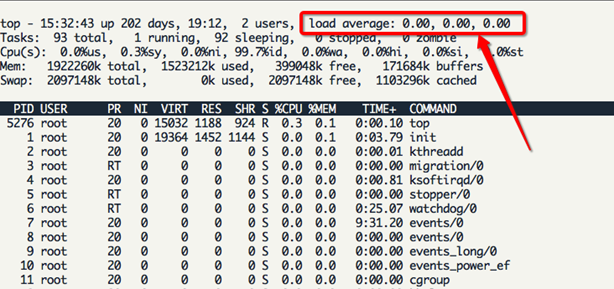

**Linux性能查看**

1.1 cpu性能查看
1、查看物理cpu个数：

> cat /proc/cpuinfo |grep "physical id"|sort|uniq|wc -l

2、查看每个物理cpu中的core个数：

> cat /proc/cpuinfo |grep "cpu cores"|wc -l

3、逻辑cpu的个数：

> cat /proc/cpuinfo |grep "processor"|wc -l

物理cpu个数*核数=逻辑cpu个数（不支持超线程技术的情况下）

1.2 内存查看
1、查看内存使用情况：

> #free -m
>              total       used       free     shared    buffers     cached
> Mem:          3949       2519       1430          0        189       1619
> -/+ buffers/cache:        710       3239
> Swap:         3576          0       3576

total：内存总数
used：已经使用的内存数
free：空闲内存数
shared：多个进程共享的内存总额
- buffers/cache：(已用)的内存数，即used-buffers-cached
+ buffers/cache：(可用)的内存数，即free+buffers+cached

Buffer Cache用于针对磁盘块的读写；
Page Cache用于针对文件inode的读写，这些Cache能有效地缩短I/O系统调用的时间。

对操作系统来说free/used是系统可用/占用的内存；
对应用程序来说-/+ buffers/cache是可用/占用内存,因为buffers/cache很快就会被使用。
我们工作时候应该从应用角度来看。

1.3 硬盘查看
1、查看硬盘及分区信息：

> fdisk -l

2、查看文件系统的磁盘空间占用情况：

> df -h

3、查看硬盘的I/O性能（每隔一秒显示一次，显示5次）：

> iostat -x 1 5

iostat是含在套装systat中的,可以用yum -y install systat来安装。

常关注的参数：

如%util接近100%,说明产生的I/O请求太多，I/O系统已经满负荷，该磁盘可能存在瓶颈。
如idle小于70%，I/O的压力就比较大了，说明读取进程中有较多的wait。
4、查看linux系统中某目录的大小：

> du -sh /root

如发现某个分区空间接近用完，可以进入该分区的挂载点，用以下命令找出占用空间最多的文件或目录，然后按照从大到小的顺序，找出系统中占用最多空间的前10个文件或目录：

> du -cksh *|sort -rn|head -n 10

1.4 查看平均负载
有时候系统响应很慢，但又找不到原因，这时就要查看平均负载了，看它是否有大量的进程在排队等待。

load average:平均负载
平均负载(load average)是指系统的运行队列的平均利用率，也可以认为是可运行进程的平均数。

以路况为例， 单核CPU、单车道 情况如下：

0.00-1.00 之间的数字表示此时路况非常良好，没有拥堵，车辆可以毫无阻碍地通过。
1.00 表示道路还算正常，但有可能会恶化并造成拥堵。此时系统已经没有多余的资源了，管理员需要进行优化。
1.00-*** 表示路况不太好了，如果到达2.00表示有桥上车辆一倍数目的车辆正在等待。这种情况你必须进行检查了。
多核CPU - 多车道 情况如下：

多核CPU的话，满负荷状态的数字为 "1.00 * CPU核数"，即双核CPU为2.00，四核CPU为4.00。 

 

一般的进程需要消耗CPU、内存、磁盘I/O、网络I/O等资源，在这种情况下，平均负载就不是单独指的CPU使用情况。即内存、磁盘、网络等因素也可以影响系统的平均负载值。 
在单核处理器中，平均负载值为1或者小于1的时候，系统处理进程会非常轻松，即负载很低。当达到3的时候，就会显得很忙，达到5或者8的时候就不能很好的处理进程了（其中5和8目前还是个争议的阈值，为了保守起见，建议选择低的）。

查看load average 数据
下面几个命令都可以看到 load average

#top 
#uptime 
#w

截图如下：

 

top 命令的

 

uptime 命令的

w 命令的

 

这里的 load average 的三个值分别指系统在最后 1/5/15分钟 的平均负载值。

根据经验：我们应该把重点放在5/15分钟的平均负载，因为1分钟的平均负载太频繁，一瞬间的高并发就会导致该值的大幅度改变。

1.5 vmstat命令来判断系统是否繁忙
还可以结合vmstat命令来判断系统是否繁忙，其中：

> procs
> r：等待运行的进程数。
> b：处在非中断睡眠状态的进程数。
> w：被交换出去的可运行的进程数。
>
> memeory
> swpd：虚拟内存使用情况，单位为KB。
> free：空闲的内存，单位为KB。
> buff：被用来作为缓存的内存数，单位为KB。
>
> swap
> si：从磁盘交换到内存的交换页数量，单位为KB。
> so：从内存交换到磁盘的交换页数量，单位为KB。
>
> io
> bi：发送到块设备的块数，单位为KB。
> bo：从块设备接受的块数，单位为KB。
>
> system
> in：每秒的中断数，包括时钟中断。
> cs：每秒的环境切换次数。
>
> cpu
> 按cpu的总使用百分比来显示。
> us：cpu使用时间。
> sy：cpu系统使用时间。
> id：闲置时间。

1.6Linux下可使用 nethogs 工具查看进程流量

> 1.7 其他参数
> 查看内核版本号：
> uname -a
>
> 简化命令：uname -r
>
> 查看系统是32位还是64位的：
> file /sbin/init
>
> 查看发行版：
> cat /etc/issue
> 或lsb_release -a
>
> 查看系统已载入的相关模块：
> lsmod
>
> 查看pci设置：
> lspci

2.1.3 系统性能分析工具
1.常用系统命令
Vmstat、sar、iostat、netstat、free、ps、top等

2.常用组合方式
vmstat、sar、iostat检测是否是CPU瓶颈
free、vmstat检测是否是内存瓶颈
iostat检测是否是磁盘I/O瓶颈
netstat检测是否是网络带宽瓶颈
2.1.4 Linux性能评估与优化
系统整体性能评估（uptime命令）
uptime

16:38:00 up 118 days, 3:01, 5 users,load average: 1.22, 1.02, 0.91

注意：

load average三值大小一般不能大于系统CPU的个数。

> 系统有8个CPU,如load average三值长期大于8，说明CPU很繁忙，负载很高，可能会影响系统性能。

但偶尔大于8，一般不会影响系统性能。

如load average输出值小于CPU个数，则表示CPU有空闲时间片，比如本例中的输出，CPU是非常空闲的

2.2.1 CPU性能评估
1.利用vmstat命令监控系统CPU
显示系统各种资源之间相关性能简要信息，主要看CPU负载情况。

下面是vmstat命令在某个系统的输出结果：

> [root@node1 ~]#vmstat 2 3
>
> procs
>  ———–memory———- —swap– —–io—- –system– —–cpu——
>
> r  b swpd freebuff  cache si so bi bo incs us sy idwa st
>
> 0  0 0 162240 8304 67032 0 0 13 21 1007 23 0 1 98 0 0
>
> 0  0 0 162240 8304 67032 0 0 1 0 1010 20 0 1 100 0 0
>
> 0  0 0 162240 8304 67032 0 0 1 1 1009 18 0 1 99 0 0
> Procs
> r--运行和等待cpu时间片的进程数，这个值如果长期大于系统CPU的个数，说明CPU不足，需要增加CPU
>
> b--在等待资源的进程数，比如正在等待I/O、或者内存交换等。

CPU
us
用户进程消耗的CPU 时间百分比。
us的值比较高时，说明用户进程消耗的cpu时间多，但是如果长期大于50%，就需要考虑优化程序或算法。

sy
内核进程消耗的CPU时间百分比。Sy的值较高时，说明内核消耗的CPU资源很多。

根据经验，us+sy的参考值为80%，如果us+sy大于 80%说明可能存在CPU资源不足。

2.利用sar命令监控系统CPU
sar对系统每方面进行单独统计，但会增加系统开销，不过开销可以评估，对系统的统计结果不会有很大影响。

下面是sar命令对某个系统的CPU统计输出：

> [root@webserver ~]# sar -u 3 5
>
> Linux
>  2.6.9-42.ELsmp (webserver) 11/28/2008_i686_
>  (8 CPU)
>
> 11:41:24
>  AM CPU %user %nice%system
>  %iowait %steal %idle
>
> 11:41:27
>  AM all 0.88 0.00 0.29 0.00 0.00 98.83
>
> 11:41:30
>  AM all 0.13 0.00 0.17 0.21 0.00 99.50
>
> 11:41:33
>  AM all 0.04 0.00 0.04 0.00 0.00 99.92
>
> 11:41:36
>  AM all 90.08 0.00 0.13 0.16 0.00 9.63
>
> 11:41:39
>  AM all 0.38 0.00 0.17 0.04 0.00 99.41
>
> Average:
>  all 0.34 0.00 0.16 0.05 0.00 99.45

输出解释如下：

%user列显示了用户进程消耗的CPU 时间百分比。
%nice列显示了运行正常进程所消耗的CPU 时间百分比。
%system列显示了系统进程消耗的CPU时间百分比。
%iowait列显示了IO等待所占用的CPU时间百分比
%steal列显示了在内存相对紧张的环境下pagein强制对不同的页面进行的steal操作 。
%idle列显示了CPU处在空闲状态的时间百分比。
问题
你是否遇到过系统CPU整体利用率不高，而应用缓慢的现象？

在一个多CPU的系统中，如果程序使用了单线程，会出现这么一个现象，CPU的整体使用率不高，但是系统应用却响应缓慢，这可能是由于程序使用单线程的原因，单线程只使用一个CPU，导致这个CPU占用率为100%，无法处理其它请求，而其它的CPU却闲置，这就导致了整体CPU使用率不高，而应用缓慢现象的发生。

2.3.1 内存性能评估
1.利用free指令监控内存
free是监控Linux内存使用状况最常用的指令，看下面的一个输出：

[root@webserver ~]# free -m

total
 used freeshared
 buffers cached

Mem:
 8111 7185 926 0 243 6299

 -/+
 buffers/cache:
 643 7468

Swap:
 8189 0 8189
经验公式：

应用程序可用内存/系统物理内存>70%，表示系统内存资源非常充足，不影响系统性能;
应用程序可用内存/系统物理内存<20%，表示系统内存资源紧缺，需要增加系统内存;
20%<应用程序可用内存/系统物理内存<70%，表示系统内存资源基本能满足应用需求，暂时不影响系统性能
2.利用vmstat命令监控内存
[root@node1
 ~]#
 vmstat 2 3

procs
 ———–memory———- —swap– —–io—- –system– —–cpu——

r b swpd freebuff cache si so bi bo incs us sy idwa st

0 0 0 162240 8304 67032 0 0 13 21 1007 23 0 1 98 0 0

0 0 0 162240 8304 67032 0 0 1 0 1010 20 0 1 100 0 0

0 0 0 162240 8304 67032 0 0 1 1 1009 18 0 1 99 0 0
memory

swpd--切换到内存交换区的内存数量（k为单位)。如swpd值偶尔非0，不影响系统性能
free--当前空闲的物理内存数量（k为单位）
buff--buffers cache的内存数量，一般对块设备的读写才需要缓冲
cache--page cached的内存数量
一般作为文件系统cached，频繁访问的文件都会被cached，如cache值较大，说明cached的文件数较多，如果此时IO中bi比较小，说明文件系统效率比较好。

swap

si--由磁盘调入内存，也就是内存进入内存交换区的数量。
so--由内存调入磁盘，也就是内存交换区进入内存的数量。
si、so的值长期不为0，表示系统内存不足。需增加系统内存。

2.4.1磁盘I/O性能评估
1.磁盘存储基础
频繁访问的文件或数据尽可能用内存读写代替直接磁盘I/O，效率高千倍。

将经常进行读写的文件与长期不变的文件独立出来，分别放置到不同的磁盘设备上。

对于写操作频繁的数据，可以考虑使用裸设备代替文件系统。

裸设备优点：

数据可直接读写，不需经过操作系统级缓存，节省内存资源，避免内存资源争用;
避免文件系统级维护开销，如文件系统需维护超级块、I-node等;
避免了操作系统cache预读功能，减少了I/O请求
使用裸设备的缺点是：

数据管理、空间管理不灵活，需要很专业的人来操作。

2.利用iostat评估磁盘性能
[root@webserver ~]# iostat -d 2 3

Linux
 2.6.9-42.ELsmp (webserver) 12/01/2008_i686_
 (8 CPU)

 

Device:
 tps Blk_read/sBlk_wrtn/sBlk_read
 Blk_wrtn

sda 1.87 2.58 114.12 6479462 286537372

 

Device:
 tps Blk_read/sBlk_wrtn/sBlk_read
 Blk_wrtn

sda
 0.00 0.00 0.00 0 0

Device:
 tps Blk_read/sBlk_wrtn/sBlk_read
 Blk_wrtn

sda
 1.00 0.00 12.00 0 24
解释如下：

Blk_read/s--每秒读取数据块数
Blk_wrtn/s--每秒写入数据块数
Blk_read--读取的所有块数
Blk_wrtn--写入的所有块数
可通过Blk_read/s和Blk_wrtn/s值对磁盘的读写性能有一个基本的了解.
如Blk_wrtn/s值很大，表示磁盘写操作频繁，考虑优化磁盘或程序，
如Blk_read/s值很大，表示磁盘直接读操作很多，可将读取的数据放入内存

规则遵循：

长期的、超大的数据读写，肯定是不正常的，这种情况一定会影响系统性能。

3.利用sar评估磁盘性能
通过“sar –d”组合，可以对系统的磁盘IO做一个基本的统计，请看下面的一个输出：

[root@webserver ~]# sar -d 2 3

Linux
 2.6.9-42.ELsmp (webserver) 11/30/2008_i686_
 (8 CPU)

11:09:33
 PM DEV tps rd_sec/swr_sec/savgrq-sz
 avgqu-sz await svctm %util

11:09:35
 PM dev8-0 0.00 0.00 0.00 0.00 0.00 0.00 0.00 0.00

11:09:35
 PM DEV tps rd_sec/swr_sec/savgrq-sz
 avgqu-sz await svctm %util

11:09:37
 PM dev8-0 1.00 0.00 12.00 12.00 0.00 0.00 0.00 0.00

11:09:37
 PM DEV tps rd_sec/swr_sec/savgrq-sz
 avgqu-sz await svctm %util

11:09:39
 PM dev8-0 1.99 0.00 47.76 24.00 0.00 0.50 0.25 0.05

Average:
 DEV tps rd_sec/swr_sec/savgrq-sz
 avgqu-sz await svctm %util

Average:
 dev8-0 1.00 0.00 19.97 20.00 0.00 0.33 0.17 0.02
参数含义：

await--平均每次设备I/O操作等待时间（毫秒）
svctm--平均每次设备I/O操作的服务时间（毫秒）
%util--一秒中有百分之几的时间用于I/O操作
对磁盘IO性能评判标准：

正常svctm应小于await值，而svctm和磁盘性能有关，CPU、内存负荷也会对svctm值造成影响，过多的请求也会间接的导致svctm值的增加。

await值取决svctm和I/O队列长度以及I/O请求模式，
如果svctm的值与await很接近，表示几乎没有I/O等待，磁盘性能很好，
如果await的值远高于svctm的值，则表示I/O队列等待太长，系统上运行的应用程序将变慢，
此时可以通过更换更快的硬盘来解决问题。
%util--衡量磁盘I/O重要指标，

如%util接近100%，表示磁盘产生的I/O请求太多，I/O系统已经满负荷工作，该磁盘可能存在瓶颈。

可优化程序或者 通过更换 更高、更快的磁盘。

2.5.1. 网络性能评估
（1）通过ping命令检测网络的连通性
（2）通过netstat –i组合检测网络接口状况
（3）通过netstat –r组合检测系统的路由表信息
（4）通过sar –n组合显示系统的网络运行状态
三 Linux服务器性能调优
1.为磁盘I/O调整Linux内核电梯算法
选择文件系统后，该算法可以平衡低延迟需求，收集足够数据，有效组织对磁盘读写请求。

2.禁用不必要的守护进程，节省内存和CPU资源
许多守护进程或服务通常非必需，消耗宝贵内存和CPU时间。将服务器置于险地。
禁用可加快启动时间，释放内存。

减少CPU要处理的进程数
一些应被禁用的Linux守护进程，默认自动运行：

序号 守护进程 描述
1 Apmd 高级电源管理守护进程
2 Nfslock 用于NFS文件锁定
3 Isdn ISDN Moderm支持
4 Autofs 在后台自动挂载文件系统(如自动挂载CD-ROM)
5 Sendmail 邮件传输代理
6 Xfs X Window的字体服务器

3.关掉GUI
4、清理不需要的模块或功能
服务器软件包中太多被启动的功能或模块实际上是不需要的(如Apache中的许多功能模块)，禁用掉有助于提高系统内存可用量，腾出资源给那些真正需要的软件，让它们运行得更快。

5、禁用控制面板
在Linux中，有许多流行的控制面板，如Cpanel，Plesk，Webmin和phpMyAdmin等，禁用释放出大约120MB内存，内存使用量大约下降30-40%。

6、改善Linux Exim服务器性能
使用DNS缓存守护进程，可降低解析DNS记录需要的带宽和CPU时间，DNS缓存通过消除每次都从根节点开始查找DNS记录的需求，从而改善网络性能。

Djbdns是一个非常强大的DNS服务器，它具有DNS缓存功能，Djbdns比BIND DNS服务器更安全，性能更好，可以直接通过http://cr.yp.to/下载，或通过Red Hat提供的软件包获得。

7、使用AES256增强gpg文件加密安全
为提高备份文件或敏感信息安全，许多Linux系统管理员都使用gpg进行加密，在使用gpg时，最好指定gpg使用AES256加密算法，AES256使用256位密钥，它是一个开放的加密算法，美国国家安全局(NSA)使用它保护绝密信息。

8、远程备份服务安全
安全是选择远程备份服务最重要的因素，大多数系统管理员都害怕两件事：(黑客)可以删除备份文件，不能从备份恢复系统。

为了保证备份文件100%的安全，备份服务公司提供远程备份服务器，使用scp脚本或RSYNC通过SSH传输数据，这样，没有人可以直接进入和访问远程系统，因此，也没有人可以从备份服务删除数据。在选择远程备份服务提供商时，最好从多个方面了解其服务强壮性，如果可以，可以亲自测试一下。

9、更新默认内核参数设置
为了顺利和成功运行企业应用程序，如数据库服务器，可能需要更新一些默认的内核参数设置，例如，2.4.x系列内核消息队列参数msgmni有一个默认值(例如，共享内存，或shmmax在Red Hat系统上默认只有33554432字节)，它只允许有限的数据库并发连接，下面为数据库服务器更好地运行提供了一些建议值(来自IBM DB2支持网站)：

kernel.shmmax=268435456 (32位)
kernel.shmmax=1073741824 (64位)
kernel.msgmni=1024
fs.file-max=8192
kernel.sem=”250 32000 32 1024″

10、优化TCP
优化TCP协议有助于提高网络吞吐量，跨广域网的通信使用的带宽越大，延迟时间越长时，建议使用越大的TCP Linux大小，以提高数据传输速率，TCP Linux大小决定了发送主机在没有收到数据传输确认时，可以向接收主机发送多少数据。

11、选择正确的文件系统
使用ext4文件系统取代ext3

● Ext4是ext3文件系统的增强版，扩展了存储限制

●具有日志功能，保证高水平的数据完整性(在非正常关闭事件中)

●非正常关闭和重启时，它不需要检查磁盘(这是一个非常耗时的动作)

●更快的写入速度，ext4日志优化了硬盘磁头动作

12、使用noatime文件系统挂载选项
在文件系统启动配置文件fstab中使用noatime选项，如果使用了外部存储，这个挂载选项可以有效改善性能。

13、调整Linux文件描述符限制
Linux限制了任何进程可以打开的文件描述符数量，默认限制是每进程1024，这些限制可能会阻碍基准测试客户端(如httperf和apachebench)和Web服务器本身获得最佳性能，Apache每个连接使用一个进程，因此不会受到影响，但单进程Web服务器，如Zeus是每连接使用一个文件描述符，因此很容易受默认限制的影响。

打开文件限制是一个可以用ulimit命令调整的限制，ulimit -aS命令显示当前的限制，ulimit -aH命令显示硬限制(在未调整/proc中的内核参数前，你不能增加限制)。

Linux第三方应用程序性能技巧

对于运行在Linux上的第三方应用程序，一样有许多性能优化技巧，这些技巧可以帮助你提高Linux服务器的性能，降低运行成本。

14、正确配置MySQL
为了给MySQL分配更多的内存，可设置MySQL缓存大小，要是MySQL服务器实例使用了更多内存，就减少缓存大小，如果MySQL在请求增多时停滞不动，就增加MySQL缓存。

15、正确配置Apache
检查Apache使用了多少内存，再调整StartServers和MinSpareServers参数，以释放更多的内存，将有助于你节省30-40%的内存。

16、分析Linux服务器性能
提高系统效率最好的办法是找出导致整体速度下降的瓶颈并解决掉，下面是找出系统关键瓶颈的一些基本技巧：

● 当大型应用程序，如OpenOffice和Firefox同时运行时，计算机可能会开始变慢，内存不足的出现几率更高。

● 如果启动时真的很慢，可能是应用程序初次启动需要较长的加载时间，一旦启动好后运行就正常了，否则很可能是硬盘太慢了。

●CPU负载持续很高，内存也够用，但CPU利用率很低，可以使用CPU负载分析工具监控负载时间。

17、学习5个Linux性能命令
使用几个命令就可以管理Linux系统的性能了，下面列出了5个最常用的Linux性能命令，包括
top、vmstat、iostat、free和sar，它们有助于系统管理员快速解决性能问题。

(1)top
当前内核服务的任务，还显示许多主机状态的统计数据，默认情况下，它每隔5秒自动更新一次。
如：当前正常运行时间，系统负载，进程数量和内存使用率，

此外，这个命令也显示了那些使用最多CPU时间的进程(包括每个进程的各种信息，如运行用户，执行的命令等)。

(2)vmstat
Vmstat命令提供当前CPU、IO、进程和内存使用率的快照，它和top命令类似，自动更新数据，如：

$ vmstat 10

(3)iostat
Iostat提供三个报告：CPU利用率、设备利用率和网络文件系统利用率，使用-c，-d和-h参数可以分别独立显示这三个报告。

(4)free
显示主内存和交换空间内存统计数据，指定-t参数显示总内存，指定-b参数按字节为单位，使用-m则以兆为单位，默认情况下千字节为单位。

Free命令也可以使用-s参数加一个延迟时间(单位：秒)连续运行，如：

$ free -s 5

(5)sar
收集，查看和记录性能数据，这个命令比前面几个命令历史更悠久，它可以收集和显示较长周期的数据。

其它

下面是一些归类为其它的性能技巧：

18、将日志文件转移到内存中
当一台机器处于运行中时，最好是将系统日志放在内存中，当系统关闭时再将其复制到硬盘，当你运行一台开启了syslog功能的笔记本电脑或移动设备时，ramlog可以帮助你提高系统电池或移动设备闪存驱动器的寿命，使用ramlog的一个好处是，不用再担心某个守护进程每隔30秒向syslog发送一条消息，放在以前，硬盘必须随时保持运转，这样对硬盘和电池都不好。

19、先打包，后写入
在内存中划分出固定大小的空间保存日志文件，这意味着笔记本电脑硬盘不用一直保持运转，只有当某个守护进程需要写入日志时才运转，注意ramlog使用的内存空间大小是固定的，否则系统内存会很快被用光，如果笔记本使用固态硬盘，可以分配50-80MB内存给ramlog使用，ramlog可以减少许多写入周期，极大地提高固态硬盘的使用寿命。

20、一般调优技巧
尽可能使用静态内容替代动态内容，如果你在生成天气预告，或其它每隔1小时就必须更新的数据，最好是写一个程序，每隔1小时生成一个静态的文件，而不是让用户运行一个CGI动态地生成报告。

为动态应用程序选择最快最合适的API，CGI可能最容易编程，但它会为每个请求产生一个进程，通常，这是一个成本很高，且不必要的过程，FastCGI是更好的选择，和Apache的mod_perl一样，都可以极大地提高应用程序的性能。