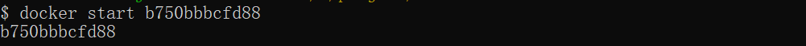
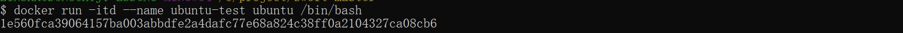

**docker使用**

命令：

```shell
docker run -it ubuntu /bin/bash
```

参数说明：

- **-i**: 交互式操作。
- **-t**: 终端。
- **ubuntu**: ubuntu 镜像。
- **/bin/bash**：放在镜像名后的是命令，这里我们希望有个交互式 Shell，因此用的是 /bin/bash。

要退出终端，直接输入 **exit**:

### 启动已停止运行的容器

查看所有的容器命令如下：

```
$ docker ps -a
```

使用 docker start 启动一个已停止的容器：

```
$ docker start b750bbbcfd88 
```



### 后台运行

在大部分的场景下，我们希望 docker 的服务是在后台运行的，我们可以过 **-d** 指定容器的运行模式。

```
$ docker run -itd --name ubuntu-test ubuntu /bin/bash
```

点击图片查看大图：

[](https://www.runoob.com/wp-content/uploads/2016/05/docker-run-d.png)

[](https://www.runoob.com/wp-content/uploads/2016/05/docker-run-d2.png)

**注：**加了 **-d** 参数默认不会进入容器，想要进入容器需要使用指令 **docker exec**（下面会介绍到）。

### 停止一个容器

停止容器的命令如下：

```
$ docker stop <容器 ID>
```


停止的容器可以通过 docker restart 重启：

```
$ docker restart <容器 ID>
```


### 进入容器

在使用 **-d** 参数时，容器启动后会进入后台。此时想要进入容器，可以通过以下指令进入：

- **docker attach**
- **docker exec**：推荐大家使用 docker exec 命令，因为此退出容器终端，不会导致容器的停止。

**attach 命令**

下面演示了使用 docker attach 命令。

```
$ docker attach 1e560fca3906 
```

[](https://www.runoob.com/wp-content/uploads/2016/05/docker-attach.png)

**注意：** 如果从这个容器退出，会导致容器的停止。

**exec 命令**

下面演示了使用 docker exec 命令。

```
docker exec -it 243c32535da7 /bin/bash
```

[](https://www.runoob.com/wp-content/uploads/2016/05/docker-exec.png)

**注意：** 如果从这个容器退出，容器不会停止，这就是为什么推荐大家使用 **docker exec** 的原因。

更多参数说明请使用 **docker exec --help** 命令查看。

### 导出和导入容器

**导出容器**

如果要导出本地某个容器，可以使用 **docker export** 命令。

```
$ docker export 1e560fca3906 > ubuntu.tar
```

导出容器 1e560fca3906 快照到本地文件 ubuntu.tar。

[](https://www.runoob.com/wp-content/uploads/2016/05/docker-export.png)

这样将导出容器快照到本地文件。

**导入容器快照**

可以使用 docker import 从容器快照文件中再导入为镜像，以下实例将快照文件 ubuntu.tar 导入到镜像 test/ubuntu:v1:

```
$ cat docker/ubuntu.tar | docker import - test/ubuntu:v1
```

[](https://www.runoob.com/wp-content/uploads/2016/05/docker-import.png)

此外，也可以通过指定 URL 或者某个目录来导入，例如：

```
$ docker import http://example.com/exampleimage.tgz example/imagerepo
```

### 删除容器

删除容器使用 **docker rm** 命令：

```
$ docker rm -f 1e560fca3906
```

[](https://www.runoob.com/wp-content/uploads/2016/05/docker-container-rmi.png)

下面的命令可以清理掉所有处于终止状态的容器。

$ docker container prune


```shell
nvidia-docker run -it --name=容器名 -v 宿主机目录:/容器内目录 -p 自定义端口号（此处假定为23333）:22 ufoym/deepo bash
```

镜像ufoym/deepo

-v是实现目录挂载，关于目录挂载，-p是端口映射，映射成功后可以直接通过映射后的端口访问docker。

举例：

假设服务器IP地址为** . ** . *. ***，端口映射为 -p 23333:22  -p 23334:6006  -p 23335:8888，其中8888是jupyter的默认端口，6006是tensorboard的默认端口。则可

- 通过IP地址的23333端口可以直接访问docker，无需通过22端口进入服务器，再在服务器中进入docker
- 同一网段内的任意浏览器都可以通过 IP地址:6006来访问tensorboard（前提：已开启tensorboard服务）
- 同一网段内的任意浏览器都可以通过 IP地址:8888来访问jupyter（前提：已开启jupyter服务）

如果要在主机（计算机或VM）与使用Deepo的容器之间共享数据和配置，请使用-v选项，例如

```shell
nvidia-docker run -it -v /host/data:/data -v /host/config:/config ufoym/deepo bash
```

某些框架（例如PyTorch）使用共享内存在进程之间共享数据，因此如果使用多处理，容器运行的默认共享内存段大小是不够的，您应该使用`--ipc=host`或`--shm-size`命令行选项增加共享内存大小到`nvidia-docker run`。

```shell
nvidia-docker run -it --ipc=host ufoym/deepo bash
```

#### 共享内存参数

shmmax:共享内存段最大尺寸(字节)
shmmni:共享内存段最大数目
shmall:系统共享内存最大尺寸(页), 对32位系统，一页(page)等于4KB
shmmin:共享内存段最小尺寸(字节)
shmseg:每进程最大共享内存段数量

```txt
--ipc="MODE" : Set the IPC mode for the container

"shareable": Own private IPC namespace, with a possibility to share it with other containers.

"host": Use the host system’s IPC namespace.
```

使用host将IPC名称空间公开给控制了主机的攻击者。使用shareable，只能在容器内部访问IPC名称空间，其中可能包含任何攻击。 host模式的存在是为了允许容器与其主机之间进行协作。

--shm-size命令：设置共享内存，shared memory

