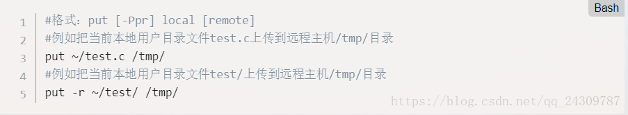
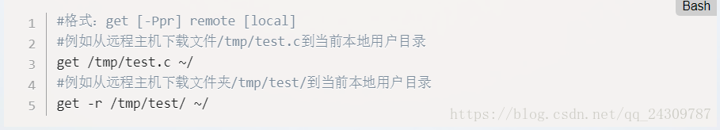

**后台任务**

只要在命令的尾部加上符号`&`，启动的进程就会成为"后台任务"

如果要让正在运行的"前台任务"变为"后台任务"，可以先按`ctrl + z`，然后执行`bg`命令（让最近一个暂停的"后台任务"继续执行）

**SFTP**

 1. sftp user@ip

          你要用sftp, 当然得登录到sftp服务器啊， 在linux的shell中执行上面的命令后， linux shell会提示用户输入密码， 我们就输入password吧。 这样就成功建立了sftp连接。

       2. help

           建立连接后， linux shell中的$编程了sftp>,  这也对。 现在执行以下help, 可以看看sftp支持哪些命令。

       3. pwd和lpwd

           pwd是看远端服务器的目录， 即sftp服务器默认的当前目录。  lpwd是看linux本地目录。

       4. ls和lls

           ls是看sftp服务器下当前目录下的东东， lls是看linux当前目录下的东东。

       5. put a.txt

           这个是把linux当前目录下的a.txt文件上传到sftp服务器的当前目录下。

           

       6. get b.txt

           这个是把sftp服务器当前目录下的b.txt文件下载到linux当前目录下。  

7. !command

    这个是指在linux上执行command这个命令， 比如!ls是列举linux当前目录下的东东， !rm a.txt是删除linux当前目录下的a.txt文件。

    这个命令非常非常有用， 因为在sftp> 后输入命令， 默认值针对sftp服务器的， 所以执行rm a.txt删除的是sftp服务器上的a.txt文件， 而非本地的linux上的a.txt文件。

     8. exit和quit

         退出。