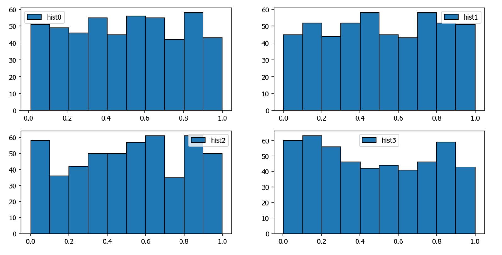
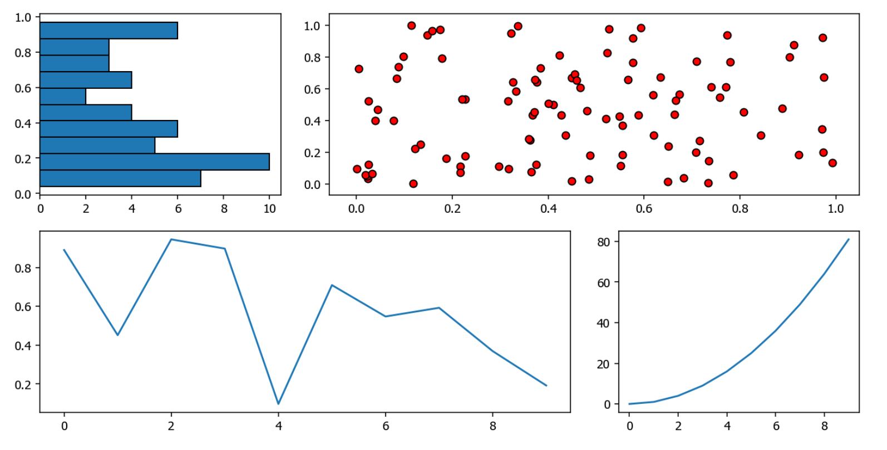

**plt绘图**

# 在matplotlib中创建子图的多种方式

在用Matplotlib绘制图像时，有时候需要从多个角度对数据进行对比。为此子图的概念便提了出来，子图可以在较大的图形中同时放置一组较小的坐标轴。这些子图可能是画中画、网格图，或者是其他更复杂的布局形式。

创建子图常用的可以有如下三种方式。

- **使用add_subplot()面向对象的方式来创建子图**

使用面向对象的方式创建子图前，需要创建一个figure对象，如`fig = plt.figure()`，然后在图像布局中绘制子图，下列例子中，我们用`fig.add_subplot(221)`绘制了2行2列子图，而221代表创建2行2列一共4个子图，并从左往右第1个子图开始绘图。假设我们要绘制2行6列子图，当画到第10块子图时，那么第10块该怎么写呢？2610是不行的，可以用另一种方式(2, 6, 10)

```python
import numpy as np  
import matplotlib.pyplot as plt

x = np.arange(100)

# 创建图像布局对象fig
fig = plt.figure(figsize = (12, 6))

# 221代表创建2行2列一共4个子图，并从左往右第1个子图开始绘图。
ax1 = fig.add_subplot(221)  
ax1.plot(x, x)

ax2 = fig.add_subplot(222)  
ax2.plot(x, -x)

ax3 = fig.add_subplot(223)  
ax3.plot(x, x ** 2)

ax4 = fig.add_subplot(224)  
ax4.plot(-x, x ** 2)

plt.show()  
```

显示的图像如下：


- **使用pyplot方式直接创建子图**

除了使用上面，面向对象的方式创建图外，我们还可以直接使用pyploy（也就是我们声明的别名plt）直接创建子图对象，而不需要先声明实例对象的方式去创建，最终绘图得到的图像是一模一样的。

```python
import numpy as np  
import matplotlib.pyplot as plt

x = np.arange(100)

plt.figure(figsize = (12, 6))  
# 先画好子图具体位置
plt.subplot(221)  
# 在该子图下绘图
plt.plot(x, x)

plt.subplot(222)  
plt.plot(x, -x)

plt.subplot(223)  
plt.plot(x, x ** 2)

plt.subplot(224)  
plt.plot(-x, x ** 2)

plt.show()  
```

- **使用subplots创建多个子图**

> 注意：如果设置的nrows = 1，ncols = 3也就是1行3列的话，axes的引用格式就不是axes[0][1]，axes[0][2]， axes[0][3]这样子。而是直接使用axes[0]， axes[1]， axes[2]， 不然会报错。因为默认1行就不算是多维数组，所以不需要多维数组访问的方式。

```python
import numpy as np  
import matplotlib.pyplot as plt

# 将画布分割为2行2列，起始值为0。
fig, axes = plt.subplots(figsize = (12, 6), nrows = 2, ncols = 2)  
# 给第1行第1列绘图
axes[0][0].hist(np.random.rand(500), label = 'hist0', edgecolor = 'black')  
# 给图形添加标签
axes[0][0].legend()

axes[0][1].hist(np.random.rand(500), label = 'hist1', edgecolor = 'black')  
axes[0][1].legend()

axes[1][0].hist(np.random.rand(500), label = 'hist2', edgecolor = 'black')  
axes[1][0].legend()

axes[1][1].hist(np.random.rand(500), label = 'hist3', edgecolor = 'black')  
axes[1][1].legend()

plt.show()  
```

显示的图像如下：



除此之外，如果要实现更复杂的排列方式，比如说实现不规则的多行多子列图有没有什么办法呢？万能的matplotlib图库当然有办法，那就是使用plt.GridSpec()，不过plt.GridSpec()对象本身不能直接创建一个图形，他其实只是plt.subplot()命令可以识别的一个简易接口。

- **plt.GridSpec：实现更复杂的排列方式**

```python
import numpy as np  
import matplotlib.pyplot as plt

# 声明一个GridSpec对象实例，创建的是2行3列的图像布局。
grid = plt.GridSpec(nrows=2, ncols=3, wspace=0.2, hspace=0.2)

# 设置整个图像大小。
plt.figure(figsize = (12, 6))  
# 第一个子图的具体排列位置为(0,0)。
plt.subplot(grid[0, 0])  
plt.hist(np.random.rand(50), orientation='horizontal', edgecolor = 'black')

plt.subplot(grid[0, 1:])  
plt.scatter(np.random.rand(100),np.random.rand(100), color = 'r', edgecolor = 'black')

plt.subplot(grid[1, :2])  
plt.plot(np.arange(10), np.random.rand(10))

plt.subplot(grid[1, 2]);  
plt.plot(np.arange(10), np.arange(10) ** 2)

plt.show()  
```

可以看到最终的绘制效果图如下，实现了不规则的图形。



这个例子中有几个参数要特别说明下，因为一开始会让不少人感到困惑，就是关于创建不规则子图的参数指定，因为这决定了子图的排列规则。例子中4个子图的位置分别是grid[0, 0]、grid[0, 1:]、grid[1, :2]、grid[1, 2]它们到底代表着什么呢，怎么理解呢。

可以这样理解，一开始我们声明创建的是2行3列的一个图像布局网格，我们可以想象成我们创建的是一个二维数组，类似如下这样，如果一行的宽度按100%计算的话，每个元素占据的宽度可以理解为33.33%：

```python
[1, 2, 3]
[4, 5, 6]
```

第一个子图的位置是`grid[0, 0]`：按照这个`[0, 0]`的下标取值为第1行第1列的元素，得到的是1这个元素位置宽度（大概是33.33%的宽度）。

第二个子图的位置是`grid[0, 1:]`：按照这个`[0, 1:]`的下标取值为第1行第2列的之后所有的元素，得到的是2, 3这个元素位置宽度。所以你可以从效果图中看到第2个子图占据了第一行一大半的宽度（大概是66.66%的宽度）。

第三个子图的位置是`grid[1, :2]`：按照这个`[1, :2]`的下标取值为第2行第1列起到第3列**之间**所有的元素，得到的是4, 5这个元素位置宽度。所以你可以从效果图中看到第3个子图占据了第二行一大半的宽度（大概是66.66%的宽度）。

第四个子图的位置是`grid[1, 2]`：按照这个`[1, 2]`的下标取值为第2行第3列的元素，得到的是6这个元素位置宽度。所以你可以从效果图中看到第4个子图只占据了一个元素的宽度（大概是33.33%的宽度）。