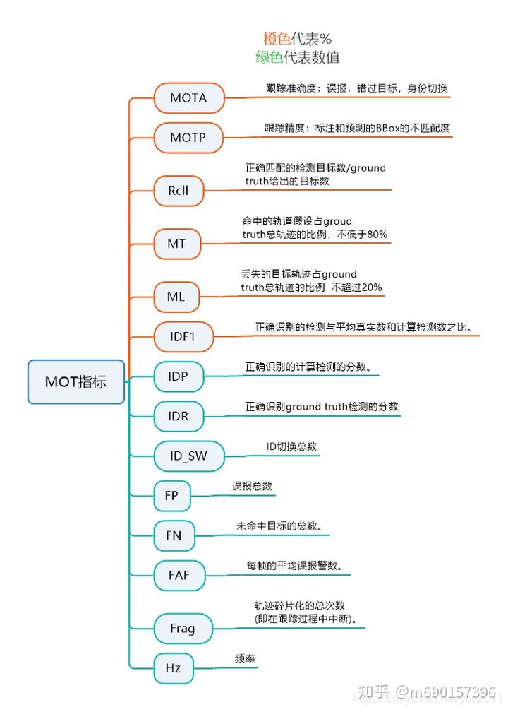

**log**

val set的结果

```python
Loaded results from ./work_dirs/tracking_result.json. Found detections for 6019 samples.
Loading annotations for val split from nuScenes version: v1.0-trainval
100%|██████████████████████████████████████████████████████████████████████████████████████████████████████| 6019/6019 [00:14<00:00, 409.08it/s]
Loaded ground truth annotations for 6019 samples.
Filtering tracks
=> Original number of boxes: 507598
=> After distance based filtering: 378345
=> After LIDAR points based filtering: 378345
=> After bike rack filtering: 377683
Filtering ground truth tracks
=> Original number of boxes: 142261
=> After distance based filtering: 103564
=> After LIDAR points based filtering: 93885
=> After bike rack filtering: 93875
Accumulating metric data...
Computing metrics for class bicycle...

Computed thresholds                                                                                                                             

                MOTAR   MOTP    Recall  Frames  GT      GT-Mtch GT-Miss GT-IDS  Pred    Pred-TP Pred-FP Pred-IDS                                
thr_0.1061      0.000   0.345   0.886   6019    1993    1717    228     48      90463   1717    88698   48

                MOTAR   MOTP    Recall  Frames  GT      GT-Mtch GT-Miss GT-IDS  Pred    Pred-TP Pred-FP Pred-IDS                                
thr_0.1517      0.000   0.339   0.869   6008    1993    1698    262     33      47831   1698    46100   33

                MOTAR   MOTP    Recall  Frames  GT      GT-Mtch GT-Miss GT-IDS  Pred    Pred-TP Pred-FP Pred-IDS                                
thr_0.1623      0.000   0.343   0.857   5995    1993    1678    285     30      39127   1678    37419   30

                MOTAR   MOTP    Recall  Frames  GT      GT-Mtch GT-Miss GT-IDS  Pred    Pred-TP Pred-FP Pred-IDS                                
thr_0.1943      0.000   0.344   0.832   5776    1993    1634    335     24      21386   1634    19728   24

                MOTAR   MOTP    Recall  Frames  GT      GT-Mtch GT-Miss GT-IDS  Pred    Pred-TP Pred-FP Pred-IDS                                
thr_0.2077      0.000   0.335   0.806   5558    1993    1586    387     20      16451   1586    14845   20

                MOTAR   MOTP    Recall  Frames  GT      GT-Mtch GT-Miss GT-IDS  Pred    Pred-TP Pred-FP Pred-IDS                                
thr_0.2206      0.000   0.327   0.784   5266    1993    1545    430     18      13193   1545    11630   18

                MOTAR   MOTP    Recall  Frames  GT      GT-Mtch GT-Miss GT-IDS  Pred    Pred-TP Pred-FP Pred-IDS                                
thr_0.2489      0.000   0.310   0.760   4420    1993    1499    479     15      8516    1499    7002    15

                MOTAR   MOTP    Recall  Frames  GT      GT-Mtch GT-Miss GT-IDS  Pred    Pred-TP Pred-FP Pred-IDS                                
thr_0.2682      0.000   0.305   0.729   3914    1993    1441    540     12      6515    1441    5062    12

                MOTAR   MOTP    Recall  Frames  GT      GT-Mtch GT-Miss GT-IDS  Pred    Pred-TP Pred-FP Pred-IDS                                
thr_0.2961      0.000   0.288   0.702   3143    1993    1391    593     9       4441    1391    3041    9

                MOTAR   MOTP    Recall  Frames  GT      GT-Mtch GT-Miss GT-IDS  Pred    Pred-TP Pred-FP Pred-IDS                                
thr_0.3237      0.000   0.285   0.683   2549    1993    1355    631     7       3303    1355    1941    7

                MOTAR   MOTP    Recall  Frames  GT      GT-Mtch GT-Miss GT-IDS  Pred    Pred-TP Pred-FP Pred-IDS                                
thr_0.3778      0.323   0.282   0.655   1932    1993    1302    688     3       2187    1302    882     3

                MOTAR   MOTP    Recall  Frames  GT      GT-Mtch GT-Miss GT-IDS  Pred    Pred-TP Pred-FP Pred-IDS                                
thr_0.3938      0.462   0.279   0.636   1795    1993    1266    725     2       1949    1266    681     2

                MOTAR   MOTP    Recall  Frames  GT      GT-Mtch GT-Miss GT-IDS  Pred    Pred-TP Pred-FP Pred-IDS                                
thr_0.4033      0.493   0.279   0.614   1771    1993    1222    769     2       1843    1222    619     2

                MOTAR   MOTP    Recall  Frames  GT      GT-Mtch GT-Miss GT-IDS  Pred    Pred-TP Pred-FP Pred-IDS                                
thr_0.4222      0.570   0.281   0.582   1697    1993    1158    834     1       1657    1158    498     1

                MOTAR   MOTP    Recall  Frames  GT      GT-Mtch GT-Miss GT-IDS  Pred    Pred-TP Pred-FP Pred-IDS                                
thr_0.4251      0.570   0.270   0.561   1684    1993    1118    874     1       1600    1118    481     1

                MOTAR   MOTP    Recall  Frames  GT      GT-Mtch GT-Miss GT-IDS  Pred    Pred-TP Pred-FP Pred-IDS                                
thr_0.4410      0.618   0.268   0.546   1646    1993    1088    905     0       1504    1088    416     0

                MOTAR   MOTP    Recall  Frames  GT      GT-Mtch GT-Miss GT-IDS  Pred    Pred-TP Pred-FP Pred-IDS                                
thr_0.4791      0.750   0.274   0.514   1518    1993    1024    969     0       1280    1024    256     0

                MOTAR   MOTP    Recall  Frames  GT      GT-Mtch GT-Miss GT-IDS  Pred    Pred-TP Pred-FP Pred-IDS                                
thr_0.4946      0.772   0.266   0.492   1500    1993    980     1013    0       1203    980     223     0

                MOTAR   MOTP    Recall  Frames  GT      GT-Mtch GT-Miss GT-IDS  Pred    Pred-TP Pred-FP Pred-IDS                                
thr_0.5247      0.812   0.267   0.461   1459    1993    918     1075    0       1091    918     173     0

                MOTAR   MOTP    Recall  Frames  GT      GT-Mtch GT-Miss GT-IDS  Pred    Pred-TP Pred-FP Pred-IDS                                
thr_0.5385      0.847   0.272   0.437   1432    1993    870     1123    0       1003    870     133     0

                MOTAR   MOTP    Recall  Frames  GT      GT-Mtch GT-Miss GT-IDS  Pred    Pred-TP Pred-FP Pred-IDS                                
thr_0.5446      0.853   0.276   0.419   1426    1993    836     1157    0       959     836     123     0

                MOTAR   MOTP    Recall  Frames  GT      GT-Mtch GT-Miss GT-IDS  Pred    Pred-TP Pred-FP Pred-IDS                                
thr_0.5746      0.892   0.284   0.384   1398    1993    766     1227    0       849     766     83      0

                MOTAR   MOTP    Recall  Frames  GT      GT-Mtch GT-Miss GT-IDS  Pred    Pred-TP Pred-FP Pred-IDS                                
thr_0.5824      0.895   0.234   0.367   1392    1993    731     1262    0       808     731     77      0

                MOTAR   MOTP    Recall  Frames  GT      GT-Mtch GT-Miss GT-IDS  Pred    Pred-TP Pred-FP Pred-IDS                                
thr_0.5951      0.907   0.232   0.339   1385    1993    676     1317    0       739     676     63      0

                MOTAR   MOTP    Recall  Frames  GT      GT-Mtch GT-Miss GT-IDS  Pred    Pred-TP Pred-FP Pred-IDS                                
thr_0.6033      0.909   0.238   0.314   1383    1993    626     1367    0       683     626     57      0

                MOTAR   MOTP    Recall  Frames  GT      GT-Mtch GT-Miss GT-IDS  Pred    Pred-TP Pred-FP Pred-IDS                                
thr_0.6149      0.913   0.239   0.295   1377    1993    588     1405    0       639     588     51      0

                MOTAR   MOTP    Recall  Frames  GT      GT-Mtch GT-Miss GT-IDS  Pred    Pred-TP Pred-FP Pred-IDS                                
thr_0.6236      0.917   0.244   0.271   1374    1993    541     1452    0       586     541     45      0

                MOTAR   MOTP    Recall  Frames  GT      GT-Mtch GT-Miss GT-IDS  Pred    Pred-TP Pred-FP Pred-IDS                                
thr_0.6369      0.926   0.249   0.251   1368    1993    500     1493    0       537     500     37      0

                MOTAR   MOTP    Recall  Frames  GT      GT-Mtch GT-Miss GT-IDS  Pred    Pred-TP Pred-FP Pred-IDS                                
thr_0.6439      0.933   0.255   0.225   1363    1993    449     1544    0       479     449     30      0

                MOTAR   MOTP    Recall  Frames  GT      GT-Mtch GT-Miss GT-IDS  Pred    Pred-TP Pred-FP Pred-IDS                                
thr_0.6590      0.942   0.230   0.200   1356    1993    398     1595    0       421     398     23      0

                MOTAR   MOTP    Recall  Frames  GT      GT-Mtch GT-Miss GT-IDS  Pred    Pred-TP Pred-FP Pred-IDS                                
thr_0.6607      0.940   0.234   0.192   1356    1993    383     1610    0       406     383     23      0

                MOTAR   MOTP    Recall  Frames  GT      GT-Mtch GT-Miss GT-IDS  Pred    Pred-TP Pred-FP Pred-IDS                                
thr_0.6642      0.929   0.146   0.156   1355    1993    310     1683    0       332     310     22      0

                MOTAR   MOTP    Recall  Frames  GT      GT-Mtch GT-Miss GT-IDS  Pred    Pred-TP Pred-FP Pred-IDS                                
thr_0.6793      0.917   0.147   0.126   1354    1993    252     1741    0       273     252     21      0

                MOTAR   MOTP    Recall  Frames  GT      GT-Mtch GT-Miss GT-IDS  Pred    Pred-TP Pred-FP Pred-IDS                                
thr_0.6912      0.936   0.137   0.102   1347    1993    203     1790    0       216     203     13      0

Computing metrics for class bus...

Computed thresholds                                                                                                                             

                MOTAR   MOTP    Recall  Frames  GT      GT-Mtch GT-Miss GT-IDS  Pred    Pred-TP Pred-FP Pred-IDS                                
thr_0.2709      0.633   0.430   0.900   1941    2112    1882    211     19      2591    1882    690     19

                MOTAR   MOTP    Recall  Frames  GT      GT-Mtch GT-Miss GT-IDS  Pred    Pred-TP Pred-FP Pred-IDS                                
thr_0.3789      0.806   0.420   0.875   1746    2112    1841    263     8       2207    1841    358     8

                MOTAR   MOTP    Recall  Frames  GT      GT-Mtch GT-Miss GT-IDS  Pred    Pred-TP Pred-FP Pred-IDS                                
thr_0.4609      0.909   0.411   0.848   1623    2112    1786    320     6       1954    1786    162     6

                MOTAR   MOTP    Recall  Frames  GT      GT-Mtch GT-Miss GT-IDS  Pred    Pred-TP Pred-FP Pred-IDS                                
thr_0.4744      0.939   0.413   0.825   1570    2112    1739    369     4       1849    1739    106     4

                MOTAR   MOTP    Recall  Frames  GT      GT-Mtch GT-Miss GT-IDS  Pred    Pred-TP Pred-FP Pred-IDS                                
thr_0.4865      0.945   0.417   0.801   1558    2112    1687    421     4       1784    1687    93      4

                MOTAR   MOTP    Recall  Frames  GT      GT-Mtch GT-Miss GT-IDS  Pred    Pred-TP Pred-FP Pred-IDS                                
thr_0.5197      0.953   0.404   0.780   1552    2112    1643    465     4       1725    1643    78      4

                MOTAR   MOTP    Recall  Frames  GT      GT-Mtch GT-Miss GT-IDS  Pred    Pred-TP Pred-FP Pred-IDS                                
thr_0.5401      0.967   0.397   0.756   1543    2112    1594    516     2       1649    1594    53      2

                MOTAR   MOTP    Recall  Frames  GT      GT-Mtch GT-Miss GT-IDS  Pred    Pred-TP Pred-FP Pred-IDS                                
thr_0.5528      0.968   0.398   0.739   1543    2112    1559    551     2       1611    1559    50      2

                MOTAR   MOTP    Recall  Frames  GT      GT-Mtch GT-Miss GT-IDS  Pred    Pred-TP Pred-FP Pred-IDS                                
thr_0.5777      0.975   0.386   0.708   1535    2112    1493    617     2       1533    1493    38      2

                MOTAR   MOTP    Recall  Frames  GT      GT-Mtch GT-Miss GT-IDS  Pred    Pred-TP Pred-FP Pred-IDS                                
thr_0.6232      0.979   0.379   0.686   1532    2112    1449    663     0       1479    1449    30      0

                MOTAR   MOTP    Recall  Frames  GT      GT-Mtch GT-Miss GT-IDS  Pred    Pred-TP Pred-FP Pred-IDS                                
thr_0.6378      0.979   0.376   0.667   1531    2112    1409    703     0       1438    1409    29      0

                MOTAR   MOTP    Recall  Frames  GT      GT-Mtch GT-Miss GT-IDS  Pred    Pred-TP Pred-FP Pred-IDS                                
thr_0.6530      0.982   0.369   0.652   1531    2112    1376    736     0       1401    1376    25      0

                MOTAR   MOTP    Recall  Frames  GT      GT-Mtch GT-Miss GT-IDS  Pred    Pred-TP Pred-FP Pred-IDS                                
thr_0.6765      0.983   0.370   0.619   1531    2112    1308    804     0       1330    1308    22      0

                MOTAR   MOTP    Recall  Frames  GT      GT-Mtch GT-Miss GT-IDS  Pred    Pred-TP Pred-FP Pred-IDS                                
thr_0.6796      0.983   0.354   0.591   1531    2112    1249    863     0       1270    1249    21      0

                MOTAR   MOTP    Recall  Frames  GT      GT-Mtch GT-Miss GT-IDS  Pred    Pred-TP Pred-FP Pred-IDS                                
thr_0.7141      0.985   0.357   0.568   1529    2112    1199    913     0       1217    1199    18      0

                MOTAR   MOTP    Recall  Frames  GT      GT-Mtch GT-Miss GT-IDS  Pred    Pred-TP Pred-FP Pred-IDS                                
thr_0.7320      0.986   0.354   0.543   1527    2112    1147    965     0       1163    1147    16      0

                MOTAR   MOTP    Recall  Frames  GT      GT-Mtch GT-Miss GT-IDS  Pred    Pred-TP Pred-FP Pred-IDS                                
thr_0.7335      0.986   0.344   0.526   1527    2112    1111    1001    0       1127    1111    16      0

                MOTAR   MOTP    Recall  Frames  GT      GT-Mtch GT-Miss GT-IDS  Pred    Pred-TP Pred-FP Pred-IDS                                
thr_0.7506      0.989   0.345   0.505   1525    2112    1067    1045    0       1079    1067    12      0

                MOTAR   MOTP    Recall  Frames  GT      GT-Mtch GT-Miss GT-IDS  Pred    Pred-TP Pred-FP Pred-IDS                                
thr_0.7613      0.990   0.340   0.474   1525    2112    1001    1111    0       1011    1001    10      0

                MOTAR   MOTP    Recall  Frames  GT      GT-Mtch GT-Miss GT-IDS  Pred    Pred-TP Pred-FP Pred-IDS                                
thr_0.7801      0.999   0.312   0.448   1525    2112    947     1165    0       948     947     1       0

                MOTAR   MOTP    Recall  Frames  GT      GT-Mtch GT-Miss GT-IDS  Pred    Pred-TP Pred-FP Pred-IDS                                
thr_0.7849      0.999   0.298   0.426   1525    2112    900     1212    0       901     900     1       0

                MOTAR   MOTP    Recall  Frames  GT      GT-Mtch GT-Miss GT-IDS  Pred    Pred-TP Pred-FP Pred-IDS                                
thr_0.7897      0.999   0.296   0.402   1525    2112    848     1264    0       849     848     1       0

                MOTAR   MOTP    Recall  Frames  GT      GT-Mtch GT-Miss GT-IDS  Pred    Pred-TP Pred-FP Pred-IDS                                
thr_0.7950      1.000   0.290   0.383   1525    2112    808     1304    0       808     808     0       0

                MOTAR   MOTP    Recall  Frames  GT      GT-Mtch GT-Miss GT-IDS  Pred    Pred-TP Pred-FP Pred-IDS                                
thr_0.7965      1.000   0.293   0.364   1525    2112    768     1344    0       768     768     0       0

                MOTAR   MOTP    Recall  Frames  GT      GT-Mtch GT-Miss GT-IDS  Pred    Pred-TP Pred-FP Pred-IDS                                
thr_0.7985      1.000   0.288   0.345   1525    2112    728     1384    0       728     728     0       0

                MOTAR   MOTP    Recall  Frames  GT      GT-Mtch GT-Miss GT-IDS  Pred    Pred-TP Pred-FP Pred-IDS                                
thr_0.7993      1.000   0.277   0.318   1525    2112    672     1440    0       672     672     0       0

                MOTAR   MOTP    Recall  Frames  GT      GT-Mtch GT-Miss GT-IDS  Pred    Pred-TP Pred-FP Pred-IDS                                
thr_0.8022      1.000   0.275   0.286   1525    2112    604     1508    0       604     604     0       0

                MOTAR   MOTP    Recall  Frames  GT      GT-Mtch GT-Miss GT-IDS  Pred    Pred-TP Pred-FP Pred-IDS                                
thr_0.8166      1.000   0.262   0.275   1525    2112    581     1531    0       581     581     0       0

                MOTAR   MOTP    Recall  Frames  GT      GT-Mtch GT-Miss GT-IDS  Pred    Pred-TP Pred-FP Pred-IDS                                
thr_0.8240      1.000   0.259   0.241   1525    2112    508     1604    0       508     508     0       0

                MOTAR   MOTP    Recall  Frames  GT      GT-Mtch GT-Miss GT-IDS  Pred    Pred-TP Pred-FP Pred-IDS                                
thr_0.8335      1.000   0.266   0.223   1525    2112    472     1640    0       472     472     0       0

                MOTAR   MOTP    Recall  Frames  GT      GT-Mtch GT-Miss GT-IDS  Pred    Pred-TP Pred-FP Pred-IDS                                
thr_0.8479      1.000   0.255   0.205   1525    2112    432     1680    0       432     432     0       0

                MOTAR   MOTP    Recall  Frames  GT      GT-Mtch GT-Miss GT-IDS  Pred    Pred-TP Pred-FP Pred-IDS                                
thr_0.8527      1.000   0.236   0.169   1525    2112    357     1755    0       357     357     0       0

                MOTAR   MOTP    Recall  Frames  GT      GT-Mtch GT-Miss GT-IDS  Pred    Pred-TP Pred-FP Pred-IDS                                
thr_0.8584      1.000   0.234   0.147   1525    2112    310     1802    0       310     310     0       0

                MOTAR   MOTP    Recall  Frames  GT      GT-Mtch GT-Miss GT-IDS  Pred    Pred-TP Pred-FP Pred-IDS                                
thr_0.8709      1.000   0.212   0.126   1525    2112    266     1846    0       266     266     0       0

                MOTAR   MOTP    Recall  Frames  GT      GT-Mtch GT-Miss GT-IDS  Pred    Pred-TP Pred-FP Pred-IDS                                
thr_0.8736      1.000   0.214   0.104   1525    2112    219     1893    0       219     219     0       0

Computing metrics for class car...

Computed thresholds

                MOTAR   MOTP    Recall  Frames  GT      GT-Mtch GT-Miss GT-IDS  Pred    Pred-TP Pred-FP Pred-IDS                                
thr_0.1997      0.518   0.290   0.925   5901    58317   53208   4398    711     79565   53208   25646   711

                MOTAR   MOTP    Recall  Frames  GT      GT-Mtch GT-Miss GT-IDS  Pred    Pred-TP Pred-FP Pred-IDS                                
thr_0.2628      0.725   0.280   0.901   5837    58317   52045   5791    481     66816   52045   14290   481

                MOTAR   MOTP    Recall  Frames  GT      GT-Mtch GT-Miss GT-IDS  Pred    Pred-TP Pred-FP Pred-IDS                                
thr_0.3066      0.804   0.271   0.876   5787    58317   50721   7226    370     61020   50721   9929    370

                MOTAR   MOTP    Recall  Frames  GT      GT-Mtch GT-Miss GT-IDS  Pred    Pred-TP Pred-FP Pred-IDS                                
thr_0.3485      0.845   0.263   0.851   5765    58317   49337   8703    277     57267   49337   7653    277

                MOTAR   MOTP    Recall  Frames  GT      GT-Mtch GT-Miss GT-IDS  Pred    Pred-TP Pred-FP Pred-IDS                                
thr_0.3799      0.870   0.256   0.826   5746    58317   47966   10127   224     54437   47966   6247    224

                MOTAR   MOTP    Recall  Frames  GT      GT-Mtch GT-Miss GT-IDS  Pred    Pred-TP Pred-FP Pred-IDS                                
thr_0.4102      0.888   0.250   0.803   5743    58317   46633   11513   171     52027   46633   5223    171

                MOTAR   MOTP    Recall  Frames  GT      GT-Mtch GT-Miss GT-IDS  Pred    Pred-TP Pred-FP Pred-IDS                                
thr_0.4393      0.903   0.245   0.779   5742    58317   45272   12907   138     49815   45272   4405    138

                MOTAR   MOTP    Recall  Frames  GT      GT-Mtch GT-Miss GT-IDS  Pred    Pred-TP Pred-FP Pred-IDS                                
thr_0.4588      0.913   0.241   0.755   5731    58317   43927   14276   114     47868   43927   3827    114

                MOTAR   MOTP    Recall  Frames  GT      GT-Mtch GT-Miss GT-IDS  Pred    Pred-TP Pred-FP Pred-IDS                                
thr_0.4759      0.921   0.236   0.731   5731    58317   42536   15682   99      45978   42536   3343    99

                MOTAR   MOTP    Recall  Frames  GT      GT-Mtch GT-Miss GT-IDS  Pred    Pred-TP Pred-FP Pred-IDS                                
thr_0.4992      0.930   0.232   0.707   5731    58317   41166   17068   83      44145   41166   2896    83

                MOTAR   MOTP    Recall  Frames  GT      GT-Mtch GT-Miss GT-IDS  Pred    Pred-TP Pred-FP Pred-IDS                                
thr_0.5155      0.936   0.229   0.684   5730    58317   39814   18442   61      42431   39814   2556    61

                MOTAR   MOTP    Recall  Frames  GT      GT-Mtch GT-Miss GT-IDS  Pred    Pred-TP Pred-FP Pred-IDS                                
thr_0.5320      0.939   0.223   0.660   5730    58317   38411   19855   51      40789   38411   2327    51

                MOTAR   MOTP    Recall  Frames  GT      GT-Mtch GT-Miss GT-IDS  Pred    Pred-TP Pred-FP Pred-IDS                                
thr_0.5447      0.943   0.219   0.636   5729    58317   37029   21240   48      39195   37029   2118    48

                MOTAR   MOTP    Recall  Frames  GT      GT-Mtch GT-Miss GT-IDS  Pred    Pred-TP Pred-FP Pred-IDS                                
thr_0.5573      0.946   0.216   0.613   5728    58317   35680   22597   40      37661   35680   1941    40

                MOTAR   MOTP    Recall  Frames  GT      GT-Mtch GT-Miss GT-IDS  Pred    Pred-TP Pred-FP Pred-IDS                                
thr_0.5702      0.950   0.213   0.589   5728    58317   34328   23957   32      36068   34328   1708    32

                MOTAR   MOTP    Recall  Frames  GT      GT-Mtch GT-Miss GT-IDS  Pred    Pred-TP Pred-FP Pred-IDS                                
thr_0.5821      0.953   0.209   0.566   5728    58317   32967   25327   23      34552   32967   1562    23

                MOTAR   MOTP    Recall  Frames  GT      GT-Mtch GT-Miss GT-IDS  Pred    Pred-TP Pred-FP Pred-IDS                                
thr_0.5924      0.956   0.205   0.542   5728    58317   31595   26701   21      33010   31595   1394    21

                MOTAR   MOTP    Recall  Frames  GT      GT-Mtch GT-Miss GT-IDS  Pred    Pred-TP Pred-FP Pred-IDS                                
thr_0.6057      0.958   0.202   0.519   5728    58317   30241   28059   17      31538   30241   1280    17

                MOTAR   MOTP    Recall  Frames  GT      GT-Mtch GT-Miss GT-IDS  Pred    Pred-TP Pred-FP Pred-IDS                                
thr_0.6143      0.960   0.198   0.496   5728    58317   28885   29419   13      30052   28885   1154    13

                MOTAR   MOTP    Recall  Frames  GT      GT-Mtch GT-Miss GT-IDS  Pred    Pred-TP Pred-FP Pred-IDS                                
thr_0.6237      0.963   0.196   0.472   5728    58317   27509   30796   12      28540   27509   1019    12

                MOTAR   MOTP    Recall  Frames  GT      GT-Mtch GT-Miss GT-IDS  Pred    Pred-TP Pred-FP Pred-IDS                                
thr_0.6320      0.966   0.194   0.449   5728    58317   26154   32154   9       27042   26154   879     9

                MOTAR   MOTP    Recall  Frames  GT      GT-Mtch GT-Miss GT-IDS  Pred    Pred-TP Pred-FP Pred-IDS                                
thr_0.6394      0.970   0.191   0.426   5728    58317   24816   33493   8       25579   24816   755     8

                MOTAR   MOTP    Recall  Frames  GT      GT-Mtch GT-Miss GT-IDS  Pred    Pred-TP Pred-FP Pred-IDS                                
thr_0.6467      0.970   0.187   0.402   5728    58317   23450   34864   3       24150   23450   697     3

                MOTAR   MOTP    Recall  Frames  GT      GT-Mtch GT-Miss GT-IDS  Pred    Pred-TP Pred-FP Pred-IDS                                
thr_0.6546      0.972   0.184   0.379   5728    58317   22088   36227   2       22704   22088   614     2

                MOTAR   MOTP    Recall  Frames  GT      GT-Mtch GT-Miss GT-IDS  Pred    Pred-TP Pred-FP Pred-IDS                                
thr_0.6628      0.975   0.181   0.355   5728    58317   20729   37586   2       21253   20729   522     2

                MOTAR   MOTP    Recall  Frames  GT      GT-Mtch GT-Miss GT-IDS  Pred    Pred-TP Pred-FP Pred-IDS                                
thr_0.6702      0.978   0.179   0.332   5728    58317   19368   38948   1       19793   19368   424     1

                MOTAR   MOTP    Recall  Frames  GT      GT-Mtch GT-Miss GT-IDS  Pred    Pred-TP Pred-FP Pred-IDS                                
thr_0.6777      0.980   0.177   0.309   5728    58317   18026   40291   0       18391   18026   365     0

                MOTAR   MOTP    Recall  Frames  GT      GT-Mtch GT-Miss GT-IDS  Pred    Pred-TP Pred-FP Pred-IDS                                
thr_0.6870      0.981   0.175   0.286   5728    58317   16660   41657   0       16975   16660   315     0

                MOTAR   MOTP    Recall  Frames  GT      GT-Mtch GT-Miss GT-IDS  Pred    Pred-TP Pred-FP Pred-IDS                                
thr_0.6944      0.984   0.171   0.263   5728    58317   15338   42979   0       15590   15338   252     0

                MOTAR   MOTP    Recall  Frames  GT      GT-Mtch GT-Miss GT-IDS  Pred    Pred-TP Pred-FP Pred-IDS                                
thr_0.7036      0.985   0.167   0.239   5728    58317   13952   44365   0       14161   13952   209     0

                MOTAR   MOTP    Recall  Frames  GT      GT-Mtch GT-Miss GT-IDS  Pred    Pred-TP Pred-FP Pred-IDS                                
thr_0.7112      0.988   0.165   0.216   5728    58317   12608   45709   0       12754   12608   146     0

                MOTAR   MOTP    Recall  Frames  GT      GT-Mtch GT-Miss GT-IDS  Pred    Pred-TP Pred-FP Pred-IDS                                
thr_0.7173      0.990   0.163   0.193   5728    58317   11244   47073   0       11352   11244   108     0

                MOTAR   MOTP    Recall  Frames  GT      GT-Mtch GT-Miss GT-IDS  Pred    Pred-TP Pred-FP Pred-IDS                                
thr_0.7259      0.991   0.160   0.170   5728    58317   9909    48408   0       9994    9909    85      0

                MOTAR   MOTP    Recall  Frames  GT      GT-Mtch GT-Miss GT-IDS  Pred    Pred-TP Pred-FP Pred-IDS                                
thr_0.7331      0.992   0.156   0.147   5727    58317   8559    49758   0       8628    8559    69      0

                MOTAR   MOTP    Recall  Frames  GT      GT-Mtch GT-Miss GT-IDS  Pred    Pred-TP Pred-FP Pred-IDS                                
thr_0.7436      0.994   0.152   0.123   5727    58317   7200    51117   0       7242    7200    42      0

                MOTAR   MOTP    Recall  Frames  GT      GT-Mtch GT-Miss GT-IDS  Pred    Pred-TP Pred-FP Pred-IDS                                
thr_0.7525      0.995   0.151   0.100   5727    58317   5848    52469   0       5880    5848    32      0

Computing metrics for class motorcycle...

Computed thresholds                                                                                                                             

                MOTAR   MOTP    Recall  Frames  GT      GT-Mtch GT-Miss GT-IDS  Pred    Pred-TP Pred-FP Pred-IDS                                
thr_0.1691      0.000   0.337   0.884   5589    1977    1678    230     69      20698   1678    18951   69

                MOTAR   MOTP    Recall  Frames  GT      GT-Mtch GT-Miss GT-IDS  Pred    Pred-TP Pred-FP Pred-IDS                                
thr_0.2191      0.000   0.327   0.863   4197    1977    1653    270     54      8617    1653    6910    54

                MOTAR   MOTP    Recall  Frames  GT      GT-Mtch GT-Miss GT-IDS  Pred    Pred-TP Pred-FP Pred-IDS                                
thr_0.2537      0.000   0.324   0.846   3120    1977    1632    304     41      5167    1632    3494    41

                MOTAR   MOTP    Recall  Frames  GT      GT-Mtch GT-Miss GT-IDS  Pred    Pred-TP Pred-FP Pred-IDS                                
thr_0.2833      0.000   0.315   0.832   2525    1977    1612    333     32      3769    1612    2125    32

                MOTAR   MOTP    Recall  Frames  GT      GT-Mtch GT-Miss GT-IDS  Pred    Pred-TP Pred-FP Pred-IDS                                
thr_0.3088      0.071   0.346   0.815   2153    1977    1582    366     29      3081    1582    1470    29

                MOTAR   MOTP    Recall  Frames  GT      GT-Mtch GT-Miss GT-IDS  Pred    Pred-TP Pred-FP Pred-IDS                                
thr_0.3487      0.384   0.345   0.792   1806    1977    1543    412     22      2516    1543    951     22

                MOTAR   MOTP    Recall  Frames  GT      GT-Mtch GT-Miss GT-IDS  Pred    Pred-TP Pred-FP Pred-IDS                                
thr_0.3844      0.596   0.351   0.772   1625    1977    1511    450     16      2137    1511    610     16

                MOTAR   MOTP    Recall  Frames  GT      GT-Mtch GT-Miss GT-IDS  Pred    Pred-TP Pred-FP Pred-IDS                                
thr_0.3920      0.668   0.350   0.747   1543    1977    1462    501     14      1962    1462    486     14

                MOTAR   MOTP    Recall  Frames  GT      GT-Mtch GT-Miss GT-IDS  Pred    Pred-TP Pred-FP Pred-IDS                                
thr_0.4091      0.723   0.342   0.723   1491    1977    1417    547     13      1822    1417    392     13

                MOTAR   MOTP    Recall  Frames  GT      GT-Mtch GT-Miss GT-IDS  Pred    Pred-TP Pred-FP Pred-IDS                                
thr_0.4515      0.821   0.325   0.692   1394    1977    1356    609     12      1611    1356    243     12

                MOTAR   MOTP    Recall  Frames  GT      GT-Mtch GT-Miss GT-IDS  Pred    Pred-TP Pred-FP Pred-IDS                                
thr_0.4559      0.820   0.323   0.668   1390    1977    1308    657     12      1556    1308    236     12

                MOTAR   MOTP    Recall  Frames  GT      GT-Mtch GT-Miss GT-IDS  Pred    Pred-TP Pred-FP Pred-IDS                                
thr_0.4599      0.820   0.318   0.644   1386    1977    1261    704     12      1500    1261    227     12

                MOTAR   MOTP    Recall  Frames  GT      GT-Mtch GT-Miss GT-IDS  Pred    Pred-TP Pred-FP Pred-IDS                                
thr_0.4799      0.839   0.322   0.612   1366    1977    1202    767     8       1403    1202    193     8

                MOTAR   MOTP    Recall  Frames  GT      GT-Mtch GT-Miss GT-IDS  Pred    Pred-TP Pred-FP Pred-IDS                                
thr_0.4940      0.863   0.310   0.589   1358    1977    1162    812     3       1324    1162    159     3

                MOTAR   MOTP    Recall  Frames  GT      GT-Mtch GT-Miss GT-IDS  Pred    Pred-TP Pred-FP Pred-IDS                                
thr_0.5244      0.891   0.301   0.555   1343    1977    1095    879     3       1217    1095    119     3

                MOTAR   MOTP    Recall  Frames  GT      GT-Mtch GT-Miss GT-IDS  Pred    Pred-TP Pred-FP Pred-IDS                                
thr_0.5286      0.904   0.303   0.546   1331    1977    1078    897     2       1183    1078    103     2

                MOTAR   MOTP    Recall  Frames  GT      GT-Mtch GT-Miss GT-IDS  Pred    Pred-TP Pred-FP Pred-IDS                                
thr_0.5393      0.910   0.304   0.508   1324    1977    1004    973     0       1094    1004    90      0

                MOTAR   MOTP    Recall  Frames  GT      GT-Mtch GT-Miss GT-IDS  Pred    Pred-TP Pred-FP Pred-IDS                                
thr_0.5482      0.918   0.308   0.482   1316    1977    952     1025    0       1030    952     78      0

                MOTAR   MOTP    Recall  Frames  GT      GT-Mtch GT-Miss GT-IDS  Pred    Pred-TP Pred-FP Pred-IDS                                
thr_0.5525      0.916   0.301   0.462   1315    1977    913     1064    0       990     913     77      0

                MOTAR   MOTP    Recall  Frames  GT      GT-Mtch GT-Miss GT-IDS  Pred    Pred-TP Pred-FP Pred-IDS                                
thr_0.5590      0.919   0.302   0.428   1315    1977    847     1130    0       916     847     69      0

                MOTAR   MOTP    Recall  Frames  GT      GT-Mtch GT-Miss GT-IDS  Pred    Pred-TP Pred-FP Pred-IDS                                
thr_0.5691      0.918   0.307   0.401   1314    1977    792     1185    0       857     792     65      0

                MOTAR   MOTP    Recall  Frames  GT      GT-Mtch GT-Miss GT-IDS  Pred    Pred-TP Pred-FP Pred-IDS                                
thr_0.5800      0.917   0.311   0.377   1314    1977    746     1231    0       808     746     62      0

                MOTAR   MOTP    Recall  Frames  GT      GT-Mtch GT-Miss GT-IDS  Pred    Pred-TP Pred-FP Pred-IDS                                
thr_0.5969      0.918   0.277   0.350   1313    1977    692     1285    0       749     692     57      0

                MOTAR   MOTP    Recall  Frames  GT      GT-Mtch GT-Miss GT-IDS  Pred    Pred-TP Pred-FP Pred-IDS                                
thr_0.6147      0.921   0.271   0.322   1311    1977    636     1341    0       686     636     50      0

                MOTAR   MOTP    Recall  Frames  GT      GT-Mtch GT-Miss GT-IDS  Pred    Pred-TP Pred-FP Pred-IDS                                
thr_0.6159      0.918   0.266   0.308   1311    1977    609     1368    0       659     609     50      0

                MOTAR   MOTP    Recall  Frames  GT      GT-Mtch GT-Miss GT-IDS  Pred    Pred-TP Pred-FP Pred-IDS                                
thr_0.6197      0.921   0.213   0.268   1306    1977    530     1447    0       572     530     42      0

                MOTAR   MOTP    Recall  Frames  GT      GT-Mtch GT-Miss GT-IDS  Pred    Pred-TP Pred-FP Pred-IDS                                
thr_0.6387      0.940   0.197   0.252   1304    1977    498     1479    0       528     498     30      0

                MOTAR   MOTP    Recall  Frames  GT      GT-Mtch GT-Miss GT-IDS  Pred    Pred-TP Pred-FP Pred-IDS                                
thr_0.6565      0.936   0.183   0.221   1304    1977    436     1541    0       464     436     28      0

                MOTAR   MOTP    Recall  Frames  GT      GT-Mtch GT-Miss GT-IDS  Pred    Pred-TP Pred-FP Pred-IDS                                
thr_0.6601      0.931   0.181   0.198   1304    1977    392     1585    0       419     392     27      0

                MOTAR   MOTP    Recall  Frames  GT      GT-Mtch GT-Miss GT-IDS  Pred    Pred-TP Pred-FP Pred-IDS                                
thr_0.6719      0.925   0.169   0.175   1304    1977    345     1632    0       371     345     26      0

                MOTAR   MOTP    Recall  Frames  GT      GT-Mtch GT-Miss GT-IDS  Pred    Pred-TP Pred-FP Pred-IDS                                
thr_0.6828      0.928   0.158   0.154   1301    1977    305     1672    0       327     305     22      0

                MOTAR   MOTP    Recall  Frames  GT      GT-Mtch GT-Miss GT-IDS  Pred    Pred-TP Pred-FP Pred-IDS                                
thr_0.6890      0.922   0.155   0.131   1301    1977    258     1719    0       278     258     20      0

                MOTAR   MOTP    Recall  Frames  GT      GT-Mtch GT-Miss GT-IDS  Pred    Pred-TP Pred-FP Pred-IDS                                
thr_0.7174      0.931   0.146   0.103   1297    1977    204     1773    0       218     204     14      0

Computing metrics for class pedestrian...

Computed thresholds                                                                                                                             

                MOTAR   MOTP    Recall  Frames  GT      GT-Mtch GT-Miss GT-IDS  Pred    Pred-TP Pred-FP Pred-IDS                                
thr_0.1878      0.000   0.245   0.946   5585    25423   23347   1384    692     56959   23347   32920   692

                MOTAR   MOTP    Recall  Frames  GT      GT-Mtch GT-Miss GT-IDS  Pred    Pred-TP Pred-FP Pred-IDS                                
thr_0.2607      0.271   0.245   0.933   4989    25423   23104   1698    621     40573   23104   16848   621

                MOTAR   MOTP    Recall  Frames  GT      GT-Mtch GT-Miss GT-IDS  Pred    Pred-TP Pred-FP Pred-IDS                                
thr_0.3212      0.542   0.238   0.915   4655    25423   22700   2151    572     33668   22700   10396   572

                MOTAR   MOTP    Recall  Frames  GT      GT-Mtch GT-Miss GT-IDS  Pred    Pred-TP Pred-FP Pred-IDS                                
thr_0.3597      0.647   0.236   0.896   4551    25423   22248   2656    519     30627   22248   7860    519

                MOTAR   MOTP    Recall  Frames  GT      GT-Mtch GT-Miss GT-IDS  Pred    Pred-TP Pred-FP Pred-IDS                                
thr_0.3948      0.703   0.242   0.876   4495    25423   21787   3160    476     28733   21787   6470    476

                MOTAR   MOTP    Recall  Frames  GT      GT-Mtch GT-Miss GT-IDS  Pred    Pred-TP Pred-FP Pred-IDS                                
thr_0.4235      0.742   0.245   0.855   4450    25423   21312   3683    428     27230   21312   5490    428

                MOTAR   MOTP    Recall  Frames  GT      GT-Mtch GT-Miss GT-IDS  Pred    Pred-TP Pred-FP Pred-IDS                                
thr_0.4470      0.775   0.243   0.832   4420    25423   20754   4278    391     25822   20754   4677    391

                MOTAR   MOTP    Recall  Frames  GT      GT-Mtch GT-Miss GT-IDS  Pred    Pred-TP Pred-FP Pred-IDS                                
thr_0.4733      0.805   0.249   0.810   4413    25423   20248   4823    352     24540   20248   3940    352

                MOTAR   MOTP    Recall  Frames  GT      GT-Mtch GT-Miss GT-IDS  Pred    Pred-TP Pred-FP Pred-IDS                                
thr_0.4904      0.820   0.250   0.786   4395    25423   19668   5433    322     23530   19668   3540    322

                MOTAR   MOTP    Recall  Frames  GT      GT-Mtch GT-Miss GT-IDS  Pred    Pred-TP Pred-FP Pred-IDS                                
thr_0.5142      0.844   0.249   0.758   4374    25423   19008   6155    260     22237   19008   2969    260

                MOTAR   MOTP    Recall  Frames  GT      GT-Mtch GT-Miss GT-IDS  Pred    Pred-TP Pred-FP Pred-IDS                                
thr_0.5323      0.857   0.239   0.728   4361    25423   18286   6911    226     21126   18286   2614    226

                MOTAR   MOTP    Recall  Frames  GT      GT-Mtch GT-Miss GT-IDS  Pred    Pred-TP Pred-FP Pred-IDS                                
thr_0.5496      0.870   0.232   0.703   4351    25423   17665   7561    197     20153   17665   2291    197

                MOTAR   MOTP    Recall  Frames  GT      GT-Mtch GT-Miss GT-IDS  Pred    Pred-TP Pred-FP Pred-IDS                                
thr_0.5639      0.885   0.229   0.679   4347    25423   17079   8170    174     19224   17079   1971    174

                MOTAR   MOTP    Recall  Frames  GT      GT-Mtch GT-Miss GT-IDS  Pred    Pred-TP Pred-FP Pred-IDS                                
thr_0.5788      0.895   0.224   0.651   4345    25423   16399   8871    153     18279   16399   1727    153

                MOTAR   MOTP    Recall  Frames  GT      GT-Mtch GT-Miss GT-IDS  Pred    Pred-TP Pred-FP Pred-IDS                                
thr_0.5919      0.904   0.234   0.625   4341    25423   15754   9528    141     17403   15754   1508    141

                MOTAR   MOTP    Recall  Frames  GT      GT-Mtch GT-Miss GT-IDS  Pred    Pred-TP Pred-FP Pred-IDS                                
thr_0.6042      0.914   0.227   0.602   4341    25423   15175   10118   130     16611   15175   1306    130

                MOTAR   MOTP    Recall  Frames  GT      GT-Mtch GT-Miss GT-IDS  Pred    Pred-TP Pred-FP Pred-IDS                                
thr_0.6119      0.921   0.227   0.578   4339    25423   14568   10740   115     15839   14568   1156    115

                MOTAR   MOTP    Recall  Frames  GT      GT-Mtch GT-Miss GT-IDS  Pred    Pred-TP Pred-FP Pred-IDS                                
thr_0.6246      0.930   0.221   0.553   4310    25423   13974   11362   87      15041   13974   980     87

                MOTAR   MOTP    Recall  Frames  GT      GT-Mtch GT-Miss GT-IDS  Pred    Pred-TP Pred-FP Pred-IDS                                
thr_0.6375      0.934   0.217   0.527   4309    25423   13331   12015   77      14287   13331   879     77

                MOTAR   MOTP    Recall  Frames  GT      GT-Mtch GT-Miss GT-IDS  Pred    Pred-TP Pred-FP Pred-IDS                                
thr_0.6463      0.944   0.209   0.503   4284    25423   12721   12637   65      13496   12721   710     65

                MOTAR   MOTP    Recall  Frames  GT      GT-Mtch GT-Miss GT-IDS  Pred    Pred-TP Pred-FP Pred-IDS                                
thr_0.6548      0.952   0.209   0.479   4284    25423   12118   13257   48      12753   12118   587     48

                MOTAR   MOTP    Recall  Frames  GT      GT-Mtch GT-Miss GT-IDS  Pred    Pred-TP Pred-FP Pred-IDS                                
thr_0.6619      0.958   0.207   0.453   4284    25423   11479   13908   36      11992   11479   477     36

                MOTAR   MOTP    Recall  Frames  GT      GT-Mtch GT-Miss GT-IDS  Pred    Pred-TP Pred-FP Pred-IDS                                
thr_0.6675      0.962   0.204   0.428   4283    25423   10858   14532   33      11304   10858   413     33

                MOTAR   MOTP    Recall  Frames  GT      GT-Mtch GT-Miss GT-IDS  Pred    Pred-TP Pred-FP Pred-IDS                                
thr_0.6754      0.965   0.200   0.403   4276    25423   10203   15189   31      10588   10203   354     31

                MOTAR   MOTP    Recall  Frames  GT      GT-Mtch GT-Miss GT-IDS  Pred    Pred-TP Pred-FP Pred-IDS                                
thr_0.6834      0.969   0.197   0.378   4257    25423   9585    15808   30      9912    9585    297     30

                MOTAR   MOTP    Recall  Frames  GT      GT-Mtch GT-Miss GT-IDS  Pred    Pred-TP Pred-FP Pred-IDS                                
thr_0.6924      0.969   0.194   0.354   4256    25423   8967    16430   26      9267    8967    274     26

                MOTAR   MOTP    Recall  Frames  GT      GT-Mtch GT-Miss GT-IDS  Pred    Pred-TP Pred-FP Pred-IDS                                
thr_0.6989      0.978   0.191   0.327   4256    25423   8286    17114   23      8489    8286    180     23

                MOTAR   MOTP    Recall  Frames  GT      GT-Mtch GT-Miss GT-IDS  Pred    Pred-TP Pred-FP Pred-IDS                                
thr_0.7051      0.979   0.191   0.302   4256    25423   7656    17749   18      7836    7656    162     18

                MOTAR   MOTP    Recall  Frames  GT      GT-Mtch GT-Miss GT-IDS  Pred    Pred-TP Pred-FP Pred-IDS                                
thr_0.7137      0.979   0.182   0.278   4250    25423   7054    18355   14      7213    7054    145     14

                MOTAR   MOTP    Recall  Frames  GT      GT-Mtch GT-Miss GT-IDS  Pred    Pred-TP Pred-FP Pred-IDS                                
thr_0.7201      0.979   0.184   0.254   4249    25423   6434    18978   11      6579    6434    134     11

                MOTAR   MOTP    Recall  Frames  GT      GT-Mtch GT-Miss GT-IDS  Pred    Pred-TP Pred-FP Pred-IDS                                
thr_0.7252      0.980   0.178   0.229   4248    25423   5819    19596   8       5944    5819    117     8

                MOTAR   MOTP    Recall  Frames  GT      GT-Mtch GT-Miss GT-IDS  Pred    Pred-TP Pred-FP Pred-IDS                                
thr_0.7326      0.980   0.177   0.203   4248    25423   5167    20252   4       5272    5167    101     4

                MOTAR   MOTP    Recall  Frames  GT      GT-Mtch GT-Miss GT-IDS  Pred    Pred-TP Pred-FP Pred-IDS                                
thr_0.7397      0.986   0.173   0.178   4248    25423   4529    20891   3       4596    4529    64      3

                MOTAR   MOTP    Recall  Frames  GT      GT-Mtch GT-Miss GT-IDS  Pred    Pred-TP Pred-FP Pred-IDS                                
thr_0.7461      0.986   0.167   0.154   4248    25423   3902    21519   2       3957    3902    53      2

                MOTAR   MOTP    Recall  Frames  GT      GT-Mtch GT-Miss GT-IDS  Pred    Pred-TP Pred-FP Pred-IDS                                
thr_0.7526      0.987   0.169   0.130   4248    25423   3309    22112   2       3354    3309    43      2

                MOTAR   MOTP    Recall  Frames  GT      GT-Mtch GT-Miss GT-IDS  Pred    Pred-TP Pred-FP Pred-IDS                                
thr_0.7622      0.995   0.156   0.104   4247    25423   2641    22780   2       2657    2641    14      2

Computing metrics for class trailer...

Computed thresholds                                                                                                                             

                MOTAR   MOTP    Recall  Frames  GT      GT-Mtch GT-Miss GT-IDS  Pred    Pred-TP Pred-FP Pred-IDS                                
thr_0.1107      0.000   0.648   0.746   5166    2425    1756    617     52      17500   1756    15692   52

                MOTAR   MOTP    Recall  Frames  GT      GT-Mtch GT-Miss GT-IDS  Pred    Pred-TP Pred-FP Pred-IDS                                
thr_0.1806      0.000   0.648   0.721   3421    2425    1709    677     39      7750    1709    6002    39

                MOTAR   MOTP    Recall  Frames  GT      GT-Mtch GT-Miss GT-IDS  Pred    Pred-TP Pred-FP Pred-IDS                                
thr_0.2102      0.000   0.633   0.700   2725    2425    1667    728     30      5738    1667    4041    30

                MOTAR   MOTP    Recall  Frames  GT      GT-Mtch GT-Miss GT-IDS  Pred    Pred-TP Pred-FP Pred-IDS                                
thr_0.2976      0.037   0.618   0.668   1593    2425    1604    804     17      3166    1604    1545    17

                MOTAR   MOTP    Recall  Frames  GT      GT-Mtch GT-Miss GT-IDS  Pred    Pred-TP Pred-FP Pred-IDS                                
thr_0.3501      0.378   0.610   0.642   1320    2425    1547    867     11      2521    1547    963     11

                MOTAR   MOTP    Recall  Frames  GT      GT-Mtch GT-Miss GT-IDS  Pred    Pred-TP Pred-FP Pred-IDS                                
thr_0.3848      0.474   0.600   0.624   1237    2425    1501    913     11      2301    1501    789     11

                MOTAR   MOTP    Recall  Frames  GT      GT-Mtch GT-Miss GT-IDS  Pred    Pred-TP Pred-FP Pred-IDS                                
thr_0.4226      0.553   0.587   0.600   1149    2425    1444    971     10      2099    1444    645     10

                MOTAR   MOTP    Recall  Frames  GT      GT-Mtch GT-Miss GT-IDS  Pred    Pred-TP Pred-FP Pred-IDS                                
thr_0.4929      0.678   0.580   0.576   1082    2425    1390    1028    7       1845    1390    448     7

                MOTAR   MOTP    Recall  Frames  GT      GT-Mtch GT-Miss GT-IDS  Pred    Pred-TP Pred-FP Pred-IDS                                
thr_0.5063      0.721   0.581   0.562   1046    2425    1356    1062    7       1741    1356    378     7

                MOTAR   MOTP    Recall  Frames  GT      GT-Mtch GT-Miss GT-IDS  Pred    Pred-TP Pred-FP Pred-IDS                                
thr_0.5156      0.725   0.571   0.530   1038    2425    1278    1140    7       1636    1278    351     7

                MOTAR   MOTP    Recall  Frames  GT      GT-Mtch GT-Miss GT-IDS  Pred    Pred-TP Pred-FP Pred-IDS                                
thr_0.5340      0.737   0.564   0.504   1036    2425    1216    1204    5       1541    1216    320     5

                MOTAR   MOTP    Recall  Frames  GT      GT-Mtch GT-Miss GT-IDS  Pred    Pred-TP Pred-FP Pred-IDS                                
thr_0.5493      0.757   0.564   0.485   1019    2425    1173    1248    4       1462    1173    285     4

                MOTAR   MOTP    Recall  Frames  GT      GT-Mtch GT-Miss GT-IDS  Pred    Pred-TP Pred-FP Pred-IDS                                
thr_0.5730      0.791   0.564   0.459   1017    2425    1110    1312    3       1345    1110    232     3

                MOTAR   MOTP    Recall  Frames  GT      GT-Mtch GT-Miss GT-IDS  Pred    Pred-TP Pred-FP Pred-IDS                                
thr_0.5918      0.780   0.562   0.432   1015    2425    1045    1377    3       1278    1045    230     3

                MOTAR   MOTP    Recall  Frames  GT      GT-Mtch GT-Miss GT-IDS  Pred    Pred-TP Pred-FP Pred-IDS                                
thr_0.6053      0.807   0.555   0.407   1013    2425    986     1437    2       1178    986     190     2

                MOTAR   MOTP    Recall  Frames  GT      GT-Mtch GT-Miss GT-IDS  Pred    Pred-TP Pred-FP Pred-IDS                                
thr_0.6216      0.818   0.534   0.381   1000    2425    924     1500    1       1093    924     168     1

                MOTAR   MOTP    Recall  Frames  GT      GT-Mtch GT-Miss GT-IDS  Pred    Pred-TP Pred-FP Pred-IDS                                
thr_0.6265      0.812   0.533   0.365   998     2425    883     1541    1       1050    883     166     1

                MOTAR   MOTP    Recall  Frames  GT      GT-Mtch GT-Miss GT-IDS  Pred    Pred-TP Pred-FP Pred-IDS                                
thr_0.6388      0.807   0.535   0.340   998     2425    823     1601    1       983     823     159     1

                MOTAR   MOTP    Recall  Frames  GT      GT-Mtch GT-Miss GT-IDS  Pred    Pred-TP Pred-FP Pred-IDS                                
thr_0.6426      0.793   0.522   0.318   998     2425    769     1655    1       929     769     159     1

                MOTAR   MOTP    Recall  Frames  GT      GT-Mtch GT-Miss GT-IDS  Pred    Pred-TP Pred-FP Pred-IDS                                
thr_0.6624      0.839   0.522   0.291   988     2425    704     1720    1       818     704     113     1

                MOTAR   MOTP    Recall  Frames  GT      GT-Mtch GT-Miss GT-IDS  Pred    Pred-TP Pred-FP Pred-IDS                                
thr_0.6894      0.837   0.531   0.271   982     2425    656     1768    1       764     656     107     1

                MOTAR   MOTP    Recall  Frames  GT      GT-Mtch GT-Miss GT-IDS  Pred    Pred-TP Pred-FP Pred-IDS                                
thr_0.6963      0.828   0.501   0.252   982     2425    610     1814    1       716     610     105     1

                MOTAR   MOTP    Recall  Frames  GT      GT-Mtch GT-Miss GT-IDS  Pred    Pred-TP Pred-FP Pred-IDS                                
thr_0.7126      0.825   0.502   0.224   977     2425    543     1881    1       639     543     95      1

                MOTAR   MOTP    Recall  Frames  GT      GT-Mtch GT-Miss GT-IDS  Pred    Pred-TP Pred-FP Pred-IDS                                
thr_0.7260      0.805   0.507   0.202   977     2425    488     1936    1       584     488     95      1

                MOTAR   MOTP    Recall  Frames  GT      GT-Mtch GT-Miss GT-IDS  Pred    Pred-TP Pred-FP Pred-IDS                                
thr_0.7500      0.810   0.500   0.180   977     2425    436     1989    0       519     436     83      0

                MOTAR   MOTP    Recall  Frames  GT      GT-Mtch GT-Miss GT-IDS  Pred    Pred-TP Pred-FP Pred-IDS                                
thr_0.7553      0.897   0.482   0.152   977     2425    368     2057    0       406     368     38      0

                MOTAR   MOTP    Recall  Frames  GT      GT-Mtch GT-Miss GT-IDS  Pred    Pred-TP Pred-FP Pred-IDS                                
thr_0.7602      0.898   0.442   0.129   977     2425    313     2112    0       345     313     32      0

                MOTAR   MOTP    Recall  Frames  GT      GT-Mtch GT-Miss GT-IDS  Pred    Pred-TP Pred-FP Pred-IDS                                
thr_0.7748      0.884   0.451   0.114   977     2425    277     2148    0       309     277     32      0

Computing metrics for class truck...

Computed thresholds                                                                                                                             

                MOTAR   MOTP    Recall  Frames  GT      GT-Mtch GT-Miss GT-IDS  Pred    Pred-TP Pred-FP Pred-IDS                                
thr_0.1472      0.000   0.400   0.871   5555    9650    8326    1242    82      32484   8326    24076   82

                MOTAR   MOTP    Recall  Frames  GT      GT-Mtch GT-Miss GT-IDS  Pred    Pred-TP Pred-FP Pred-IDS                                
thr_0.2239      0.089   0.385   0.846   4633    9650    8116    1486    48      15554   8116    7390    48

                MOTAR   MOTP    Recall  Frames  GT      GT-Mtch GT-Miss GT-IDS  Pred    Pred-TP Pred-FP Pred-IDS                                
thr_0.2760      0.504   0.377   0.822   4182    9650    7892    1720    38      11842   7892    3912    38

                MOTAR   MOTP    Recall  Frames  GT      GT-Mtch GT-Miss GT-IDS  Pred    Pred-TP Pred-FP Pred-IDS                                
thr_0.3060      0.628   0.375   0.799   4014    9650    7676    1943    31      10565   7676    2858    31

                MOTAR   MOTP    Recall  Frames  GT      GT-Mtch GT-Miss GT-IDS  Pred    Pred-TP Pred-FP Pred-IDS                                
thr_0.3370      0.699   0.376   0.777   3894    9650    7467    2156    27      9743    7467    2249    27

                MOTAR   MOTP    Recall  Frames  GT      GT-Mtch GT-Miss GT-IDS  Pred    Pred-TP Pred-FP Pred-IDS                                
thr_0.3626      0.726   0.375   0.752   3847    9650    7235    2393    22      9236    7235    1979    22

                MOTAR   MOTP    Recall  Frames  GT      GT-Mtch GT-Miss GT-IDS  Pred    Pred-TP Pred-FP Pred-IDS                                
thr_0.3766      0.737   0.372   0.729   3831    9650    7016    2614    20      8880    7016    1844    20

                MOTAR   MOTP    Recall  Frames  GT      GT-Mtch GT-Miss GT-IDS  Pred    Pred-TP Pred-FP Pred-IDS                                
thr_0.4066      0.784   0.370   0.704   3747    9650    6779    2854    17      8261    6779    1465    17

                MOTAR   MOTP    Recall  Frames  GT      GT-Mtch GT-Miss GT-IDS  Pred    Pred-TP Pred-FP Pred-IDS                                
thr_0.4354      0.801   0.368   0.681   3717    9650    6554    3081    15      7870    6554    1301    15

                MOTAR   MOTP    Recall  Frames  GT      GT-Mtch GT-Miss GT-IDS  Pred    Pred-TP Pred-FP Pred-IDS                                
thr_0.4458      0.811   0.370   0.658   3689    9650    6330    3305    15      7542    6330    1197    15

                MOTAR   MOTP    Recall  Frames  GT      GT-Mtch GT-Miss GT-IDS  Pred    Pred-TP Pred-FP Pred-IDS                                
thr_0.4558      0.810   0.369   0.634   3688    9650    6106    3530    14      7280    6106    1160    14

                MOTAR   MOTP    Recall  Frames  GT      GT-Mtch GT-Miss GT-IDS  Pred    Pred-TP Pred-FP Pred-IDS                                
thr_0.4678      0.820   0.367   0.611   3687    9650    5884    3754    12      6958    5884    1062    12

                MOTAR   MOTP    Recall  Frames  GT      GT-Mtch GT-Miss GT-IDS  Pred    Pred-TP Pred-FP Pred-IDS                                
thr_0.4784      0.823   0.366   0.588   3685    9650    5662    3978    10      6673    5662    1001    10

                MOTAR   MOTP    Recall  Frames  GT      GT-Mtch GT-Miss GT-IDS  Pred    Pred-TP Pred-FP Pred-IDS                                
thr_0.4853      0.828   0.360   0.565   3676    9650    5446    4196    8       6390    5446    936     8

                MOTAR   MOTP    Recall  Frames  GT      GT-Mtch GT-Miss GT-IDS  Pred    Pred-TP Pred-FP Pred-IDS                                
thr_0.4990      0.835   0.363   0.542   3670    9650    5222    4420    8       6091    5222    861     8

                MOTAR   MOTP    Recall  Frames  GT      GT-Mtch GT-Miss GT-IDS  Pred    Pred-TP Pred-FP Pred-IDS                                
thr_0.5109      0.846   0.358   0.519   3660    9650    5004    4638    8       5782    5004    770     8

                MOTAR   MOTP    Recall  Frames  GT      GT-Mtch GT-Miss GT-IDS  Pred    Pred-TP Pred-FP Pred-IDS                                
thr_0.5191      0.844   0.357   0.499   3658    9650    4804    4838    8       5560    4804    748     8

                MOTAR   MOTP    Recall  Frames  GT      GT-Mtch GT-Miss GT-IDS  Pred    Pred-TP Pred-FP Pred-IDS                                
thr_0.5287      0.847   0.354   0.474   3658    9650    4563    5079    8       5268    4563    697     8

                MOTAR   MOTP    Recall  Frames  GT      GT-Mtch GT-Miss GT-IDS  Pred    Pred-TP Pred-FP Pred-IDS                                
thr_0.5409      0.870   0.345   0.449   3626    9650    4326    5316    8       4896    4326    562     8

                MOTAR   MOTP    Recall  Frames  GT      GT-Mtch GT-Miss GT-IDS  Pred    Pred-TP Pred-FP Pred-IDS                                
thr_0.5515      0.882   0.348   0.425   3626    9650    4099    5544    7       4590    4099    484     7

                MOTAR   MOTP    Recall  Frames  GT      GT-Mtch GT-Miss GT-IDS  Pred    Pred-TP Pred-FP Pred-IDS                                
thr_0.5639      0.885   0.348   0.402   3611    9650    3875    5768    7       4329    3875    447     7

                MOTAR   MOTP    Recall  Frames  GT      GT-Mtch GT-Miss GT-IDS  Pred    Pred-TP Pred-FP Pred-IDS                                
thr_0.5730      0.889   0.349   0.379   3611    9650    3648    5995    7       4061    3648    406     7

                MOTAR   MOTP    Recall  Frames  GT      GT-Mtch GT-Miss GT-IDS  Pred    Pred-TP Pred-FP Pred-IDS                                
thr_0.5843      0.899   0.336   0.356   3611    9650    3430    6214    6       3784    3430    348     6

                MOTAR   MOTP    Recall  Frames  GT      GT-Mtch GT-Miss GT-IDS  Pred    Pred-TP Pred-FP Pred-IDS                                
thr_0.5969      0.905   0.334   0.332   3611    9650    3201    6443    6       3512    3201    305     6

                MOTAR   MOTP    Recall  Frames  GT      GT-Mtch GT-Miss GT-IDS  Pred    Pred-TP Pred-FP Pred-IDS                                
thr_0.6118      0.930   0.329   0.309   3594    9650    2980    6664    6       3195    2980    209     6

                MOTAR   MOTP    Recall  Frames  GT      GT-Mtch GT-Miss GT-IDS  Pred    Pred-TP Pred-FP Pred-IDS                                
thr_0.6169      0.934   0.326   0.287   3594    9650    2765    6879    6       2953    2765    182     6

                MOTAR   MOTP    Recall  Frames  GT      GT-Mtch GT-Miss GT-IDS  Pred    Pred-TP Pred-FP Pred-IDS                                
thr_0.6253      0.928   0.329   0.264   3594    9650    2544    7100    6       2732    2544    182     6

                MOTAR   MOTP    Recall  Frames  GT      GT-Mtch GT-Miss GT-IDS  Pred    Pred-TP Pred-FP Pred-IDS                                
thr_0.6330      0.923   0.336   0.241   3594    9650    2319    7326    5       2502    2319    178     5

                MOTAR   MOTP    Recall  Frames  GT      GT-Mtch GT-Miss GT-IDS  Pred    Pred-TP Pred-FP Pred-IDS                                
thr_0.6511      0.930   0.335   0.219   3584    9650    2115    7534    1       2263    2115    147     1

                MOTAR   MOTP    Recall  Frames  GT      GT-Mtch GT-Miss GT-IDS  Pred    Pred-TP Pred-FP Pred-IDS                                
thr_0.6663      0.932   0.339   0.193   3567    9650    1863    7787    0       1990    1863    127     0

                MOTAR   MOTP    Recall  Frames  GT      GT-Mtch GT-Miss GT-IDS  Pred    Pred-TP Pred-FP Pred-IDS                                
thr_0.6746      0.923   0.345   0.172   3567    9650    1660    7990    0       1787    1660    127     0

                MOTAR   MOTP    Recall  Frames  GT      GT-Mtch GT-Miss GT-IDS  Pred    Pred-TP Pred-FP Pred-IDS                                
thr_0.6878      0.958   0.347   0.147   3567    9650    1414    8236    0       1474    1414    60      0

                MOTAR   MOTP    Recall  Frames  GT      GT-Mtch GT-Miss GT-IDS  Pred    Pred-TP Pred-FP Pred-IDS                                
thr_0.7027      0.990   0.342   0.124   3567    9650    1195    8455    0       1207    1195    12      0

                MOTAR   MOTP    Recall  Frames  GT      GT-Mtch GT-Miss GT-IDS  Pred    Pred-TP Pred-FP Pred-IDS                                
thr_0.7157      0.997   0.346   0.102   3567    9650    984     8666    0       987     984     3       0

Calculating metrics...
Saving metrics to: ./work_dirs

### Final results ###

Per-class results:
                AMOTA   AMOTP   RECALL  MOTAR   GT      MOTA    MOTP    MT      ML      FAF     TP      FP      FN      IDS     FRAG    TID    LGD
bicycle         0.476   0.528   0.514   0.750   1993    0.385   0.274   58      80      16.9    1024    256     969     0       2       0.55   0.85
bus             0.848   0.538   0.825   0.939   2112    0.773   0.413   73      17      6.8     1739    106     369     4       25      0.29   0.85
car             0.838   0.386   0.826   0.870   58317   0.715   0.256   2632    791     108.7   47966   6247    10127   224     245     0.26   0.51
motorcy         0.602   0.582   0.692   0.821   1977    0.563   0.325   67      45      17.4    1356    243     609     12      26      0.58   1.21
pedestr         0.770   0.392   0.810   0.805   25423   0.641   0.249   1155    392     89.3    20248   3940    4823    352     121     0.21   0.62
trailer         0.457   0.986   0.562   0.721   2425    0.403   0.581   61      59      36.1    1356    378     1062    7       11      0.67   1.35
truck           0.680   0.602   0.704   0.784   9650    0.551   0.370   314     183     39.1    6779    1465    2854    17      51      0.36   0.82

Aggregated results:
AMOTA   0.667
AMOTP   0.573
RECALL  0.705
MOTAR   0.813
GT      14556
MOTA    0.576
MOTP    0.353
MT      4360
ML      1567
FAF     44.9
TP      80468
FP      12635
FN      20813
IDS     616
FRAG    481
TID     0.42
LGD     0.89
Eval time: 8262.6s

Rendering curves
```

NDS的全称是Navigation Data Standard（导航数据标准）

MOT评价标准：



使用test生成prediction.json文件之后再用于tracking


1. backbone：主干网络，经常使用的是resnet VGG等，而不是我们自己设计的网络，因为这些网络已经证明了在分类等问题上的特征提取能力是很强的。在用这些网络作为backbone的时候，都是直接加载官方已经训练好的模型参数，后面接着我们自己的网络。让网络的这两个部分同时进行训练，因为加载的backbone模型已经具有提取特征的能力了，在我们的训练过程中，会对他进行微调，使得其更适合于我们自己的任务。

2. head：是获取网络输出内容的网络，利用之前提取的特征，head利用这些特征，做出预测。
3. neck:是放在backbone和head之间的，是为了更好的利用backbone提取的特征


