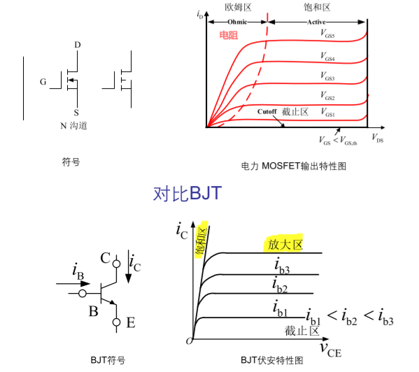
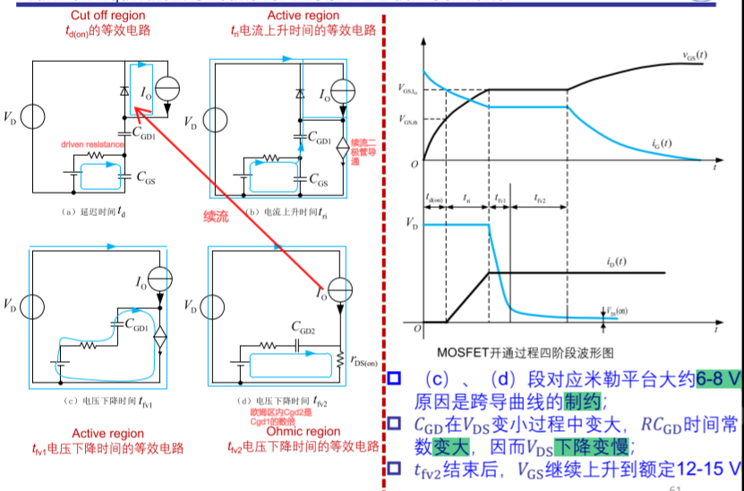
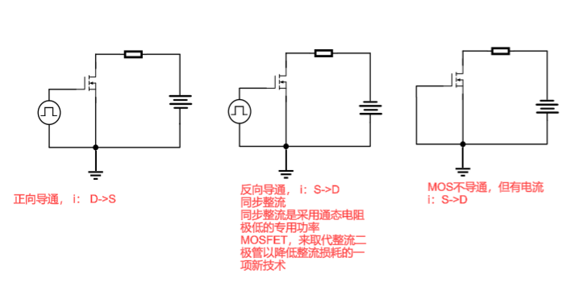
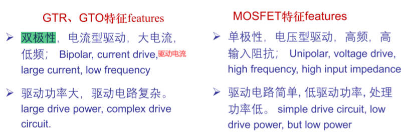
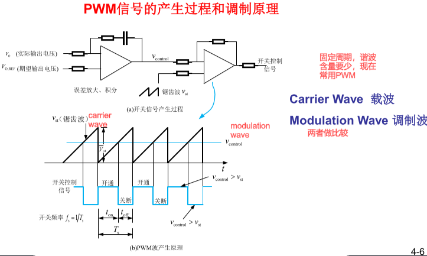
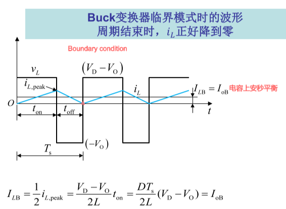
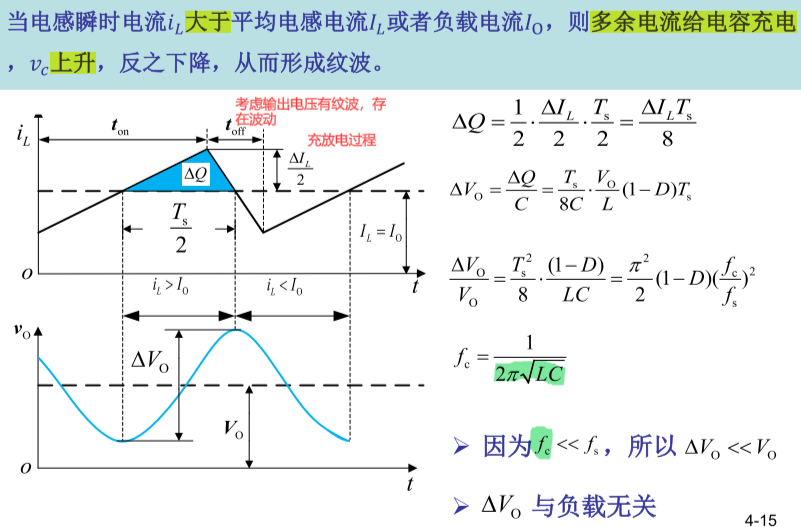
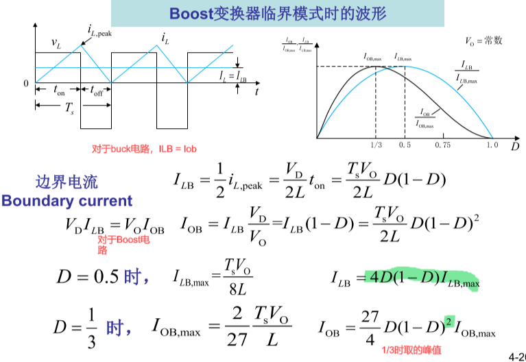
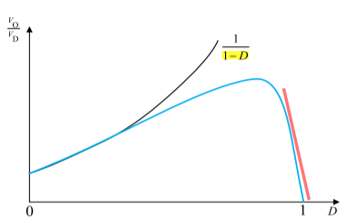
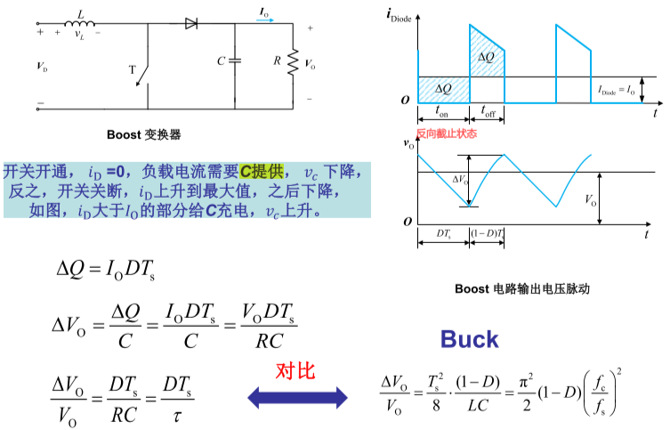

**电力电子技术期中**

### 绪论

器件：有源，无源

，拓扑，控制三要素

四种基本变换

AC-DC整流；DC-AC逆变；AC-AC周波变流器，cyclo-converter；DC-DC斩波器chopper

器件，拓扑，控制是电力电子的三要素，开关模式是现代电力电子的核心特征

### 第二章电力电子器件

#### 2.1概述

##### 特征和概念

1. 处理功率大
2. 工作在开关模式
3. 需要控制电路
4. 需要驱动电路
5. 功率损耗大，需要特殊封装器，散热器

损耗分类

1. 通态损耗
2. 开关损耗：开通损耗，关断损耗
3. 断态损耗

器件分类

1. 不控器件——功率二极管
2. 半控器件——晶闸管
3. 全控器件——BJT(GTR),GTO,MOSFET，IGBT

全控器件又分为电流型和电压型，单极型（一种带电粒子，如power mosfet）、双极型（有电子、空穴两种带电粒子，如GTR和GTO），由双极型和单极型器件复合成的器件称为复合型器件，如IGBT

PN结形成的原因

多子扩散，少子漂移

1. 正偏：形成正向电流，利于多子扩散，抑制漂移（因为电场的原因），少子的存储（越过电荷区后来不及复合）
2. 反偏：漏电流，抑制多子扩散，利于漂移，空间电荷区变宽，少子的抽取（两侧漂移的少子被抽取来不及被补充）

反偏击穿

雪崩击穿，齐纳击穿——可恢复；热击穿（不可恢复）

电容

结电容，频率越高，电容效应越明显

势垒电容：多子的移动

扩散电容：少子的存储和抽取

静态特性：伏安特性

#### 2.2不控器件

功率二极管

1. 尺寸更大，通过电流更大
2. 垂直导电结构，通过电流更大
3. n-低掺杂，耐高压
4. 电导调制效应，正向电流大时，P区注入并积累在N-区的少子空穴浓度增大，为维持漂移区电中性条件，N-区多子浓度也增大，从而使得电阻率下降，电导率增大；==主要是指N-区内的浓度变化==
5. 大量少子需要一定时间来存储在N-区
6. 反偏不能立即关断：功率二极管的空间电荷区两侧（特别是多掺杂N区）储存有大量少子的缘故而并没 有恢复反向阻断能力
7. 延迟时间：$t_d  = t_4$，电流下降时间：$t_f = t_5$，反向恢复时间：$t_{rr} = t_d+t_f$，恢复特性的软度：$\frac{t_f}{t_d}$，用$S_r$表示。
8. 反偏到正偏存在正向恢复时间$t_{rr}$。电流上升率越大，$V_{FP}$越高

正向和反向电压过充的原因：

正向电流的上升会因器件自身的电感而产生较大压降，所以，电流上升率越大，电压过充越高

下降的两个过程：==抽取少子和抽取远端少子==

$V_{DRM}$正向重复峰值电压：$I_G = 0$时允许==重复==加在器件上的峰值电压，50Hz，每次不超过10ms

#### 2.3半控器件

正反馈导通：正偏 + 提供门极电流$𝑰_𝐆$。

关断：反偏+电流过零

维持电流$I_H$ 晶闸管维持导通所必需的最小电流 ==通-断==

擎住电流$I_{L}$，晶闸管刚从断态转入通态并移除触发信号后， 能维持导通所需的最小电流。对同一晶闸管来说，通常$I_{L}$约为$I_H$的2~4倍。 ==断-通==
开通时间turn on time $t_{on}=t_d+t_r$

carrier recombination用于少子复合，无法用外电路抽取

关断时间turn off time $t_{off}=t_{rr}+t_{gr}$。反向恢复时间$t_{rr}$，正向阻断时间$t_{gr}$

#### 2.4全控器件

GTO关断增益大，可以通过门级抽取电流的方法进行关断，但开通关断吸收电路复杂，容易出现误导通现象。二极管反向恢复特性差，存在拖尾过程，不能用于高频工作

GTO可控关断的原因：

1. α2 设计的较大V2 更容易被控制，因而正反馈在关断时候也存在;
2. α1+α2 更接近于1， α1 + α2 ≈ 1. 05 ，因而开通时更接近于饱和区的边界；
3. 多元集成结构使每个GTO元阴极面积很小，门极和阴极间的距 离大为缩短，使得P2基区横向电阻很小，使得从门极抽出较大电流成为可能.

GTR放大倍数有限，需要采用达林顿接法，基极很宽，导致β较小。

BJT（GTR）二次击穿会造成永久损害

==负的温度系数==

功率MOSFET

按导电沟道分为P沟道和N沟道

按栅极电压为零时存在导电沟道与否可分为耗尽型（为0）和增强型（不为0）

- 截止($V_{DS}$>0, $V_{GS}$=0 或开路)： J1处于反偏状态

- 导通($V_{DS}$>0, $V_{GS}$>0)：$V_{GS} >V_{th}$
- 体二极管反向导通($V_{DS}$<0, $V_{GS}$=0 或开路)

MOSFET开通等效电路

了解四个阶段的大致过程即可，$C_{GD}$在增大

米勒平台：第三阶段中只对$C_{GD}$充电，$V_{GS}$保持不变

整个过程看$V_{DS}$要下降到0左右

米勒平台时间等于（$t_{fv1}+t_{fv2}$）

进入欧姆区后给$C_{GS}$充电直到稳态电压约15V

MOSFET的动态特性

1. 开关频率和Cin关系大
2. 可以减小门极电阻RG可以加快开关速度（增大注入电流）
3. 开关时间10~100 ns，频率可以高于 100 kHz
4. 正温度系数，易并联

IGBT可以看成是MOSFET控制的GTR

1. 低导通损耗，类似GTR
2. 电压型器件，类似MOSFET
3. 工作频率高于GTR，低于MOSFET

IGBT三端分别为G，C，E

与MOSFET区别

IGBT开通

$𝑡_{fv2}$不对应米勒平台 ；MOSFET $𝑡_{fv2}$对应米勒平台的原因是$V_{DS}$变小，自身 $C_{GD}$及充电时间常数变很大。而IGBT中，MOSFET的$C_{GD}$是和GTR结电容串联后共同决定时间常数

IGBT关断

电流下降分两段，$𝑡_{fv1}+𝑡_{fv2}$,并存在$𝑡_{fv2}$拖尾电流时间$𝑡_{fv1}$对应IGBT内部MOSFET和GTR一起关断，电流下 降较快，$𝑡_{fv1}$时间，MOSFET已经关断，PNP晶体管无基区少子抽取通道，晶体管基区少子复合缓慢，造成电流下降缓慢，成为拖尾电流。

IGBT特征

1. 开关速度快（相对于GTR）
2. 通态电压比MOSFET低（导通损耗低）
3. 高输入阻抗（电阻串联）
4. 驱动功率低（电压驱动）
5. 驱动电路简单
6. 有拖尾电流（漂移层存储电荷导致）
7. 存在==擎住效应==——内部存在一个寄生晶闸管导致

### 第四章 DC-DC变换器

#### 4.1 概述

分类：

非隔离型：Buck 变换器，Boost 变换器，Buck-Boost变换器，Cúk 变换器。非隔离DC-DC变换器按所用有源功率器件的个数分为单管、双管和四管。半桥和全桥直流变换器是常用的双管、四管直流变换器。

隔离型DC-DC变换器：单管的有正激式和反激式两种，双管有双管正激、双管反激、推挽和半桥四种，四管就是全桥直流变换器。

按能量传递分为：单向和双向两种。

#### 4.2 开关模式控制

脉冲频率调制（PFM）：固定开通或关断时间、调节脉冲频率的方法实现稳压输出的技术。

脉冲宽度调制（PWM）：固定周期，调节占空比来调节输出电压。

实现通过$v_{control}$调制波和高频的锯齿波称为载波$v_{tri}$来控制占空比。

> 学习思路
> 电路拓扑：D，T，R，L，C的位置
> 工作模态（working mode）
> 伏秒平衡（V-S balance）
> 电压增益（voltage gain）
> 边界电流（boundary current）CCM&DCM
> 纹波分析（ripple analysis）

#### 4.3 降压式变换器

伏秒平衡

$(V_D-V_O)t_{on} = V_Ot_{off}$推得$\frac{V_O}{V_D}=\frac{t_{on}}{T_{s}}=D$

CCM模式的判断

CCM模式下的纹波分析

#### 4.4 Boost升压变换器

伏秒平衡

$V_Dt_{on} = (V_O-V_D)t_{off}$推得$\frac{V_O}{V_D}=\frac{T_{s}}{T_{s}-t_{on}}=\frac{1}{1-D}$

CCM模式分析

寄生参数对于Boost电压增益的影响

因为电感，电容，开关等具有寄生参数导致损耗，所以Boost电路实际的增益曲线并不是线性的，在D逼近1时，电压增益大幅下降，事实上，Boost电路的占空比D是有限制的，通常电压增益限制在4倍以内。

Boost变换器输出电压的纹波

DCM优势：

1. L尺寸小
2. 没有二极管反向恢复损耗
3. 效率高（所有存储能量都转移给负载）

DCM劣势

1. EMI电磁干扰
2. D调节困难，可能会跑到CCM模式

#### Buck-Boost变换器

