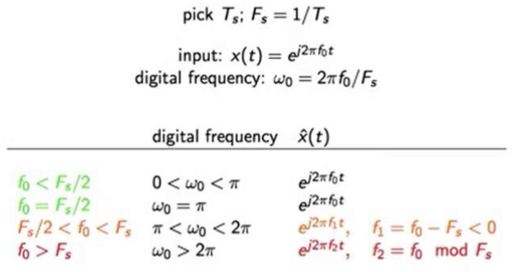
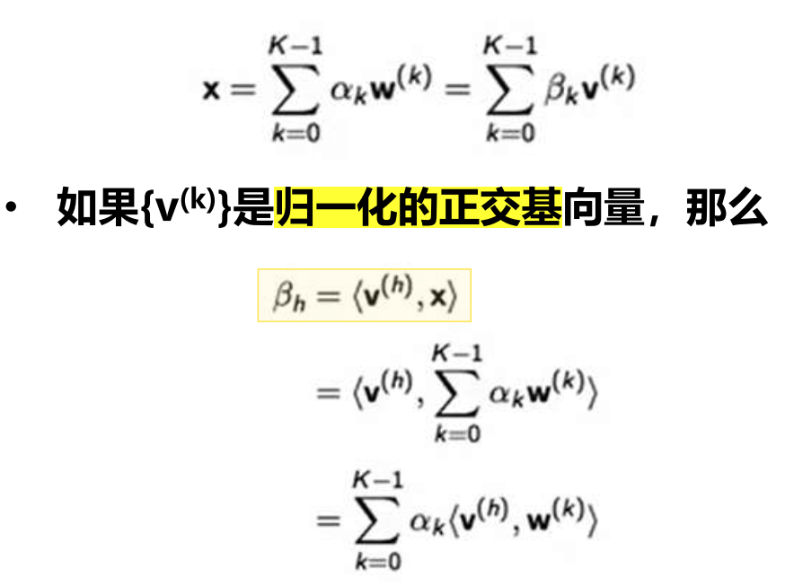
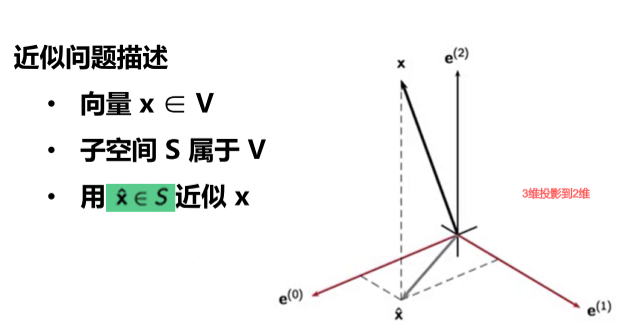

**数字信号处理复习**

重要公式离散转模拟
$$
x[n] = sin(\omega _{0}n+\theta)=x_{a}(nT_{s})=sin(2\pi f_{0}nT_{s}+\theta)
$$
具有周期性的正弦序列满足

$$
\omega _{0} = 2\pi \frac{M}{N}, M,N \in Z
$$

在离散时间中$0\le \omega <2\pi$，其他是混叠的

DTFT：对离散时间的傅里叶变换，转换到频域中去，是连续的

对DTFT得到的频域序列进行采样，再取周期序列的主值空间，得到的便是DFT（离散傅里叶变换），方便计算机计算

这样IDFT得到的便是时域的周期延拓，==频域采样，时域周期延拓；时域采样，频域周期延拓==

DFS与DFT本质一致，DFS = 周期性序列一个周期的DFT

$n < 0 时 x[n] = 0$的序列称为因果序列。

线性移不变系统稳定的充分必要条件是其单位冲激响应绝对可和
$$
\sum_{n=-\infin}^{\infin} |h[n]| = P < \infin
$$
==FT变换公式==
$$
X(f)=\int_{-\infin}^{\infin}x(t)e^{-j2\pi ft}dt\\
x(t)=\int_{-\infin}^{\infin}X(f)e^{j2\pi ft}df
$$
另外一种表达形式：$\Omega = 2\pi f$
$$
X(j\Omega )=\int_{-\infin}^{\infin}x(t)e^{-j\Omega t}dt\\
x(t)=\frac{1}{2\pi}\int_{-\infin}^{\infin}X(j\Omega )e^{j\Omega t}d\Omega
$$
==重要例子==
$$
\Phi(f)=\frac{1}{F_{s}}rect(\frac{f}{F_{s}})\\
\psi(t)=sinc(\frac{t}{T_{s}})
$$
插值应该是无限可微的

多项式插值

- [ ] 拉格朗日插值函数

$$
L_n^{(N)}(t) = \prod_{k=-N\ and\ k\ne n}^{N}\frac{t-k}{n-k}, n=-N,...,N \\
p(t) = \sum_{n=-N}^{N}x[n]L_n^{(N)}(t)
$$

- 重要特征：无限可微
- 缺点：拉格朗日插值函数定义依赖于N，如果数据长度改变，多项式改变

如果不要求无限可微，可采用核函数插值法，零阶插值、一阶插值、三阶插值……
$$
\lim_{N\rightarrow \infin} L_n^{(N)}(t) = sinc(t-n) 
$$
混叠公式

使用==低通滤波==将信号变成==带限信号==

采样时每隔$T_s$关闭一次开关，采样一次

信号流图上乘除上系数

不完备空间的例子：有理数集合
$$
x_{n}=\sum_{k=0}^{n} \frac{1}{k!} \in Q ~~ but~~ \lim_{n\rightarrow \infin}x_{n}=e\notin Q
$$
找到基函数

找到正交基前的系数，便是DFT的过程

近似空间

正交投影是“最优”近似，有着最小范数误差

- [ ] sinc采样的==空间解释==

STFT用窗取一段信号进行DFT

DFT定义
$$
w_k[n]=e^{j\frac{2\pi}{N}nk},~~n,k=0,1,...,N-1
$$
用这个基去表示x[n]

DFT在幅度上是对称的

