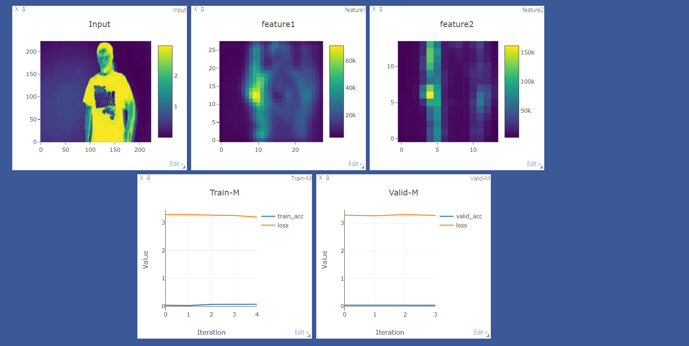

**五月二十三日**

早上被雨声吵醒了，赖在被窝中不愿意起来，反正是周日，自己睡久点有什么关系吗？还是要打起精神，好好完成自己的任务，上午把工科创2A的代码搞定了就没做什么了。

下午和晚上都待在实验室，慢慢看着代码，更改数据集，跑80轮。了解了opencv读取.avi帧数，使用visdom可视化训练结果。

晚上又和刘卓聊了一会，陷入感情之中的人如果没有得到那么就会很烦躁，虽然已经足够关心了，但如果你没有做到最好，为什么会需要你呢？自己要不卑不亢，不能太舔了，适度的关心却别让对方以为什么要求都答应，但也要让对方感受到独一无二的关心。当真正碰到适合的人你就会有能力去追求自己的美好了。