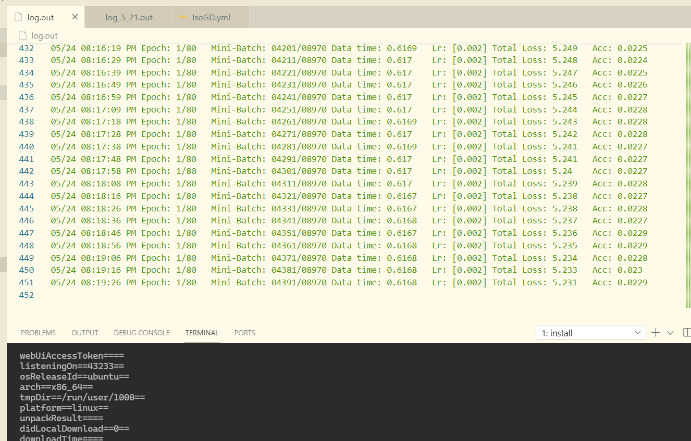

**五月二十四日**

本来的原本的老年生活怎么就这么累啊？还想看看生活大爆炸娱乐一下。

上午待在图书馆里还是那么的轻松自在，自己心情也还是不错，玩了一会三国杀，写了一点代码。下午开开心心的打网球，回来还洗了澡，心情也是舒畅，到了晚上却是什么gb东西。

- [ ] 训练代码突然中断
- [ ] 小车调试不断被喷

训练代码为什么突然就停了啊？又不是一帆风顺，为什么总是要这么磕磕绊绊，就是没有效果。应该是内存问题吧，存不了这么多数据。跟学长说一下吧，总是停止在这个位置训练的时候就把数据量调下来。

晚上的小车调试更是让人心烦，总是说自己没有做到他的要求，直接控制就有问题，电机用pid，舵机又不用pid，写的代码有问题，改来改去就是没有改好。从原来的motor.h说不能直接用duty占空比控制，说要用pid，改完之后又说舵机控制用1514有问题，改来改去结果确实没有减1，数组是从0开始的，自己没有想到，减完1后所有代码通了。

自己在调试代码的过程中总是被说，自己也越来越难过，没有什么继续做下去的动力，自己不可能是没有能力的。自己学习能力强，自己也能够静下心来好好的分析代码，慢慢的寻找问题，这种事不能急。但还是被嘲讽了，自己就这样被说，越来越哀，自己整个一个晚上情绪都不怎么好。回到寝室，自己的表情也都挂在了脸上，一回来就大叫了一声“艹”，就被嘲讽说是不是犯病。如果真的不是特别烦，也不会突然这样了，自己的心理暗示也是不断在让自己忧愁。最后心里想到的寻找心里安慰的居然还是段颖，已经让自己够难过了，第一个想到的却还是她，自己好好调整吧，加油，问题都可以慢慢解决的！

