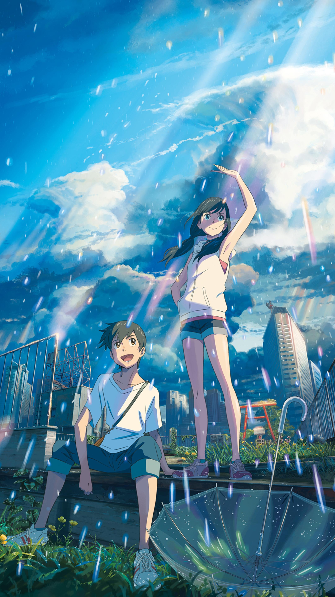

**天气之子**

画面、音乐都是唯美含蓄。

- **这些都不重要，有你在身边就够了。**
- **能让人放弃对天气，不，是对世界的执念。**
- **这不是一件本身就比那束光还暖还亮，男主一直追寻的那道光的尽头的答案吗？**

大部分影片都是处于留白，留下无尽的想象。自己的感受就是一个青年从懵懂慢慢地走向成长，要承担自己的责任，为自己所爱的事物去不断努力，男生莽撞，女生担负着照顾其他的职责。

不断地成长吧！为了自己的以后。