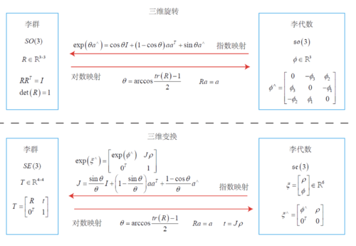
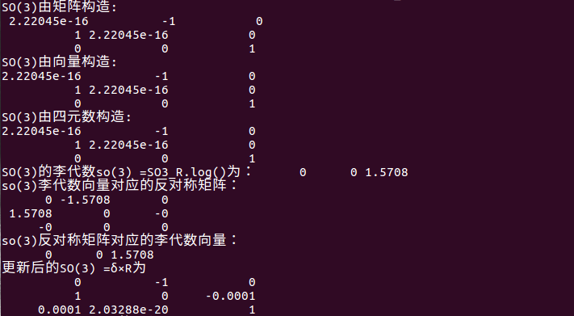
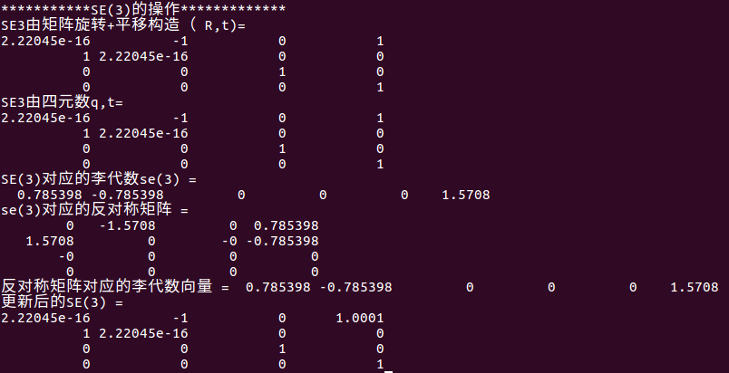

**李群和李代数**

- 三维旋转矩阵构成特殊正交群，SO(3),变换矩阵构成了特殊欧式群SE(3).

$$
SO(3)=\{R \in R^{3 \times 3} \mid RR^{T} = I,det(R)=I\}
$$

$$
\operatorname{SE}(3)=\left\{\mathrm{T}=\left[\begin{array}{cc}
R & t \\
0 & 1
\end{array}\right] \in \mathrm{R}^{4 \times 4} \mid R \in S O(3), t \in R^{3}\right\}
$$


- 从上面看群是一种集合加上一种运算的代数结构。把集合记作A，运算记作$\bullet $，群记为G=(A,$\bullet $),群应满足以下四个特性（封结幺逆）：

1. 封闭性：$\forall a_{1}, a_{2} \in A, \quad a_{2} \bullet a_{3} \in A$
2. 结合律：$\forall a_{1}, a_{2}, a_{3} \in A, \quad\left(a_{1} \bullet a_{2}\right) \bullet a_{3}=a_{1} \bullet\left(a_{2} \bullet a_{3}\right)$
3. 幺元：$\exists a_{0} \in A, s . t \forall a \in A, a_{0} \bullet a=a \bullet a_{0}=a$
4. 逆：∀a∈A,∃$a^{−1}$∈A, s.t $a \bullet  a^{−1}$ = a

- 李群是指具有连续光滑性质的群,像一般的整数离散群不具有连续性，SO(3), SE(3)在实数空间上是连续的，表示一个位置变换到另一个位置，路径是连续的。但是群的概念只定义了乘法，没有加法。

- 李代数的引出：

  李代数由一个集合V、一个数域F和一个二元运算[ ，]（李括号）组成。称（V,F，[ , ]）为一个李代数，记为g.

  在实际应用中我们估计相机的位置和姿态时，由于干扰，不可能没有误差，那么产生误差需要矫正，我们会用补偿量ΔR,ΔT 去补偿误差。然而群的定义对加法没有封闭性，比如两个旋转或变换矩阵相加后不再表示一个旋转或变换矩阵，失去了原有的意义，于是李代数的提出为此问题提供了解决思路，把SE(3)空间的T映射为李代数se(3),它由向量组成，我们在中学数学就知道，向量相加还表示为一个向量（例如平行四边形原则），李代数对加法具有封闭性（加完之后还是向量）。这样可以通过李代数求导间接对变换矩阵T进行求导。在优化相机位姿时，每次迭代更新一个位姿的增量δ，使目标函数最小，那么这个δ就是通过对T微分得到的。它们对于某时刻的R(t)(李群空间)，存在一个三维向量$\phi = (\phi_1, \phi_2, \phi_3 )$的李代数空间来描述R在t时刻的导数。

$$
\dot{R}(t)=\phi(t)^{\wedge} R(t)=\left[\begin{array}{ccc} 0 & -\phi_{3} & \phi_{2} \\ \phi_{3} & 0 & -\phi_{1} \\ -\phi_{2} & \phi_{1} & 0 \end{array}\right] R(t)
$$

- 指数映射：向量$\phi = (\phi_1, \phi_2, \phi_3 )$反映了R的导数性质，它们之间的微分关系可以描述为：李代数so(3)对应李群SO(3) 在原点附近的正切空间。换句话说，李代数so(3)是三维向量$\phi = (\phi_1, \phi_2, \phi_3 )$的集合，每个$\phi (i)$的反对称矩阵都$\phi (i)$^可以表示SO(3)上旋转矩阵$R(i)$的导数,R和$\phi$又呈现一个指数映射关系：$R(t)=exp(\phi_0 ^{\wedge}t)$

  $\exp \left(\phi^{\wedge}\right)=\exp \left(\theta \mathrm{a}^{\wedge}\right)=\sum_{n=0}^{\infty} \frac{1}{n !}\left(\theta \mathrm{a}^{\wedge}\right)^{n}$经过泰勒展开后变为$\exp \left(\theta \mathrm{a}^{\wedge}\right)= cos\left( \theta I\right) + \left( 1- cos\theta \right)aa^{T} + sin \theta \mathrm{a}^{\wedge}$又回到了罗德里格斯。对于三维旋转和变换的关系图如下;



- 李代数求导与扰动模型：

 　以SO(3)为例，当李代数的so(3)做加法时，在李群SO(3)是否对应为两个矩阵的乘积，$exp(ϕ^{\wedge}_1)exp(ϕ^{\wedge}_2)=exp((ϕ1+ϕ2)_{\wedge})？ln(exp(A)exp(B))=A+B？$答案是对矩阵运算都不成立，BCH公式给出了近似解：
$$
\begin{aligned}
& \ln \left(\exp \left(A \phi_{1}^{\wedge}\right) \exp \left(\phi_{2}^{\wedge}\right)\right)^{\vee} \\
\approx &\left\{\begin{array}{l}
J_{l}\left(\phi_{2}\right)^{-1} \phi_{1}+\phi_{2}, \phi_{1} \min \\
J_{r}\left(\phi_{1}\right)^{-1} \phi_{2}+\phi_{1}, \phi_{2} \min
\end{array}\right.
\end{aligned}
$$


　　以下标为l的左乘模型来说，意思是，我们对一个旋转矩阵R2 (李代数$\phi_2$)左乘一个微小旋转矩阵R1 (李代数$\phi_1$ )，看成是李代数 $\phi_2$加上一项

$$
J_{l}\left(\phi_{2}\right)^{-1} \phi_{1}
$$
　　右乘模型同理。式中有一个近似的雅可比$J_l$,再通俗的形象一下就是，假定对一个旋转R(李代数$\phi $)产生的漂移进行矫正，左乘一个ΔR (李代数Δϕ)，在李群上的结果为ΔR$\bullet$R

用BCH近似为

$$
J_{l}\left(\phi\right)^{-1}  \Delta\phi + \phi
$$
　　合起来就是$exp(\Delta \phi^{\wedge})exp(\phi^{\wedge})= exp({(\phi +J_{l}\left(\phi\right)^{-1}  \Delta\phi )}^{\wedge})$，**然而上面刚刚说到在李代数上加法是封闭的，可以进行加法运算**，一个$\phi + \Delta \phi$

　　*可以近似为李群上带左右雅可比的乘法:*$exp((\phi +\Delta \phi)^{\wedge})=exp((J_{l}\Delta \phi)^{\wedge})exp(\phi^{\wedge})=exp(\phi^{\wedge})exp({(J_{r}  \Delta\phi )}^{\wedge})$

- 求导运算1

　　空间中有一向量p,然后我们对其进行了R的旋转变换变为Rp,求旋转之后Rp对旋转R的导数，$\frac{\partial(R p)}{\partial R}$，但是没有加法，无法按照导数定义计算，因此转为李代数计算。

$$
\frac{\partial(R p)}{\partial R}=\frac{\partial\left(\exp \left(\phi^{\wedge}\right) p\right)}{\partial \phi}=-(R p)^{\wedge} J_{l}
$$
　　结果中有一个雅可比，在应用中不太好处理，又出现了扰动模型来替代，思路是对R进行一次扰动ΔR(左乘形式），看结果相对扰动的变化率。 ΔR对应的李代数为$\varphi$，$\frac{\partial(R p)}{\partial \varphi}=-(R p)^{\wedge}$,这样就没有了雅可比，对实际应用更加合理。

-  实现才是硬道理：

[](javascript:void(0);)

```
 1 #include<iostream>
 2 #include<cmath>
 3 #include<Eigen/Core>
 4 #include<Eigen/Geometry>
 5 #include"sophus/se3.h"
 6 #include"sophus/so3.h"
 7 
 8 using namespace std;
 9 using namespace Eigen;
10 
11 int main(int argc,char **argv)
12 {
13     // 沿Z轴转90度的旋转矩阵用旋转向量表示
14     Eigen::Matrix3d R = Eigen::AngleAxisd(M_PI/2, Eigen::Vector3d(0,0,1)).toRotationMatrix();
15     
16     Sophus::SO3 SO3_R(R);               // Sophus::SO(3)可以直接从旋转矩阵构造
17     Sophus::SO3 SO3_v( 0, 0, M_PI/2 );  // 亦可从旋转向量构造
18     Eigen::Quaterniond q(R);            // 或者四元数
19     Sophus::SO3 SO3_q( q );
20     // 上述表达方式都是等价的
21    
22     cout<<"SO(3)由矩阵构造:\n "<<SO3_R.matrix()<<endl;
23     cout<<"SO(3)由向量构造: \n"<<SO3_v.matrix()<<endl;
24     cout<<"SO(3)由四元数构造:\n"<<SO3_q.matrix()<<endl;
25     
26     // 使用对数映射获得它的李代数
27     Eigen::Vector3d so3 = SO3_R.log();
28     cout<<"SO(3)的李代数so(3) =SO3_R.log()为： "<<so3.transpose()<<endl;
29     // hat 为向量到反对称矩阵
30     cout<<"so(3)李代数向量对应的反对称矩阵： \n"<<Sophus::SO3::hat(so3)<<endl;
31     // 相对的，vee为反对称矩阵到向量
32     cout<<"so(3)反对称矩阵对应的李代数向量： \n "<<Sophus::SO3::vee( Sophus::SO3::hat(so3) ).transpose()<<endl;
33     // transpose纯粹是为了输出美观一些
34     
35     // 增量扰动模型的更新
36     Eigen::Vector3d update_so3(1e-4, 0, 0); //假设更新量为这么多
37     Sophus::SO3 SO3_updated = Sophus::SO3::exp(update_so3)*SO3_R;
38     cout<<"更新后的SO(3) =δ×R为 \n"<<SO3_updated.matrix()<<endl;
39     
40     cout<<"***********SE(3)的操作*************"<<endl;
41     // 对SE(3)操作大同小异
42     Eigen::Vector3d t(1,0,0);           // 沿X轴平移1
43     Sophus::SE3 SE3_Rt(R, t);           // 从R,t构造SE(3)
44     Sophus::SE3 SE3_qt(q,t);            // 从q,t构造SE(3)
45     cout<<"SE3由矩阵旋转+平移构造（ R,t)= "<<endl<<SE3_Rt.matrix()<<endl;
46     cout<<"SE3由四元数q,t= "<<endl<<SE3_qt.matrix()<<endl;
47     // 李代数se(3) 是一个六维向量，方便起见先typedef一下
48     typedef Eigen::Matrix<double,6,1> Vector6d;
49     Vector6d se3 = SE3_Rt.log();
50     cout<<"SE(3)对应的李代数se(3) =\n "<<se3.transpose()<<endl;
51     // 观察输出，会发现在Sophus中，se(3)的平移在前，旋转在后.
52     // 同样的，有hat和vee两个算符
53     cout<<"se(3)对应的反对称矩阵 = "<<endl<<Sophus::SE3::hat(se3)<<endl;
54     cout<<"反对称矩阵对应的李代数向量 = "<<Sophus::SE3::vee( Sophus::SE3::hat(se3) ).transpose()<<endl;
55     
56     // se(3)的扰动
57     Vector6d update_se3; //更新量
58     update_se3.setZero();//六维更新量
59     update_se3(0,0) = 1e-4d;//改变其中一个量来产生观测
60     Sophus::SE3 SE3_updated = Sophus::SE3::exp(update_se3)*SE3_Rt;
61     cout<<"更新后的SE(3) = "<<endl<<SE3_updated.matrix()<<endl;
62     
63 return 0;
64 }
```

[](javascript:void(0);)

 



 

