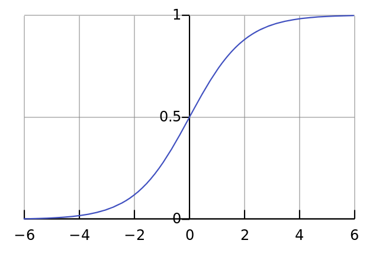
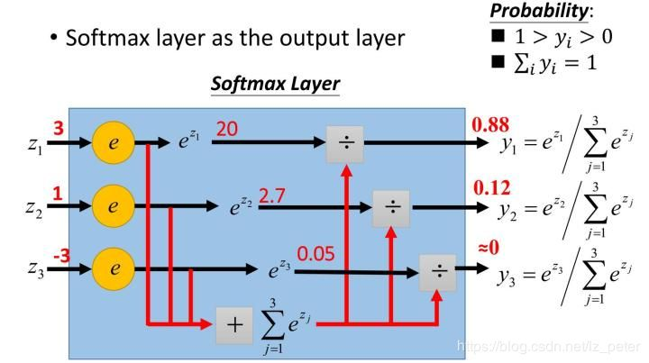

**归一化**

sigmoid和softmax函数区别

## 分类问题

### **1 Sigmoid函数**

Sigmoid =**多标签分类问题**=多个正确答案=非独占输出（例如胸部X光检查、住院）。构建分类器，解决有多个正确答案的问题时，用Sigmoid函数分别处理各个原始输出值。

**Sigmoid函数**是一种logistic函数，它将任意的值转换到$[0,1]$之间，如图1所示，函数表达式为：$Sigmoid = \frac{1}{1 + e^{-x}}$ 。

它的导函数为： $Sigmoid'(x) = Sigmoid(x)*(1-Sigmoid(x))$。



​																									图1：Sigmoid函数

**优点**：1. Sigmoid函数的输出在(0,1)之间，输出范围有限，优化稳定，可以用作输出层。2. 连续函数，便于求导。

**缺点**：1. 最明显的就是饱和性，从上图也不难看出其两侧导数逐渐趋近于0，容易造成梯度消失。2.==激活函数的偏移现象==。Sigmoid函数的输出值均大于0，使得输出==不是0的均值==，这会导致后一层的神经元将得到上一层非0均值的信号作为输入，这会对梯度产生影响。 3. 计算复杂度高，因为Sigmoid函数是指数形式。

### 2 Softmax函数

Softmax =**多类别分类问题**=只有一个正确答案=互斥输出（例如手写数字，鸢尾花）。构建分类器，解决只有唯一正确答案的问题时，用Softmax函数处理各个原始输出值。Softmax函数的分母综合了原始输出值的所有因素，这意味着，Softmax函数得到的不同概率之间相互关联。

**Softmax函数**，又称归一化指数函数，函数表达式为：$Softmax = \frac{e^{x_i}}{\sum_{j=1}^{n}e^{x_j}}$。



​																				图2：Softmax函数计算过程

**Softmax函数是二分类函数Sigmoid在多分类上的推广，目的是将多分类的结果以概率的形式展现出来。**如图2所示，Softmax直白来说就是将原来输出是3,1,-3通过Softmax函数一作用，就映射成为(0,1)的值，而这些值的累和为1（满足概率的性质），那么我们就可以将它理解成概率，在最后选取输出结点的时候，我们就可以选取概率最大（也就是值对应最大的）结点，作为我们的预测目标。

由于Softmax函数先拉大了输入向量元素之间的差异（通过指数函数），然后才归一化为一个概率分布，在应用到分类问题时，它使得各个类别的概率差异比较显著，最大值产生的概率更接近1，这样输出分布的形式更接近真实分布。

**Softmax可以由三个不同的角度来解释。从不同角度来看softmax函数，可以对其应用场景有更深刻的理解：**

1. softmax可以当作arg max的一种平滑近似，与arg max操作中暴力地选出一个最大值（产生一个one-hot向量）不同，softmax将这种输出作了一定的平滑，即将one-hot输出中最大值对应的1按输入元素值的大小分配给其他位置。
2. softmax将输入向量归一化映射到一个类别概率分布，即 个类别上的概率分布（前文也有提到）。这也是为什么在深度学习中常常将softmax作为MLP的最后一层，并配合以交叉熵损失函数（对分布间差异的一种度量)。
3. 从概率图模型的角度来看，softmax的这种形式可以理解为一个概率无向图上的联合概率。因此你会发现，条件最大熵模型与softmax回归模型实际上是一致的，诸如这样的例子还有很多。由于概率图模型很大程度上借用了一些热力学系统的理论，因此也可以从物理系统的角度赋予softmax一定的内涵。

### 3 总结

1. 如果模型输出为非互斥类别，且可以同时选择多个类别，则采用Sigmoid函数计算该网络的原始输出值。
2. 如果模型输出为互斥类别，且只能选择一个类别，则采用Softmax函数计算该网络的原始输出值。
3. Sigmoid函数可以用来解决多标签问题，Softmax函数用来解决单标签问题。[[1\]](https://zhuanlan.zhihu.com/p/356976844#ref_1)
4. 对于某个分类场景，当Softmax函数能用时，Sigmoid函数一定可以用。

### 4. 二分类任务

对于二分类问题来说，**理论上，两者是没有任何区别的。**由于我们现在用的Pytorch、TensorFlow等框架计算矩阵方式的问题，导致两者在反向传播的过程中还是有区别的。实验结果表明，两者还是存在差异的，对于不同的分类模型，可能Sigmoid函数效果好，也可能是Softmax函数效果。

**首先我们先理论上证明一下二者没有本质上的区别**，对于二分类而言（以输入$x_1$为例)：

Sigmoid函数： $output(x_1)=\frac{1}{1+e^{-x_1}} (1)$

Softmax函数： $output(x_2)=\frac{e^{-x_1}}{e^{-x_1}+e^{-x_2}} (2)$

由公式（2）我们可知， $x_1-x_2$可以用$z_1$代替，即Softmax函数可以写成：  $output(z_1)=\frac{1}{1+e^{-z_1}} $，和公式（1)完全相同，所以理论上来说两者是没有任何区别的。

**然后我们再分析为什么两者之间还存着差异（以Pytorch为例）：**

首先我们要明白，当你用Sigmoid函数的时候，你的最后一层全连接层的神经元个数为1，而当你用Softmax函数的时候，你的最后一层全连接层的神经元个数是2。这个很好理解，因为Sigmoid函数只有是目标和不是目标之分，实际上只存在一类目标类，另外一个是背景类。而Softmax函数将目标分类为了二类，所以有两个神经元。这也是导致两者存在差异的主要原因。

**Sigmoid函数**针对两点分布提出。神经网络的输出经过它的转换，可以将数值压缩到(0,1)之间，得到的结果可以理解成**分类成目标类别的概率P，而不分类到该类别的概率是(1 - P)**，这也是典型的两点分布的形式。

**Softmax函数**本身针对多项分布提出，当类别数是2时，它退化为二项分布。而它和Sigmoid函数真正的区别就在——二项分布包含两个分类类别（姑且分别称为A和B），而两点分布其实是针对一个类别的概率分布，其对应的那个类别的分布直接由1-P得出。

简单点理解就是，**Sigmoid函数，我们可以当作成它是对一个类别的“建模”**，将该类别建模完成，另一个相对的类别就直接通过1减去得到。**而softmax函数，是对两个类别建模**，同样的，得到两个类别的概率之和是1。

神经网络在做二分类时，使用Softmax还是Sigmoid，做法其实有明显差别。由于Softmax是对两个类别（正反两类，通常定义为0/1的label）建模，所以对于NLP模型而言（比如泛BERT模型），Bert输出层需要通过一个nn.Linear()全连接层压缩至2维，然后接Softmax（Pytorch的做法，就是直接接上torch.nn.CrossEntropyLoss）；而Sigmoid只对一个类别建模（通常就是正确的那个类别），所以Bert输出层需要通过一个nn.Linear()全连接层压缩至1维，然后接Sigmoid（torch就是接torch.nn.BCEWithLogitsLoss）。

总而言之，Sotfmax和Sigmoid确实在二分类的情况下可以化为相同的数学表达形式，但并不意味着二者有一样的含义，而且二者的输入输出都是不同的。Sigmoid得到的结果是“分到正确类别的概率和未分到正确类别的概率”，Softmax得到的是“分到正确类别的概率和分到错误类别的概率”。

**一种常见的错法（NLP中）：**即错误地将Softmax和Sigmoid混为一谈，再把BERT输出层压缩至2维的情况下，却用Sigmoid对结果进行计算。这样我们得到的结果其意义是什么呢？

假设我们现在BERT输出层经nn.Linear()压缩后，得到一个二维的向量：

```text
[-0.9419267177581787, 1.944047451019287]
```

对应类别分别是(0,1)。我们经过Sigmoid运算得到：

```text
tensor([0.2805, 0.8748])
```

前者0.2805指的是分类类别为0的概率，0.8748指的是分类类别为1的概率。二者相互独立，可看作两次独立的实验（显然在这里不适用，因为0-1类别之间显然不是相互独立的两次伯努利事件）。所以显而易见的，二者加和并不等于1。

若用softmax进行计算，可得：

```text
tensor([0.0529, 0.9471])
```

这里两者加和是1，才是正确的选择。

**经验：**

**对于NLP而言**，这两者之间确实有差别，Softmax的处理方式有时候会比Sigmoid的处理方式好一点。

**对于CV而言**，这两者之间也是有差别的，Sigmoid的处理方式有时候会比Softmax的处理方式好一点。

两者正好相反，这只是笔者的实验经验，建议大家两者都试试。