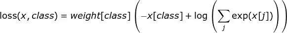

**Pytorch的坑**

1. **nn.Module.cuda() 和 Tensor.cuda() 的作用效果差异**

- 对于nn.Module:

```python
model = model.cuda() 
model.cuda() 
```

对model自身进行的内存迁移。

- 对于tensor

和nn.Module不同，调用tensor.cuda()只是返回这个tensor对象在GPU内存上的拷贝，而不会对自身进行改变。因此必须对tensor进行重新赋值，即tensor=tensor.cuda().

```python
model = create_a_model()
tensor = torch.zeros([2,3,10,10])
model.cuda()
tensor.cuda()
model(tensor)    # 会报错
tensor = tensor.cuda()
model(tensor)    # 正常运行
```

2. **PyTorch 0.4 计算累积损失的不同**

以广泛使用的模式total_loss += loss.data[0]为例。Python0.4.0之前，loss是一个封装了(1,)张量的Variable，但Python0.4.0的loss现在是一个零维的标量。对标量进行索引是没有意义的（似乎会报 invalid index to scalar variable 的错误）。使用loss.item()可以从标量中获取Python数字。所以改为：

```python
total_loss += loss.item()
```

3. **torch.Tensor.detach()的使用**

detach()的官方说明如下：

```python
Returns a new Tensor, detached from the current graph.
    The result will never require gradient.
```

假设有模型A和模型B，我们需要将A的输出作为B的输入，但训练时我们只训练模型B. 那么可以这样做：

```python
input_B = output_A.detach()
```

它可以使两个计算图的梯度传递断开，从而实现我们所需的功能。

4. **ERROR: Unexpected bus error encountered in worker. This might be caused by insufficient shared memory (shm)**

   出现这个错误的情况是，在服务器上的docker中运行训练代码时，batch size设置得过大，shared memory不够（因为docker限制了shm）.解决方法是，将Dataloader的num_workers设置为0.

5. **pytorch中loss函数的参数设置**

   以CrossEntropyLoss为例：

   ```python
   CrossEntropyLoss(self, weight=None, size_average=None, ignore_index=-100, reduce=None, reduction='elementwise_mean')
   ```

   - 若 reduce = False，那么 size_average 参数失效，直接返回向量形式的 loss，即batch中每个元素对应的loss.

   - 若 reduce = True，那么 loss 返回的是标量：

   - - 如果 size_average = True，返回 loss.mean().
     - 如果 size_average = False，返回 loss.sum().

   - weight : 输入一个1D的权值向量，为各个类别的loss加权，如下公式所示：

   

   

   - ignore_index : 选择要忽视的目标值，使其对输入梯度不作贡献。如果 size_average = True，那么只计算不被忽视的目标的loss的均值。
   - reduction : 可选的参数有：‘none’ | ‘elementwise_mean’ | ‘sum’, 正如参数的字面意思，不解释。

6. **多GPU的处理机制**

   使用多GPU时，应该记住pytorch的处理逻辑是：

   1)在各个GPU上初始化模型。

   2)前向传播时，把batch分配到各个GPU上进行计算。

   3)得到的输出在主GPU上进行汇总，计算loss并反向传播，更新主GPU上的权值。

   4)把主GPU上的模型复制到其它GPU上

7. **num_batches_tracked参数**

   读取模型参数时出现了错误

   KeyError: 'unexpected key "module.bn1.num_batches_tracked" in state_dict'

   经过研究发现，在pytorch 0.4.1及后面的版本里，BatchNorm层新增了num_batches_tracked参数，用来统计训练时的forward过的batch数目，源码如下（pytorch0.4.1）：

   ```python
       if self.training and self.track_running_stats:
           self.num_batches_tracked += 1
           if self.momentum is None:  # use cumulative moving average
               exponential_average_factor = 1.0 / self.num_batches_tracked.item()
           else:  # use exponential moving average
               exponential_average_factor = self.momentum
   ```

   大概可以看出，这个参数和训练时的归一化的计算方式有关。

   因此，我们可以知道该错误是由于训练和测试所用的pytorch版本(0.4.1版本前后的差异)不一致引起的。具体的解决方案是：如果是模型参数（Orderdict格式，很容易修改）里少了num_batches_tracked变量，就加上去，如果是多了就删掉。偷懒的做法是将load_state_dict的strict参数置为False，如下所示：

   ```python
   load_state_dict(torch.load(weight_path), strict=False)
   ```

   还看到有人直接修改pytorch 0.4.1的源代码把num_batches_tracked参数删掉的，这就非常不建议了。

8. **训练时损失出现nan的问题**

   训练模型时出现了损失为nan的情况，发现是个大坑。

   可能导致梯度出现nan的三个原因：

   **1.梯度爆炸**。也就是说梯度数值超出范围变成nan. 通常可以调小学习率、加BN层或者做梯度裁剪来试试看有没有解决。

   **2.损失函数或者网络设计。**比方说，出现了除0，或者出现一些边界情况导致函数不可导，比方说log(0)、sqrt(0).

   **3.脏数据。**可以事先对输入数据进行判断看看是否存在nan.

   补充一下nan数据的判断方法：

   注意！像nan或者inf这样的数值不能使用 == 或者 is 来判断！为了安全起见统一使用 math.isnan() 或者 numpy.isnan() 吧。

   例如：

   ```python
   import numpy as np
   
   # 判断输入数据是否存在nan
   if np.any(np.isnan(input.cpu().numpy())):
     print('Input data has NaN!')
   
   # 判断损失是否为nan
   if np.isnan(loss.item()):
     print('Loss value is NaN!')
   ```

9. **ValueError: Expected more than 1 value per channel when training**

   当batch里只有一个样本时，再调用batch_norm就会报下面这个错误：

   ```text
     raise ValueError('Expected more than 1 value per channel when training, got input size {}'.format(size))
   ```

   没有什么特别好的解决办法，在训练前用 num_of_samples % batch_size 算一下会不会正好剩下一个样本。

10. **优化器的weight_decay项导致的隐蔽bug**

    weight_decay指的是权值衰减，即在原损失的基础上加上一个L2惩罚项，使得模型趋向于选择更小的权重参数，起到正则化的效果。

    在训练一个ResNet50的时候，网络的高层部分layer4暂时没有用到，因此也并不会有梯度回传，于是将ResNet50的**所有参数**都传递给Optimizer进行更新了，想着layer4应该能保持原来的权重不变才对。但是实际上，尽管layer4没有梯度回传，但是**weight_decay的作用仍然存在，它使得layer4权值越来越小，趋向于0**。后面需要用到layer4的时候，发现输出异常（接近于0），才注意到这个问题的存在。

    虽然这样的情况可能不容易遇到，但是还是要谨慎：**暂时不需要更新的权值，一定不要传递给Optimizer，避免不必要的麻烦。**

11. **高低版本的切换**

​		AT_CHECK()->TORCH_CHECK()

​		THCState_getCurrentStream(state)->at::cuda::getCurrentCUDAStream().stream()

​		来自 <https://discuss.pytorch.org/t/thcstate-getcurrentstream-in-torch1-5/85754> 
