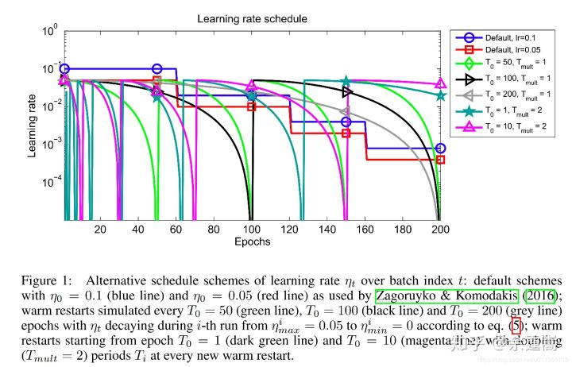
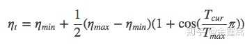
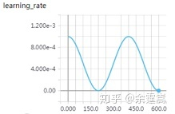
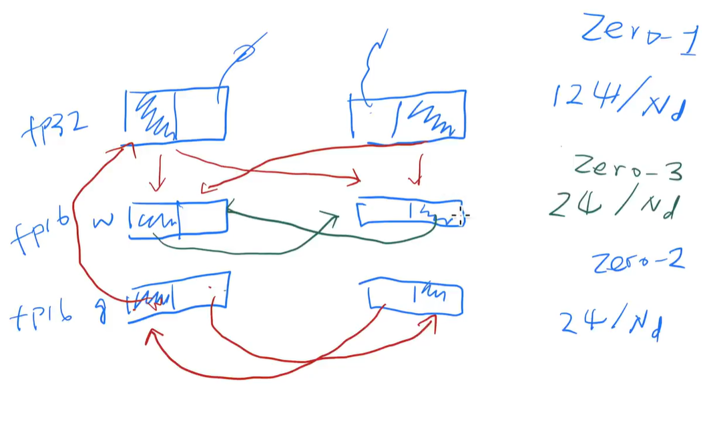

**一、pytorch中学习率调整方法**

**1. lr_scheduler.StepLR**

class torch.optim.lr_scheduler.StepLR(optimizer, step_size, gamma=0.1, last_epoch=-1)

**功能：** 等间隔调整学习率，**调整倍数为gamma倍，调整间隔为step_size**。间隔单位是step。需要注意的是，step通常是指epoch，不要弄成iteration了。

**参数：**

step_size(int)- 学习率下降间隔数，若为30，则会在30、60、90......个step时，将**学习率调整为lr*gamma**。

gamma(float)- 学习率调整倍数，**默认为0.1倍，即下降10倍**。

last_epoch(int)- **上一个epoch数**，这个变量用来指示学习率是否需要调整。当last_epoch符合设定的间隔时，就会对学习率进行调整。**当为-1时，学习率设置为初始值**。

**2.lr_scheduler.MultiStepLR**

class torch.optim.lr_scheduler.MultiStepLR(optimizer, milestones, gamma=0.1, last_epoch=-1)

**功能：** 按设定的间隔调整学习率。这个方法适合后期调试使用，==观察loss曲线==，为每个实验定制学习率调整时机。

**参数：**

milestones(list)- 一个list，==每一个元素代表何时调整学习率==，list元素必须是递增的。如 milestones=[30,80,120]

gamma(float)- 学习率调整倍数，默认为0.1倍，即下降10倍。

last_epoch(int)- 上一个epoch数，这个变量用来指示学习率是否需要调整。当last_epoch符合设定的间隔时，就会对学习率进行调整。当为-1时，学习率设置为初始值。

**3.lr_scheduler.ExponentialLR**

class torch.optim.lr_scheduler.ExponentialLR(optimizer, gamma, last_epoch=-1)

**功能：** 按指数衰减调整学习率，调整公式: lr = lr * gamma** **epoch**

参数：

**gamma- 学习率调整倍数的底，指数为epoch，即 gamma\****epoch

last_epoch(int)- 上一个epoch数，这个变量用来指示学习率是否需要调整。当last_epoch符合设定的间隔时，就会对学习率进行调整。当为-1时，学习率设置为初始值。

**4.lr_scheduler.CosineAnnealingLR**

class torch.optim.lr_scheduler.CosineAnnealingLR(optimizer, T_max, eta_min=0, last_epoch=-1)

**功能：** 以余弦函数为周期，并在每个周期最大值时重新设置学习率。具体如下图所示




详细请阅读论文《 SGDR: Stochastic Gradient Descent with Warm Restarts》(ICLR-2017)：[https://arxiv.org/abs/1608.03983](https://link.zhihu.com/?target=https%3A//arxiv.org/abs/1608.03983)

**参数：**

T_max(int)- 一次学习率周期的迭代次数，即T_max个epoch之后重新设置学习率。 eta_min(float)- 最小学习率，即在一个周期中，学习率最小会下降到eta_min，默认值为0。

学习率调整公式为：



可以看出是以初始学习率为最大学习率，以2*Tmax为周期，在一个周期内先下降，后上升。

实例： T_max = 200, 初始学习率 = 0.001, eta_min = 0




**5.lr_scheduler.ReduceLROnPlateau**

class torch.optim.lr_scheduler.ReduceLROnPlateau(optimizer, mode='min', factor=0.1, patience=10, verbose=False, threshold=0.0001, threshold_mode='rel', cooldown=0, min_lr=0, eps=1e-08)

**功能：** 当某指标不再变化（下降或升高），调整学习率，这是非常实用的学习率调整策略。例如，当验证集的loss不再下降时，进行学习率调整；或者监测验证集的accuracy，当accuracy不再上升时，则调整学习率。

**参数：**

mode(str)- 模式选择，有 min和max两种模式，min表示当指标不再降低(如监测loss)，max表示当指标不再升高(如监测accuracy)。

factor(float)- 学习率调整倍数(等同于其它方法的gamma)，即学习率更新为 lr = lr * factor patience(int)- 直译——"耐心"，即忍受该指标多少个step不变化，当忍无可忍时，调整学习率。注，可以不是连续5次。

verbose(bool)- 是否打印学习率信息， print('Epoch {:5d}: reducing learning rate' ' of group {} to {:.4e}.'.format(epoch, i, new_lr))

threshold(float)- Threshold for measuring the new optimum，配合threshold_mode使用，默认值1e-4。作用是用来控制当前指标与best指标的差异。

threshold_mode(str)- 选择判断指标是否达最优的模式，有两种模式，rel和abs。 当threshold_mode = rel，并且mode = max时，dynamic_threshold = best * ( 1 + threshold )； 当threshold_mode = rel，并且mode = min时，dynamic_threshold = best * ( 1 - threshold )； 当threshold_mode = abs，并且mode = max时，dynamic_threshold = best + threshold ； 当threshold_mode = rel，并且mode = max时，dynamic_threshold = best - threshold

cooldown(int)- “冷却时间“，当调整学习率之后，让学习率调整策略冷静一下，让模型再训练一段时间，再重启监测模式。

min_lr(float or list)- 学习率下限，可为float，或者list，当有多个参数组时，可用list进行设置。

eps(float)- 学习率衰减的最小值，当学习率变化小于eps时，则不调整学习率。

**6.lr_scheduler.LambdaLR**

class torch.optim.lr_scheduler.LambdaLR(optimizer, lr_lambda, last_epoch=-1)

**功能：** 为不同参数组设定不同学习率调整策略。调整规则为，lr = base_lr * lmbda(self.last_epoch) 。

**参数：**

lr_lambda(function or list)- 一个计算**学习率调整倍数的函数**，输入通常为step，当有多个参数组时，设为list。

last_epoch(int)- 上一个epoch数，这个变量用来指示学习率是否需要调整。当last_epoch符合设定的间隔时，就会对学习率进行调整。当为-1时，学习率设置为初始值。

**例如：**

```python
ignored_params = list(map(id, net.fc3.parameters()))
base_params = filter(lambda p: id§ not in ignored_params, net.parameters())
optimizer = optim.SGD([
    {‘params’: base_params},
    {‘params’: net.fc3.parameters(), ‘lr’: 0.001*100}], 
    0.001, momentum=0.9, weight_decay=1e-4)

lambda1 = lambda epoch: epoch // 3
lambda2 = lambda epoch: 0.95 ** epoch

scheduler = torch.optim.lr_scheduler.LambdaLR(optimizer, lr_lambda=[lambda1, lambda2])
for epoch in range(100):
    scheduler.step()
print('epoch: ', i, 'lr: ', scheduler.get_lr())
```

**输出：**

```python
epoch: 0 lr: [0.0, 0.1]
epoch: 1 lr: [0.0, 0.095]
epoch: 2 lr: [0.0, 0.09025]
epoch: 3 lr: [0.001, 0.0857375]
epoch: 4 lr: [0.001, 0.081450625]
epoch: 5 lr: [0.001, 0.07737809374999999]
epoch: 6 lr: [0.002, 0.07350918906249998]
epoch: 7 lr: [0.002, 0.06983372960937498]
epoch: 8 lr: [0.002, 0.06634204312890622]
epoch: 9 lr: [0.003, 0.0630249409724609]
```

第一个参数组的学习率为0：这是因为学习率计算方式。 第一个参数组的初始学习率设置为0.001, lambda1 = lambda epoch: epoch // 3, 第1个epoch时，由lr = base_lr * lmbda(self.last_epoch)，可知道 lr = 0.001 * (0//3) ，又因为1//3等于0，所以导致学习率为0。 

第二个参数组的学习率变化，初始为0.1，lr = 0.1 * 0.95^epoch ，当epoch为0时，lr=0.1 ，epoch为1时，lr=0.1*0.95。

------

**二、 学习率调整小结及step源码阅读**

**2.1 学习率调整小结**

Pytorch提供了六种学习率调整方法，可分为三大类，分别是

1. 有序调整；

2. 自适应调整；

3. 自定义调整。

第一类，依一定规律有序进行调整，这一类是最常用的，分别是等间隔下降(Step)，按需设定下降间隔(MultiStep)，指数下降(Exponential)和CosineAnnealing。这四种方法的调整时机都是人为可控的，也是**训练时常用到的**。

第二类，依训练状况伺机调整，这就是ReduceLROnPlateau方法。该法通过监测某一指标的变化情况，当该指标不再怎么变化的时候，就是调整学习率的时机，因而属于自适应的调整。

第三类，自定义调整，Lambda。Lambda方法提供的调整策略十分灵活，我们可以为不同的层设定不同的学习率调整方法，这在fine-tune中十分有用，我们不仅可为不同的层设定不同的学习率，还可以为其设定不同的学习率调整策略，简直不能更棒！

**2.2 step源码阅读**

在pytorch中，学习率的更新是通过scheduler.step()，而我们知道影响学习率的一个重要参数就是epoch，而epoch与scheduler.step()是如何关联的呢？这就需要看源码了。 源码在torch/optim/lr_scheduler.py，step()方法在_LRScheduler类当中，该类作为所有学习率调整的基类，其中定义了一些基本方法，如现在要介绍的step()，以及最常用的get_lr()，不过get_lr()是一个虚函数，均需要在派生类中重新定义函数。

看看step()

```python
def step(self, epoch=None):
    if epoch is None:
    epoch = self.last_epoch + 1
    self.last_epoch = epoch
    for param_group, lr in zip(self.optimizer.param_groups, self.get_lr()):
    	param_group[‘lr’] = lr
```

函数接收变量epoch，默认为None，当为None时，epoch = self.last_epoch + 1。从这里知道，last_epoch是用以记录epoch的。上面有提到last_epoch的初始值是-1，因此，第一个epoch的值为 -1+1 =0。接着最重要的一步就是获取学习率，并更新。 由于pytorch是基于参数组的管理方式，这里需要采用for循环对每一个参数组的学习率进行获取及更新。这里需要注意的是get_lr()，get_lr()的功能就是获取当前epoch，该参数组的学习率。

这里以StepLR()为例，介绍get_lr()，请看代码：

```python
def get_lr(self):
    return [base_lr * self.gamma ** (self.last_epoch // self.step_size) for base_lr in self.base_lrs]
```

由于pytorch是基于参数组的管理方式，可能会有多个参数组，因此用for循环，返回的是一个list。list元素的计算方式为 base_lr * self.gamma ** (self.last_epoch // self.step_size)。

看完代码，可以知道，在执行一次scheduler.step()之后，epoch会加1，因此scheduler.step()要放在epoch的for循环当中执行。

------


```python
#优化函数，model.parameters()为该实例中可优化的参数，lr为参数优化的选项（学习率等）
optimizer = optim.Adam(model.parameters(), lr=learning_rate) 
for name, param in model.named_parameters(): #查看可优化的参数有哪些
  if param.requires_grad:
    print(name)
```


**三、源码解读**

有两种定义optimizer的方法：

 

```python
optimizer = optim.SGD(model.parameters(), lr=0.01, momentum=0.9)
optimizer = optim.SGD([    {'params': model.base.parameters()},    
                       {'params': model.classifier.parameters(), 'lr': 1e-3}], 
                      lr=1e-2, momentum=0.9)
```

如果是第一种定义的方法：在这个初始化方法中，会把这些参数先改造成`[{'params': Alexnet.parameters()}]`这样的一个长度为1的list。然后对这个list进行加工，添加上defaults中的参数，如果我们使用Alexnet来做一个例子的话，就是下边这个样子：

```python
optimizer = torch.optim.Adam(Alexnet.parameters(), lr=0.001)
print([group.keys() for group in optimizer.param_groups])
# [dict_keys(['params', 'lr', 'betas', 'eps', 'weight_decay', 'amsgrad'])]
```


如果是第二种定义的方法：因为传入的本身就是dict的形式，所以会继续对他进行加工，添加上后边的参数，我们直接看疗效：

```python
optimizer = torch.optim.SGD([    
    {'params': Alexnet.features.parameters()},   
    {'params': Alexnet.classifier.parameters(), 'lr': 1e-3}],
     lr=1e-2, momentum=0.9)
print([group.keys() for group in optimizer.param_groups])
# [dict_keys(['params', 'lr', 'momentum', 'dampening', 'weight_decay', 'nesterov']), dict_keys(['params', 'lr', 'momentum', 'dampening', 'weight_decay', 'nesterov'])]
```


这次的list变成了两个元素，而且每个元素的组成和使用Adam也不一样了，这很明显，因为不同的优化器需要的参数不同嘛~(关于不同层的lr不同的设置这里给出官网[链接](https://pytorch.org/docs/1.1.0/optim.html#per-parameter-options))

 

但是两者是相似的，就是每个元素都有params和lr，这就够了。

pytorch1.1+是先训练，然后再`step()`

scheduler会调用`get_lr()`重载函数更换lr


adam优化算法，维护momentum和variance两个量，计算开销翻两倍

fp16比fp32速度快，但可能导致精度不够。

pytorch使用的内存是碎片化的，可能无法很好得使用，tensorflow事先计算好需要内存，取一整块出来。



参数服务器的思想，不同GPU维护不同块的参数。

每次计算前，拿到完整计算量，然后只保存需要的量，多的释放。

tcp/ip等通讯协议，维护一个buffer，到一定时间统一发送