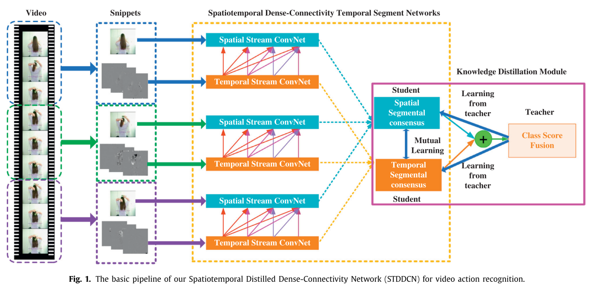
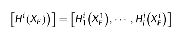
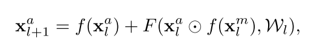

**论文阅读**

总共四篇论文，关于action recognition蒸馏方向

1. **Spatiotemporal distilled dense-Connectivity network for video action recognition**

解决空间和时间层面信息共享的问题，而不是单独训练。

**新知识**：乘法门

乘法门是一组信息对另一组数据的控制。

**写作手法**：首先便与21文章比对区别之处，说明网络想法来源，通过DenseNet（将所有浅层输出的feature map作为输入），方便信息重复利用，减缓梯度消失问题，等等。公式花里胡哨的，将公式分多块书写，每个loss大量笔墨

新设计的网络跨模态融合，让RGB（appearance）和FLOW（motion）信息交流，设计了一个新的网络结构SDDN和新的蒸馏方式，两个学生（RGB，FLOW）和一个teacher（fusion）

基础网络结构

**如果使用乘法将两个信息相乘进行控制？使用dense connection？**

用所有层的信息有提升准确率

将各个层的flow feature concatenate在一起

消融实验做得很好：

提升的做法有：

1. STDDCN模型本身更好
2. α，β，temperature选取最佳值
3. Distillation，教师和两个学生的模式更佳
4. 利用前置所有的信息更佳
5. motion信息指导appearance更佳

2. **Modality distillation with multiple stream networks for action recognition**

hallucination network:初步理解为模拟的信息输入，自我产生，例如在RGB中模拟输入depth信息

将depth数据学得的信息输入hallucination network中学习，网络原本的输入是RGB，所以最后可以在同一种RGB数据下训练和测试

跨模态方法是通过残差

