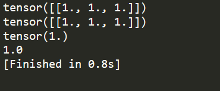

**PyTorch常见报错汇总**

1.

报错： ValueError: num_samples should be a positive integer value, but got num_samples=0

可能的原因：传入的Dataset中的len(self.data_info)==0，即传入该dataloader的dataset里没有数据

解决方法：

1. 检查dataset中的路径，路径不对，读取不到数据。

2. 检查Dataset的__len__()函数为何**输出为零**

2

报错：TypeError: pic should be PIL Image or ndarray. Got <class 'torch.Tensor'>

可能的原因：当前操作需要PIL Image或ndarray数据类型，但传入了Tensor

解决方法：

1. 检查transform中是否存在**两次ToTensor()方法**

2. 检查transform中每一个操作的数据类型变化

3

报错：RuntimeError: invalid argument 0: Sizes of tensors must match except in dimension 0. Got 93 and 89 in dimension 1 at /Users/soumith/code/builder/wheel/pytorch-src/aten/src/TH/generic/THTensorMath.cpp:3616

可能的原因：dataloader的__getitem__函数中，返回的图片形状不一致，导致无法stack

解决方法：检查__getitem__函数中的操作

4

报错：

conv: RuntimeError: Given groups=1, weight of size 6 1 5 5, expected input[16, 3, 32, 32] to have 1 channels, but got 3 channels instead

linear: RuntimeError: size mismatch, m1: [16 x 576], m2: [400 x 120] at ../aten/src/TH/generic/THTensorMath.cpp:752

可能的原因：网络层输入数据与网络的参数不匹配

解决方法：

1. 检查对应网络层前后定义是否有误

2. 检查输入数据shape

5

报错：AttributeError: 'DataParallel' object has no attribute 'linear'

可能的原因：并行运算时，模型被dataparallel包装，所有module都增加一个属性 module. 因此需要通过 net.module.linear调用

解决方法：

1. 网络层前加入module.

6

报错:

RuntimeError: Attempting to deserialize object on a CUDA device but torch.cuda.is_available() is False. If you are running on a CPU-only machine, please use torch.load with map_location=torch.device('cpu') to map your storages to the CPU.

可能的原因：gpu训练的模型保存后，在无gpu设备上无法直接加载，或者内存不够了

解决方法：

1. 需要设置map_location="cpu"

7

报错：

AttributeError: Can't get attribute 'FooNet2' on <module '__main__' from '

可能的原因：保存的网络模型在当前python脚本中没有定义

解决方法：

1. 提前定义该类

8

报错：

RuntimeError: Assertion `cur_target >= 0 && cur_target < n_classes' failed. at ../aten/src/THNN/generic/ClassNLLCriterion.c:94

可能的原因：

1. 标签数大于等于类别数量，即不满足 cur_target < n_classes，通常是因为**标签从1开始而不是从0开始**

解决方法：

1. 修改label，从0开始，例如：10分类的标签取值应该是0-9

9

报错：

RuntimeError: expected device cuda:0 and dtype Long but got device cpu and dtype Long

Expected object of backend CPU but got backend CUDA for argument #2 'weight'

可能的原因：需计算的两个数据不在同一个设备上

解决方法：采用to函数将数据迁移到同一个设备上

10

报错：

RuntimeError: DataLoader worker (pid 27) is killed by signal: Killed. Details are lost due to multiprocessing. Rerunning with num_workers=0 may give better error trace.

可能原因：内存不够（不是gpu显存，是内存）

解决方法：申请更大内存

11

报错：


RuntimeError: reduce failed to synchronize: device-side assert triggered

可能的原因：采用**BCE损失函数的时候，input必须是0-1之间**，由于模型最后没有加sigmoid激活函数，导致的。

解决方法：让模型输出的值域在[0, 1]

12

报错：RuntimeError: unexpected EOF. The file might be corrupted.

torch.load加载模型过程报错，因为模型传输过程中有问题，重新传一遍模型即可

13

报错：UnicodeDecodeError: 'utf-8' codec can't decode byte 0xff in position 1: invalid start byte

可能的原因：**python2保存，python3加载，会报错**

解决方法：把**encoding改为encoding='iso-8859-1'**

check_p = torch.load(path, map_location="cpu", encoding='iso-8859-1')

14

报错：RuntimeError: Input type (torch.cuda.FloatTensor) and weight type (torch.FloatTensor) should be the same

问题原因：数据张量已经转换到GPU上，但模型参数还在cpu上，造成计算不匹配问题。

解决方法：通过添加model.cuda()将模型转移到GPU上以解决这个问题。或者通过添加model.to(cuda)解决问题

15.

报错：ValueError: num_samples should be a positive integer value, but got num_samples=0

问题原因：高版本pytorch对于tensor.data[0]会报错，统一修改成tensor.item()

实验代码demo

```python
import torch 
a  = torch.ones([1,3])
print(a)
print(a.data)
print(a.data[0,1])
print(a.data[0,1].item())
```

**print(a.item()) 运行该行代码会报错**



