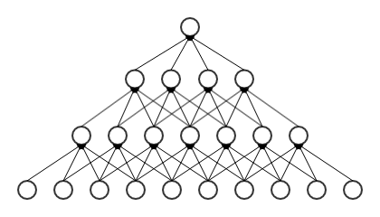
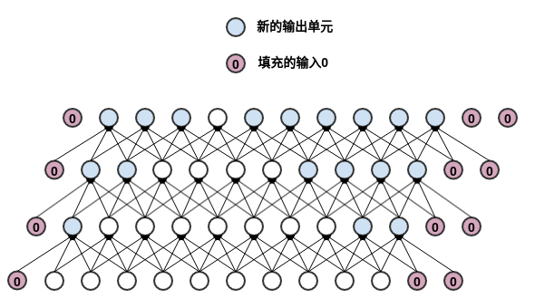
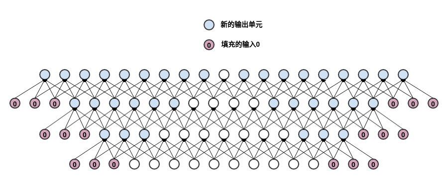
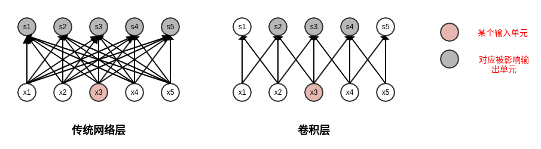
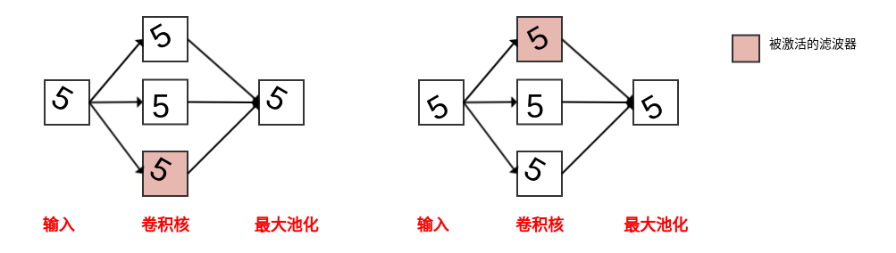
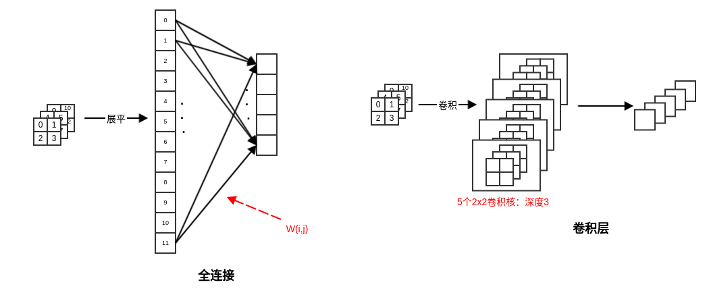
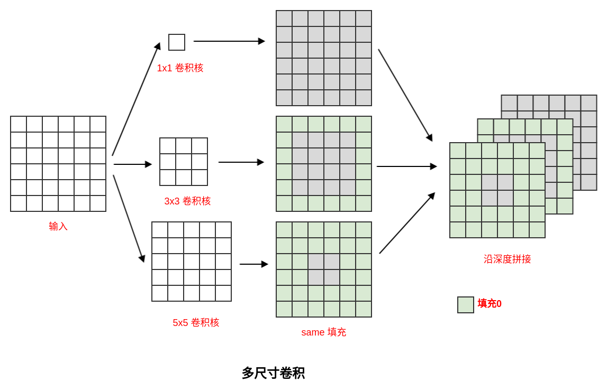

**CNN**

卷积时channel 的意义：每个卷积核提取一个特征，多个卷积核提取多层特征

------

事实上，当输入为图片或者feature map 时，池化层、非线性激活层、Batch Normalization 等层的输出也可以称作feature map 。卷积神经网络中，非全连接层、输出层以外的几乎所有层的输出都可以称作feature map 。

------

填充：为了让输入尺寸不变，填充，卷积核大小减一

1. valid 填充：

   不使用零来填充输入，卷积核只允许访问那些图像中能完全包含整个核的位置。
    在valid 填充模式中，输出的大小在每一层都缩减。假设核的宽度是 k，则每经过一层，输出的宽度减少了 k-1。
    如果输入图像的宽度是m ，则网络经过了d 层之后，输出的宽度变成 m- d*（k-1） 。如果核的宽度 k非常大时，缩减非常明显。最终网络会缩减到 1 。

   

2.  same 填充：

   使用足够的零来填充，使得输出和输入保持相同的大小。这是最常见的填充方式。

   - 在same填充模式中，网络可以包含任意多的卷积层，因为它不存在网络输出宽度缩减的问题。
   - same 填充模式的一个问题是：输入的边缘单元可能存在一定程度上的欠表达。
      因为==输入的中间区域的单元的影响域为全部的输出单元==，这意味着这些输入单元的信息会被很多输出单元所编码。而输入的边缘区域的单元的影响域只是输出单元的一部分，这意味着这些输入单元的信息仅仅被少量输出单元所编码。

   

3.  full 填充：

   在输入的两端各填充K-1个零，使得每个输入单元都恰好被卷积核访问k次。其中k为卷积核的宽度。

   - 它将从卷积核和输入开始相交的时候开始做卷积。
   -  假设核的宽度是k  ，则每经过一层，输出的宽度增加了 k-1 。
      如果输入图像的宽度是 m ，则网络经过了 d 层之后，输出的宽度变成 m+d*(k-1) 。
   - 它使得输入的边缘单元也能够得到充分表达。
   -  full 填充的一个问题是：输出的边界单元依赖于更少的输入单元。
      这使得学习到的结果在输出的中间部分表现较好，边缘部分的表现较差。

每个图像的像素位置当作一个输入单元，只影响3个输出单元（核尺寸为3时）

池化对结果的影响：如果不关注特征出现的位置，采用具有平移特性的池化，只要出现这个特征就可以了，像人脸识别，而对于直线相交，需要判断位置

下图中，使用多个滤波器和一个最大池化单元可以学得旋转不变性。

- 当输入旋转某个角度时，对应的滤波器被激活。
- 只要任意一个过滤器被激活，最大池化单元也相应被激活。

全连接层转卷积层的优点：可以适应尺寸多变的输入图像。

-  如果是全连接层，则全连接层的输入大小是固定的。
- 如果网络的输入尺寸发生变化，则该变化会传递到全连接层，而全连接层无法处理可变的输入。
-  如果是卷积层，则它对输入大小没有限制。

全卷积网络`FCN` 就是将`CNN` 网络后面的几个全连接层替换为卷积层，它可以高效的对测试图像做滑动窗口式的预测。

小卷积层堆叠的缺点是：加深了网络的深度，容易引发梯度消失等问题，从而使得网络的训练难度加大。

​	图像中目标对象的大小可能差别很大。如下图所示，每张图像中狗占据区域都是不同的。由于信息区域的巨大差异，为卷积操作选择合适的卷积核尺寸就非常困难。

-  信息分布更具有全局性的图像中，更倾向于使用较大的卷积核。如最最侧的图片所示。
- 信息分布更具有局部性的图像中，更倾向于使用较小的卷积核。如最右侧的图片所示。

Inception网络中大量使用多尺寸卷积核拼接在一起无论感兴趣的信息区域尺寸多大，总有一种尺度的卷积核与之匹配。这样总可以提取到合适的特征。

卷积网络涨点可以尝试：

1. 对输入下采样时尝试无重叠小一点的卷积层，例如4 $\times$ 4，stride=4的卷积；
2. block中采用大卷积核，例如7 $\times$ 7；
3. depthwise conv + inverted bottleneck + moving up depthwise layer的block结构；
4. 减少激活/归一化层，ReLU换成GELU，BN换成LN；
5. 使用2 $\times$ 2 conv + LN下采样。
