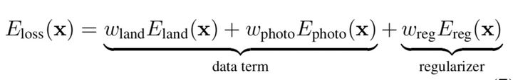

**3DMM的3D人脸重建**

​		3D建模主要包括3种，软件建模，仪器采集（不用通过人工建模雕刻），基于图像的建模，通过2维图像进行3D建模

​		人脸图像的3D重建包括立体匹配，Structure From Motion(简称SfM)，Shape from Shading(简称sfs)，三维可变形人脸模型(3DMM)，3D Morphable models(简称3DMM)

1. ​	**基本思想**

   ​	用一个通用的三维人脸模型和固定的点数来表示人脸，**它的核心思想就是人脸可以在三维空间中进行一一匹配，并且可以由其他许多幅人脸正交基加权线性相加而来**。所以先确定人脸的基，在进行线性组合即可。

​		使用PCA进行降维分解，形成正交的基向量。

​			(1) 首先计算形状和纹理向量的平均值。

​			(2) 中心化人脸数据。

​			(3) 分别计算协方差矩阵。

​			(4) 求得形状和纹理协方差矩阵的特征值α，β和特征向量si，ti。

​		上式可以转换为下式

​		其中第一项是形状和纹理的平均值，而si，ti则都是Si，Ti减去各自平均值后的协方差矩阵的特征向量，它们对应的特征值按照大小进行降序排列。

​		等式右边仍然是m项，但是累加项降了一维，减少了一项。si，ti都是线性无关的，取其前几个分量可以对原始样本做很好的近似，因此可以大大减少需要估计的参数数目，并不失精度。

​		(a) 初始化一个3维的模型，需要初始化内部参数α，β，以及外部渲染参数，包括相机的位置，图像平面的旋转角度，直射光和环境光的各个分量，图像对比度等共20多维，有了这些参数之后就可以唯一确定一个3D模型到2D图像的投影。

​		(b) 在初始参数的控制下，经过3D至2D的投影，即可由一个3D模型得到2维图像，然后计算与输入图像的误差。再以误差反向传播调整相关系数，调整3D模型，不断进行迭代。每次参与计算的是一个三角晶格，如果人脸被遮挡，则该部分不参与损失计算。

​		(c) 具体迭代时采用由粗到精的方式，初始的时候使用低分辨率的图像，只优化第一个主成分的系数，后面再逐步增加主成分。在后续一些迭代步骤中固定外部参数，对人脸的各个部位分别优化。

​		对于只需要获取人脸形状模型的应用来说，很多方法都会使用2D人脸关键点来估计出形状系数，具有更小的计算量，迭代也更加简单，另外还会增加一个正则项，所以一个典型的优化目标是如下：

​		该问题是病态问题。**病态问题（ill-conditioned problem）**是指输出结果相对于输入非常敏感的问题，输入数据中哪怕是极少（或者极微妙）的噪声也会导致输出的较大改变（该术语并没有严格的官方定义）。
 	相反的，对于输入不敏感的问题，我们就称为**良态问题（well-conditioned problem）**。