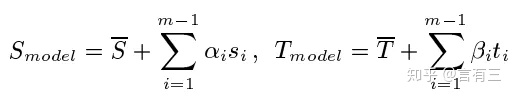

**3DMM的3D人脸重建**

​	3D建模主要包括3种，软件建模，仪器采集（不用通过人工建模雕刻），基于图像的建模，通过2维图像进行3D建模

​	人脸图像的3D重建包括立体匹配，Structure From Motion(简称SfM)，Shape from Shading(简称sfs)，三维可变形人脸模型(3DMM)，3D Morphable models(简称3DMM)

1. ​	**基本思想**

用一个通用的三维人脸模型和固定的点数来表示人脸，**它的核心思想就是人脸可以在三维空间中进行一一匹配，并且可以由其他许多幅人脸正交基加权线性相加而来**。所以先确定人脸的基，在进行线性组合即可。

使用PCA进行降维分解，形成正交的基向量。

(1) 首先计算形状和纹理向量的平均值。

(2) 中心化人脸数据。

(3) 分别计算协方差矩阵。

(4) 求得形状和纹理协方差矩阵的特征值α，β和特征向量si，ti。

上式可以转换为下式

其中第一项是形状和纹理的平均值，而si，ti则都是Si，Ti减去各自平均值后的协方差矩阵的特征向量，它们对应的特征值按照大小进行降序排列。

等式右边仍然是m项，但是累加项降了一维，减少了一项。si，ti都是线性无关的，取其前几个分量可以对原始样本做很好的近似，因此可以大大减少需要估计的参数数目，并不失精度。