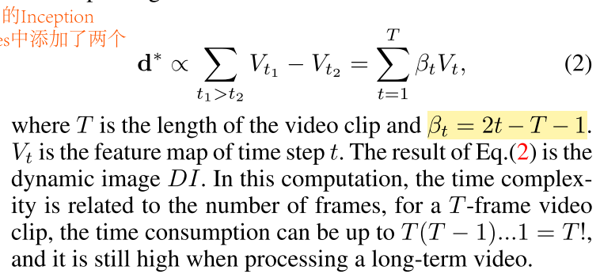
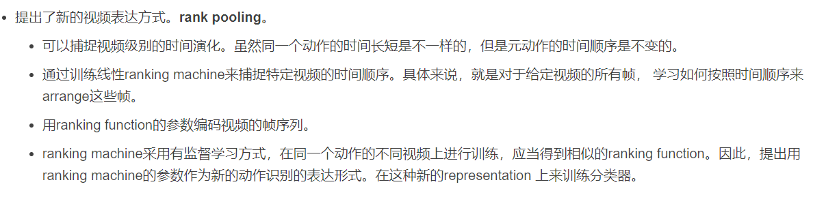
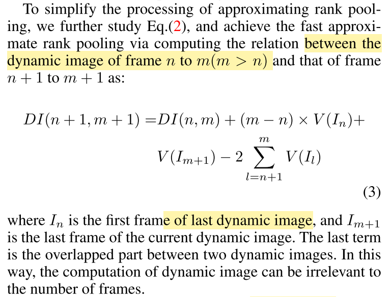
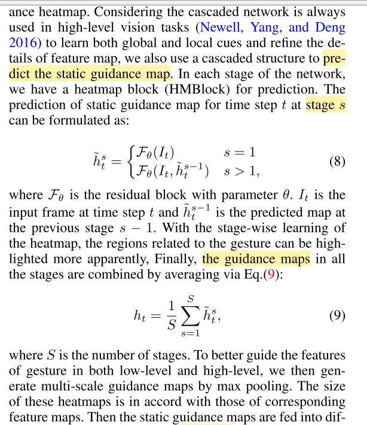
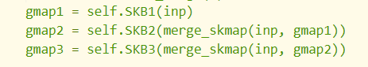
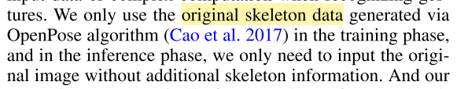
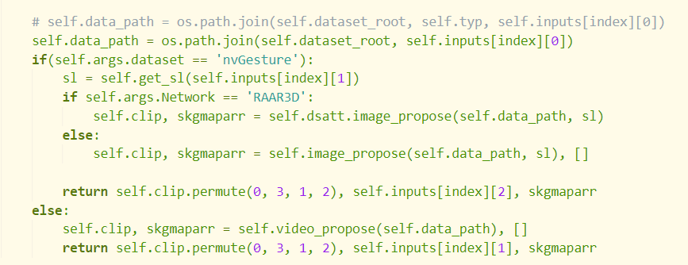

Dynamic- Static Attention (DSA)生成heatmap，时序和空间上的attention。代码中为MaxPool3d_5a_2x2类

主要region attention


**a fast approximate rank pooling algorithm**去学习图片累积的时间信息

DSA consists of the SAtt and DAtt sub-modules. SAtt highlights the hands/arms features via an online learnable Gaussian skeleton heatmap while DAtt captures the gesture motions via the proposed fast approximate rank pooling al- gorithm


将I3D中前两个inception module改为cell1，中间五个inception module改为cell2，最后两个改为cell3


*a fast approximate rank pooling algorithm*（MaxPool3dSamePadding，3D池化）



rank pooling计算后面帧与前面帧的差距（feature）






$T=m-n+1$


```python
def tensor_merge(arr):
    arr = [x.view(list(x.size()) + [1]) for x in arr]
    t = torch.cat(arr, dim=4)
    return t.permute(0, 1, 4, 2, 3)
```


```python
arrrp = tensor_arr_rp(tensor_split(x)) #DI且m-n=slef._w,tensor_split(x)为每一帧的f
arrrp = self.relu(self.bnrp(tensor_merge(arrrp))) 
arrrp = [(a + torch.ones(a.size()).cuda()) * b for a, b in zip(tensor_split(arrrp), tensor_split(x))] #加1防止0 attention map，逐元素相乘
arrrp = [oneconv(a, b) for a, b in zip(tensor_split(x), arrrp)]#attention和feature卷积 时间attention
```


```python
zip([iterable, ...])  #返回一个或多个迭代器;取最短的一个
```


**:gmap:** gaussian heat map

**HeatmapNet** 产生热图

`# logits is batch X time X classes, which is what we want to work with`

 `return logits.squeeze(), gmap3, (f1, f2, f3,f4, f5)`   

返回置信度，最终heat map，中间特征



heatmap获得



guidance map做平均，通过均方差MSEloss学习heatmap net



训练使用的数据集不一样？



baseline中没有训练heatmap net

