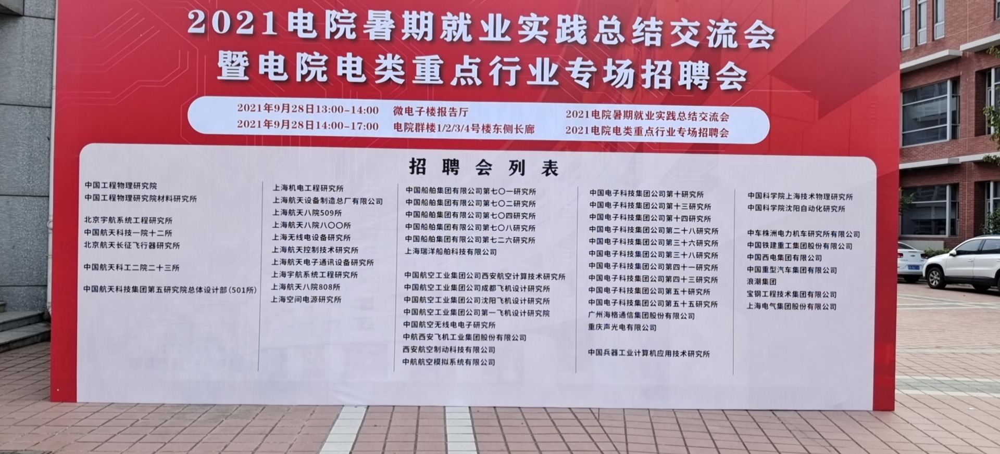

**重点行业专场招聘会**

1. 中国科学院沈阳自动化研究所

   想了解的研究所的生活：分团队，分项目，分各种各样的方向。一种是基础的理论研究（**发论文**），另外一个方向是国家重点工程项目（**会有实地的项目测试**）

   读研在国科大读半年学，读博的在中科大读一年，之后参与项目，项目时间相对和职工一样，有对应的节假日，论文要求发表数量比高校少，日常生活补贴多（国家+研究所+导师）博士能够有5、6千每个月

2. 广州海格通信集团股份有限公司

   算法岗硕士起招，其他岗位本科（知乎风评不好），主要岗位多在广州，压抑性的体验

   

3. 浪潮集团

   > AI岗的话还是要自己多积累项目经验，建议考研之后再就业
   > 问的问题更专业一点，CNN，RNN，DNN（从来没有接触过）。有的公司使用的是tensorflow，问你卷积层常使用多大3*3还是什么的，基础知识还是要多了解研究，关注代码技术和经验（**对于letcode和计算机体系结构要求基础**）
   >
   > 先去大厂实习，京东和字节

4. 上海航天八院808研究所

   工作和高校类似，但压力会更大一点，时间节点压力大。晋升公平，看你的贡献程度。上面就看你的机遇和国家体制的固化限制

   能否参与项目看你以前的研究背景，通过了就可以前往参与研究

   研究生起招。

