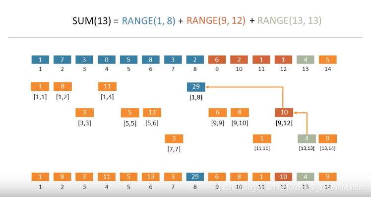
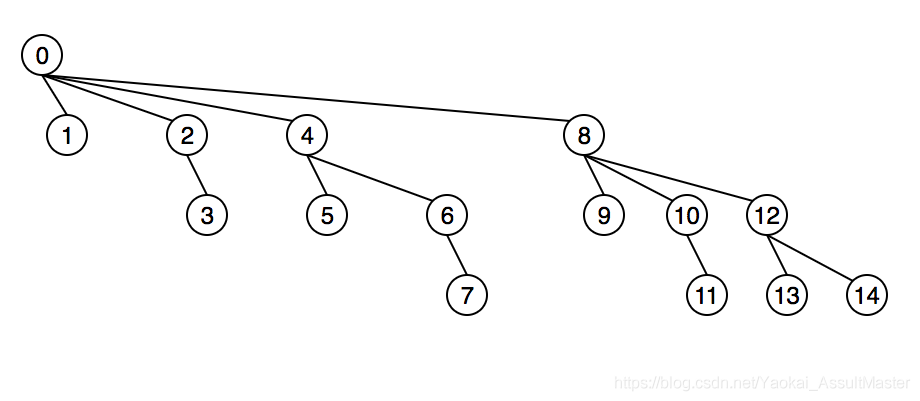

**Python**

1. list.extend返回null，直接修改原list，append是将list整个放在末尾

**Python数据结构学习**

==堆== import ==heapq==

heappush(heap, item): 将 *item* 的值加入 *heap* 中，保持堆的不变性。

heappop(heap): 弹出并返回 *heap* 的最小的元素，保持堆的不变性。如果堆为空，抛出 [`IndexError`](https://docs.python.org/zh-cn/3/library/exceptions.html#IndexError) 。使用 `heap[0]` ，可以只访问最小的元素而不弹出它。

优先队列（SortedList）

==哈希表==

Counter 记录对应字符串或者对应值的个数

cnt[x]是对应值的size

**树状数组**

然后通过对应位置的求和得到最终的结果

具体的树的结构

==lowbit==

x&-x: 找最近的不是0的位
