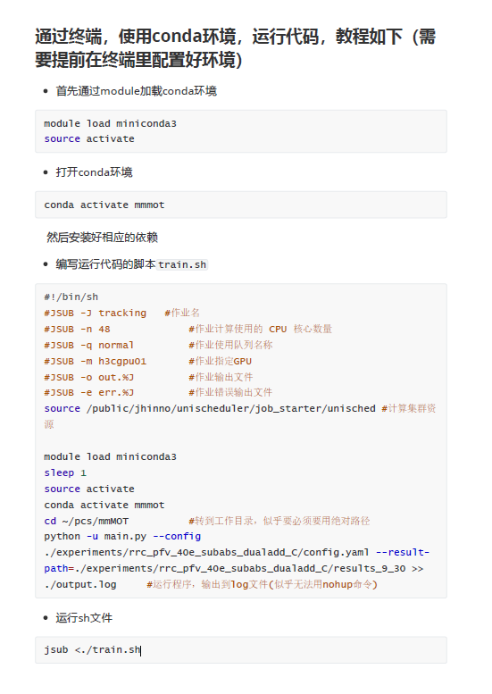

**超算平台**



记得注释掉#JSUB后的注释

source activate要在base环境下执行


# 测试 分配 GPU

### 测试脚本如下， 使用 torch.device('cuda+str(gpu_index)') 即可


```python
import torch
if __name__ == '__main__':
    num_gpu = torch.cuda.device_count()

    for i in range(num_gpu):
        torch.cuda.get_device_name(i)
        print ('cur_gpu: ', torch.cuda.get_device_name(i))
    
    gpu_index = 2

    device = torch.device('cuda:' + str(gpu_index) if torch.cuda.is_available() else 'cpu')
    print(device)

    a = torch.ones([10]).to(device, dtype = torch.float)

    print(a)
```

### 终端运行脚本

``` python
#!/bin/sh
#JSUB -J gpu
#JSUB -n 4
##JSUB -q normal
#JSUB -m h3cgpu01
#JSUB -o out.%J
#JSUB -e err.%J
source /public/jhinno/unischeduler/job_starter/unisched

module load miniconda3
sleep 1
source activate
conda activate wxr_cu111
cd ~/lsq/test_cuda
python test_cuda.py >> ./output.log
###############################

sleep 100
nvidia-smi >> nvidia.log

```


### 输出结果

cur_gpu:  NVIDIA A100-PCIE-40GB
cur_gpu:  NVIDIA A100-PCIE-40GB
cur_gpu:  NVIDIA A100-PCIE-40GB
cur_gpu:  NVIDIA A100-PCIE-40GB
cur_gpu:  NVIDIA A100-PCIE-40GB
cur_gpu:  NVIDIA A100-PCIE-40GB
cur_gpu:  NVIDIA A100-PCIE-40GB
cur_gpu:  NVIDIA A100-PCIE-40GB
cuda:2
tensor([1., 1., 1., 1., 1., 1., 1., 1., 1., 1.], device='cuda:2')