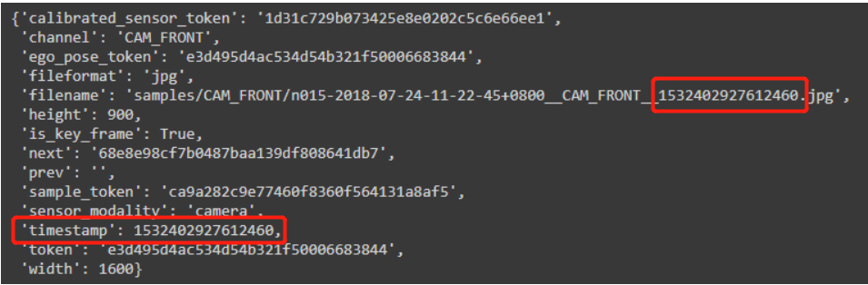

**Centerpoint**

voxel网络结构和输出tensor形状

reader：type="VoxelFeatureExtractorV3",取平均

输入torch.Size([体素数, 10, 5])"features"， torch.Size([体素数])"num_voxels"，输出torch.Size([体素数, 5])input_features


backbone：type="SpMiddleResNetFHD"

输入torch.Size([体素数, 5])，torch.Size([体素数, 4]) coordinate[0,位置坐标]，batch_size:1，data[input_shape]：[1440 1440   40]，输出x.shape：torch.Size([1, 256, 180, 180])，{'conv1': <spconv.SparseConvTensor object at 0x7f8f56e68ef0>, 'conv2': <spconv.SparseConvTensor object at 0x7f8f56e68b70>, 'conv3': <spconv.SparseConvTensor object at 0x7f8f56e68f98>, 'conv4': <spconv.SparseConvTensor object at 0x7f8f56e68d30>} voxel_feature


neck：type="RPN"

输入x.shape：torch.Size([1, 256, 180, 180])，输出x.shape：torch.Size([1, 512, 180, 180])


bbox_head：type="CenterHead"

输入x.shape：torch.Size([1, 512, 180, 180])，输出list为

**[**

**{'reg': tensor([1, 2, 180, 180]), 'height': tensor([1, 1, 180, 180]), 'dim': tensor([1, 3, 180, 180]), 'rot': tensor([1, 2, 180, 180]), 'vel': tensor([1, 2, 180, 180]), 'hm': tensor()},** 

**{'reg': tensor([1, 2, 180, 180]), 'height': tensor([1, 1, 180, 180]), 'dim': tensor([1, 3, 180, 180]), 'rot': tensor([1, 2, 180, 180]), 'vel': tensor([1, 2, 180, 180]), 'hm': tensor()},** 

**{'reg': tensor([1, 2, 180, 180]), 'height': tensor([1, 1, 180, 180]), 'dim': tensor([1, 3, 180, 180]), 'rot': tensor([1, 2, 180, 180]), 'vel': tensor([1, 2, 180, 180]), 'hm': tensor()},**

 **{'reg': tensor([1, 2, 180, 180]), 'height': tensor([1, 1, 180, 180]), 'dim': tensor([1, 3, 180, 180]), 'rot': tensor([1, 2, 180, 180]), 'vel': tensor([1, 2, 180, 180]), 'hm': tensor()},** 

**{'reg': tensor([1, 2, 180, 180]), 'height': tensor([1, 1, 180, 180]), 'dim': tensor([1, 3, 180, 180]), 'rot': tensor([1, 2, 180, 180]), 'vel': tensor([1, 2, 180, 180]), 'hm': tensor()},** 

**{'reg': tensor([1, 2, 180, 180]), 'height': tensor([1, 1, 180, 180]), 'dim': tensor([1, 3, 180, 180]), 'rot': tensor([1, 2, 180, 180]), 'vel': tensor([1, 2, 180, 180]), 'hm': tensor([1, 2, 180, 180])}**

**]**

```python
tasks = [
    dict(num_class=1, class_names=["car"]),
    dict(num_class=2, class_names=["truck", "construction_vehicle"]),
    dict(num_class=2, class_names=["bus", "trailer"]),
    dict(num_class=1, class_names=["barrier"]),
    dict(num_class=2, class_names=["motorcycle", "bicycle"]),
    dict(num_class=2, class_names=["pedestrian", "traffic_cone"]),
]
```

六种种类一个batch_size

猜想输出为regression，height-above-ground，dimension，rotation，velocity，heat-map

H,W为180

batch_box_preds：tensor[(1, 32400, 9)]，32400=180*180，9=xs(1)+ys(1)+batch_hei(1)+batch_dim(3)+batch_vel(2)+batch_rot(1)


dataloader处理后的数据为{'metadata': {'image_prefix': PosixPath('data/nuScenes'), 'num_point_features': 5, 'token': 'e411f0ab3a0243f1bea593bed340894f'}, 'points':（点数，5）, 'voxels'（体素数，10，5）:'shape': array([1440, 1440,   40]), 'num_points': 表示每个体素中的点云数量), 'num_voxels': 体素数), 'coordinates': (体素数，3)array([[ 16, 717, 682],
       [ 16, 717, 680],
       [ 16, 717, 678],
       ...,
       [ 28, 701, 636],
       [ 28, 701, 641],
       [ 28, 702, 638]], dtype=int32)}

每个体素最多10个点

NuScenes数据集中lidar文件名用时间戳区分文件



```txt
汽车编号-时间-相机位置-时间戳.jpg
汽车编号-时间-雷达位置-时间戳.pcd.bin
```

 'num_point_features'：前4个是点feature，一般是xyz和反射率，后一个是时间信息

‘feature_map_size’：180*180

for i，data in enumerate（dataloader）：一次性导入num_work个batch


data中point是10个lidar文件中的点拼接在一起，第一个文件读入的为最大的时间戳

Sparse Convolution成功用于3D目标检测的网络，相比于3D Convolution，在运算速度和显存消耗中有巨大的优势。

python前r表示禁止转义
