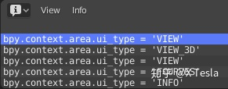
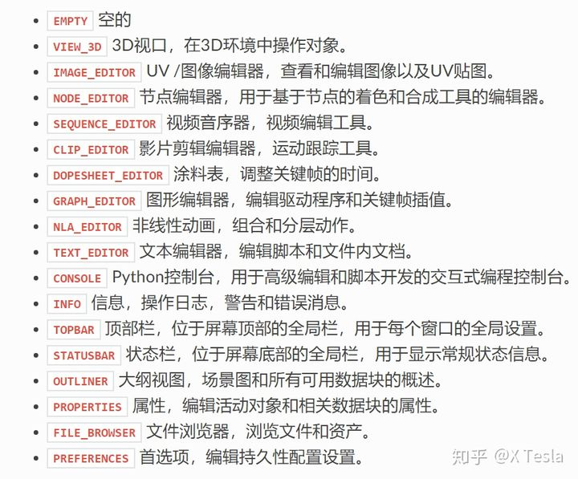
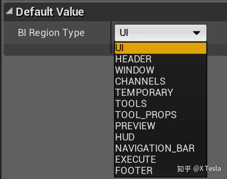
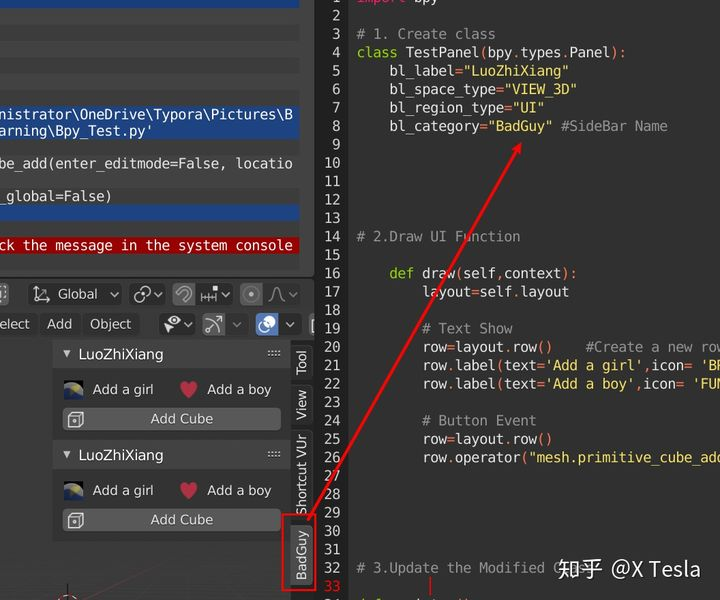

**blender script**

将blender中所有的button转换为代码接口，操纵物体

重要学习数据类型：bpy

bpy.data.object：打开的模型物体

Data is added and removed via methods on the collections in [`bpy.data`](https://docs.blender.org/api/current/bpy.data.html#module-bpy.data)

 “poll” function which checks if the cursor is in a valid area or if the object is in the correct mode ：判断是否选择正确的操作方式

blender文件夹下scripts/startup/中有python的环境

When a script is imported as a module, its class instances will remain inside the module and can be accessed later on by importing that module again.

run the script：

> blender --python /home/me/my_script.py

While `__init__()` and `__del__()` will be called if defined, the class instances lifetime only spans the execution. 

数据保存为blender.data的格式，下次开启不会丢失

The register/unregister calls are used so it’s possible to toggle add-ons and reload scripts while Blender runs

每次重新跑，估计得重新加载选项

run script

- Loaded in the text editor and press *Run Script*.

- Typed or pasted into the interactive console.

- Execute a Python file from the command line with Blender, e.g:

  ```shell
  blender --python /home/me/my_script.py
  ```

建立子类，元素命名一般以bl_开头表示自己添加的

Notice these classes don’t define an `__init__(self)` function. While `__init__()` and `__del__()` will be called if defined, the class instances lifetime only spans the execution


**步骤**

## 定义Panel面板

创建类

```python
class TestPanel(bpy.types.Panel) #创建Panel的实例
```

### 定义Panel类的属性

```python
class TestPanel(bpy.types.Panel):
    bl_label="LuoZhiXiang"
    bl_idname="PT_Test Panel"
    bl_space_type="VIEW_3D"
    bl_region_type="UI"
    bl_category="BadGuy"

#注意前面一定要带有bl_的前缀，否则是会报错的
```

**创建Space Type （插件在哪种工作空间使用）**

注意全部要大写！它的作用就是定义这个插件是作用于哪个工作区域Workspace内。

可以切换测试，日志会输出相关type。



```text
bl_space_type="VIEW_3D"
```



**设置使用区域，设置为UI即可**

```python
bl_region_type="UI"
```

其他种类：



设置**归属类别**（将此Panel实例归到哪一类里面）

```python
bl_category="BadGuy" #SideBar Name
```



# 加载更新

- register() 注册/登记/加载
- unregister() 不加载
- utils——utilities（实用工具）

```text
def register():
    bpy.utils.register_class(TestPanel)

def unregister():
    bpy.utils.unregister_class(TestPanel）
    
if __name__=="__main__":
    register()
```

通过直接执行脚本来扩展Blender意味着脚本完成执行后脚本定义的类在Blender中保持可用。与将脚本作为模块导入相比，以这种方式使用脚本使得将来访问其类（例如取消注册它们）变得更加困难。将脚本作为模块导入时，其类实例将保留在模块中，稍后可以通过再次导入该模块来访问。


bpy.data.objects返回值，第0个默认为camera，注意区别

输入：bpy.data.objects[0]

结果返回：bpy.data.objects['Camera']

输入：bpy.data.objects[1]

结果返回：bpy.data.objects['Cube']