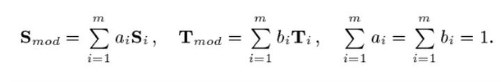

**3DMM的3D人脸重建**

​		3D建模主要包括3种，软件建模，仪器采集（不用通过人工建模雕刻），基于图像的建模，通过2维图像进行3D建模

​		人脸图像的3D重建包括立体匹配，Structure From Motion(简称SfM)，Shape from Shading(简称sfs)，三维可变形人脸模型(3DMM)，3D Morphable models(简称3DMM)

1. ​	**基本思想**

   ​	用一个通用的三维人脸模型和固定的点数来表示人脸，**它的核心思想就是人脸可以在三维空间中进行一一匹配，并且可以由其他许多幅人脸正交基加权线性相加而来**。所以先确定人脸的基，在进行线性组合即可。

​		使用PCA进行降维分解，形成正交的基向量。

​			(1) 首先计算形状和纹理向量的平均值。

​			(2) 中心化人脸数据。

​			(3) 分别计算协方差矩阵。

​			(4) 求得形状和纹理协方差矩阵的特征值α，β和特征向量si，ti。

​		上式可以转换为下式

​		其中第一项是形状和纹理的平均值，而si，ti则都是Si，Ti减去各自平均值后的协方差矩阵的特征向量，它们对应的特征值按照大小进行降序排列。

​		等式右边仍然是m项，但是累加项降了一维，减少了一项。si，ti都是线性无关的，取其前几个分量可以对原始样本做很好的近似，因此可以大大减少需要估计的参数数目，并不失精度。

​		(a) 初始化一个3维的模型，需要初始化内部参数α，β，以及外部渲染参数，包括相机的位置，图像平面的旋转角度，直射光和环境光的各个分量，图像对比度等共20多维，有了这些参数之后就可以唯一确定一个3D模型到2D图像的投影。

​		(b) 在初始参数的控制下，经过3D至2D的投影，即可由一个3D模型得到2维图像，然后计算与输入图像的误差。再以误差反向传播调整相关系数，调整3D模型，不断进行迭代。每次参与计算的是一个三角晶格，如果人脸被遮挡，则该部分不参与损失计算。

​		(c) 具体迭代时采用由粗到精的方式，初始的时候使用低分辨率的图像，只优化第一个主成分的系数，后面再逐步增加主成分。在后续一些迭代步骤中固定外部参数，对人脸的各个部位分别优化。

​		对于只需要获取人脸形状模型的应用来说，很多方法都会使用2D人脸关键点来估计出形状系数，具有更小的计算量，迭代也更加简单，另外还会增加一个正则项，所以一个典型的优化目标是如下：

​		该问题是病态问题。**病态问题（ill-conditioned problem）**是指输出结果相对于输入非常敏感的问题，输入数据中哪怕是极少（或者极微妙）的噪声也会导致输出的较大改变（该术语并没有严格的官方定义）。
 	相反的，对于输入不敏感的问题，我们就称为**良态问题（well-conditioned problem）**。

2. **loss的设计**

​		优化目标的设计。因为重建的结果是一个三维模型，所以损失函数是在三维的空间中计算，如果使用标准的欧拉损失函数来最小化距离，会使得到的人脸模型太泛化，趋于平均脸。对此作者们提出了一个非对称欧拉损失，使模型学习到更多的细节特征，使三维人脸模型具有更多的区别性，公式如下：

​		γ是标签，γp是预测值，通过两个权重λ1和λ2对损失进行控制，作者设定λ2权重更大，所以是期望γp能够更大一些，从而提供更多的细节。

3. **难点和展望**

   ​		从1999年被提出，至今3DMM模型已经有超过20年的历史，技术已经发展到从早期基于传统的优化方法到如今基于深度学习模型的系数回归，不过当前的3DMM模型还面临着许多的挑战。

   ​	(1) 当前的模型基本上都受限于人脸，没有眼睛，嘴唇以及头发信息，然而这些信息对于很多的应用却非常有效。

   ​	(2) 3DMM模型参数空间是一个比较低维的参数空间，并且纹理模型过于简单。基于3DMM模型的方法面临的最大问题就是结果过于平均，难以重建人脸皱纹等细节特征，并且无法恢复遮挡。对此有的方法通过增加局部模型[13]进行了改进，而最新的生成对抗网络技术[14]也开始被用于纹理建模。

​		(3) 遮挡脸的信息恢复。二维的人脸信息一旦被遮挡，也难以被精确地重建，除了利用人脸的对称先验信息进行补全外，有的方法借鉴了检索匹配[15]的思路，即建立一个无遮挡的数据集，将重建的模型进行姿态匹配和人脸识别相似度匹配，然后经过2D对齐，使用基于梯度的方法来进行纹理迁移，也有的方法使用GAN来进行遮挡信息恢复[16]。

​		(3) 当前3DMM模型中主要使用PCA来提取主成分信息，但是这不符合我们通常对人脸的描述，因此这==并非是一个最合适的特征空间。==*什么是适合的特征空间呢？*

​		(4) 当前存在着各种各样的3DMM模型的变种，但是没有一个模型能够在各种场景下取得最优的效果。

​		另一方面，3DMM模型也与许多新的技术开始结合，比如与生成对抗网络模型一起进行人脸的数据增强[17]，姿态编辑[17]，人脸的特征恢复[18]，对于提升人脸识别模型在具有挑战性的大姿态以及遮挡场景下的性能中具有非常重要的意义。

使用点投影到2D平面，看点与点之间的偏差，或者利用3D的工具可视化，观看效果