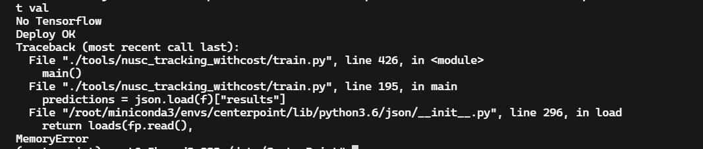

**3D Tracking on NuScences**

detection loss采用Focal loss

Focal Loss 就是一个解决**分类问题中类别不平衡、分类难度差异**的一个 loss。


​	Cameras provide a dense and rich visual signal that helps to localize even distant objects. LiDAR provide a sparse signal in 3D space.


给跟踪结果打上ID标签，后通过坐标获取相对应的真值

现在的想法：

1. 给检测结果每个物体打上对应真值的token
2. 根据官方库的方法进行真值标注

10-31讨论结果

- [x] 跟踪网络自己的特征提取:无法表示存储

  

- [x] 不加速度

- [x] sigmoid归一化0-1


更改为新的数据dict输入新的网络


给detection score设置一个阈值

data["coors"]还是有问题多出来的一个维度信息


numba报错原因：trainpipline对数据的操作影响

```shell
/data/CenterPoint/det3d/core/bbox/geometry.py:279: NumbaWarning: 
Compilation is falling back to object mode WITH looplifting enabled because Function "points_in_convex_polygon_jit" failed type inference due to: No implementation of function Function(<built-in function getitem>) found for signature:
 
 >>> getitem(array(float32, 3d, C), Tuple(slice<a:b>, list(int64)<iv=None>, slice<a:b>))
 
There are 22 candidate implementations:
   - Of which 20 did not match due to:
   Overload of function 'getitem': File: <numerous>: Line N/A.
     With argument(s): '(array(float32, 3d, C), Tuple(slice<a:b>, list(int64)<iv=None>, slice<a:b>))':
    No match.
   - Of which 2 did not match due to:
   Overload in function 'GetItemBuffer.generic': File: numba/core/typing/arraydecl.py: Line 162.
     With argument(s): '(array(float32, 3d, C), Tuple(slice<a:b>, list(int64)<iv=None>, slice<a:b>))':
    Rejected as the implementation raised a specific error:
      TypeError: unsupported array index type list(int64)<iv=None> in Tuple(slice<a:b>, list(int64)<iv=None>, slice<a:b>)
  raised from /root/miniconda3/envs/centerpoint/lib/python3.6/site-packages/numba/core/typing/arraydecl.py:69

During: typing of intrinsic-call at /data/CenterPoint/det3d/core/bbox/geometry.py (298)

File "det3d/core/bbox/geometry.py", line 298:
def points_in_convex_polygon_jit(points, polygon, clockwise=True):
    <source elided>
                :,
                [num_points_of_polygon - 1] + list(range(num_points_of_polygon - 1)),
                ^

  @numba.jit
/data/CenterPoint/det3d/core/bbox/geometry.py:279: NumbaWarning: 
Compilation is falling back to object mode WITHOUT looplifting enabled because Function "points_in_convex_polygon_jit" failed type inference due to: Cannot determine Numba type of <class 'numba.core.dispatcher.LiftedLoop'>

File "det3d/core/bbox/geometry.py", line 315:
def points_in_convex_polygon_jit(points, polygon, clockwise=True):
    <source elided>
    cross = 0.0
    for i in range(num_points):
    ^

  @numba.jit
/root/miniconda3/envs/centerpoint/lib/python3.6/site-packages/numba/core/object_mode_passes.py:152: NumbaWarning: Function "points_in_convex_polygon_jit" was compiled in object mode without forceobj=True, but has lifted loops.

File "det3d/core/bbox/geometry.py", line 290:
def points_in_convex_polygon_jit(points, polygon, clockwise=True):
    <source elided>
    # first convert polygon to directed lines
    num_points_of_polygon = polygon.shape[1]
    ^

  state.func_ir.loc))
/root/miniconda3/envs/centerpoint/lib/python3.6/site-packages/numba/core/object_mode_passes.py:162: NumbaDeprecationWarning: 
Fall-back from the nopython compilation path to the object mode compilation path has been detected, this is deprecated behaviour.

For more information visit https://numba.pydata.org/numba-doc/latest/reference/deprecation.html#deprecation-of-object-mode-fall-back-behaviour-when-using-jit

File "det3d/core/bbox/geometry.py", line 290:
def points_in_convex_polygon_jit(points, polygon, clockwise=True):
    <source elided>
    # first convert polygon to directed lines
    num_points_of_polygon = polygon.shape[1]
    ^

  state.func_ir.loc))
```

most certainly due to Numba failing to compile the `_higuchi_fd` function in Nopython mode. In this case, the compiler falls back to "object mode" (which provides no significant speed-up as compared to plain Python code).

导数部分的报错

```shell
[W accumulate_grad.h:185] Warning: grad and param do not obey the gradient layout contract. This is not an error, but may impair performance.
grad.sizes() = [512, 1024, 1, 1], strides() = [1024, 1, 1, 1]
param.sizes() = [512, 1024, 1, 1], strides() = [1024, 1, 1024, 1024] (function operator())
```

一开始由于改变了nsample_q的值，导致后面就是查询1个物体，没有起到训练的效果

- [ ] 不归一化
- [ ] softmax重新测量
- [ ] 重新训练sigmoid
