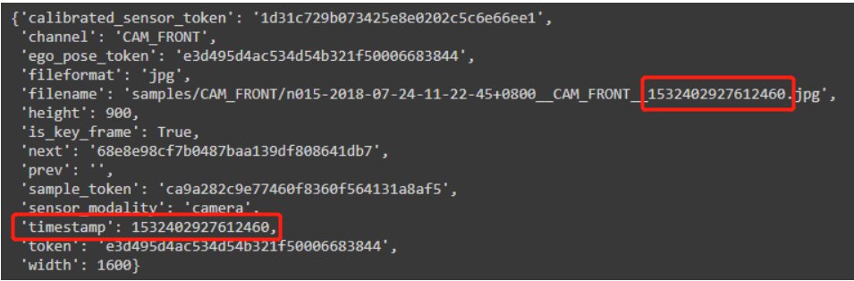
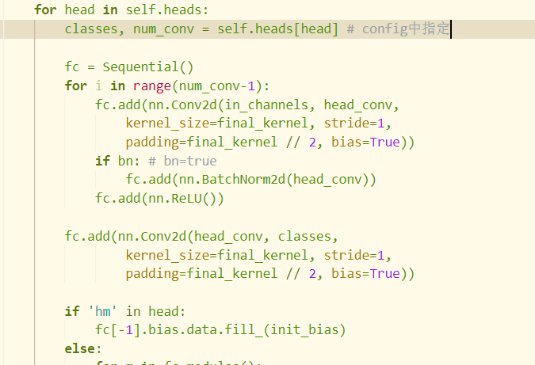

**Centerpoint**

voxel网络结构和输出tensor形状

reader：type="VoxelFeatureExtractorV3",取平均

输入torch.Size([体素数, 10, 5])"features"， torch.Size([体素数])"num_voxels"，输出torch.Size([体素数, 5])input_features


backbone：type="SpMiddleResNetFHD"

输入torch.Size([体素数, 5])，torch.Size([体素数, 4]) coordinate[0,位置坐标]，batch_size:1，data[input_shape]：[1440 1440   40]，输出x.shape：torch.Size([1, 256, 180, 180])，{'conv1': <spconv.SparseConvTensor object at 0x7f8f56e68ef0>, 'conv2': <spconv.SparseConvTensor object at 0x7f8f56e68b70>, 'conv3': <spconv.SparseConvTensor object at 0x7f8f56e68f98>, 'conv4': <spconv.SparseConvTensor object at 0x7f8f56e68d30>} voxel_feature


neck：type="RPN"

输入x.shape：torch.Size([1, 256, 180, 180])，输出x.shape：torch.Size([1, 512, 180, 180])


bbox_head：type="CenterHead"

输入x.shape：torch.Size([1, 512, 180, 180])，输出list为

**[**

**{'reg': tensor([1, 2, 180, 180]), 'height': tensor([1, 1, 180, 180]), 'dim': tensor([1, 3, 180, 180]), 'rot': tensor([1, 2, 180, 180]), 'vel': tensor([1, 2, 180, 180]), 'hm': tensor([1, 1, 180, 180])},** 

**{'reg': tensor([1, 2, 180, 180]), 'height': tensor([1, 1, 180, 180]), 'dim': tensor([1, 3, 180, 180]), 'rot': tensor([1, 2, 180, 180]), 'vel': tensor([1, 2, 180, 180]), 'hm': tensor([1, 2, 180, 180])},** 

**{'reg': tensor([1, 2, 180, 180]), 'height': tensor([1, 1, 180, 180]), 'dim': tensor([1, 3, 180, 180]), 'rot': tensor([1, 2, 180, 180]), 'vel': tensor([1, 2, 180, 180]), 'hm': tensor([1, 2, 180, 180])},**

 **{'reg': tensor([1, 2, 180, 180]), 'height': tensor([1, 1, 180, 180]), 'dim': tensor([1, 3, 180, 180]), 'rot': tensor([1, 2, 180, 180]), 'vel': tensor([1, 2, 180, 180]), 'hm': tensor([1, 1, 180, 180])},** 

**{'reg': tensor([1, 2, 180, 180]), 'height': tensor([1, 1, 180, 180]), 'dim': tensor([1, 3, 180, 180]), 'rot': tensor([1, 2, 180, 180]), 'vel': tensor([1, 2, 180, 180]), 'hm': tensor([1, 2, 180, 180])},** 

**{'reg': tensor([1, 2, 180, 180]), 'height': tensor([1, 1, 180, 180]), 'dim': tensor([1, 3, 180, 180]), 'rot': tensor([1, 2, 180, 180]), 'vel': tensor([1, 2, 180, 180]), 'hm': tensor([1, 2, 180, 180])}**

**]**


output的结果

```json
[{'box3d_lidar': tensor([[ 9.5765e-01, -8.1574e+00, -1.1584e+00,  ...,  2.3936e-01,
          1.7465e+00, -3.0140e+00],
        [ 1.0656e+01,  2.0182e+01,  2.1907e-02,  ...,  1.6337e+00,
          1.6447e+00, -2.3173e+00],
        [ 3.9706e-01, -3.0798e+01, -1.4518e+00,  ..., -1.4510e-01,
          4.8273e+00, -3.1372e+00],
        ...,
        [ 2.1409e+00,  2.1294e+01, -6.0946e-02,  ...,  7.9199e-09,
          9.7809e-10, -2.8571e+00],
        [-1.5230e+01,  1.1139e+01, -6.7530e-01,  ...,  4.3063e-03,
          1.9419e-04, -3.6318e-01],
        [-1.5802e+01, -6.9950e+00,  1.3413e+00,  ..., -4.8845e-04,
          1.7079e-03, -3.0042e+00]], device='cuda:0'), 'scores': tensor([0.8431, 0.6624, 0.5860, 0.5637, 0.3287, 0.1784, 0.1722, 0.1657, 0.1492,
        0.1128, 0.3096, 0.2991, 0.2722, 0.2451, 0.2037, 0.1750, 0.1609, 0.1528,
        0.1380, 0.1141, 0.1139, 0.1119, 0.1094, 0.1057, 0.1026, 0.1006, 0.1001,
        0.1001, 0.2855, 0.1238, 0.1084, 0.1011, 0.3027, 0.2017, 0.1995, 0.1879,
        0.1484, 0.1203, 0.1194, 0.1112, 0.1097, 0.1060, 0.1019, 0.1005, 0.3652,
        0.3497, 0.2844, 0.2724, 0.2464, 0.2014, 0.1862, 0.1774, 0.1621, 0.1597,
        0.1568, 0.1543, 0.1427, 0.1394, 0.1370, 0.1329, 0.1289, 0.1259, 0.1242,
        0.1232, 0.1224, 0.1131, 0.1129, 0.1102, 0.1082, 0.1037, 0.1033, 0.1011,
        0.1008, 0.1002, 0.1001, 0.3860, 0.3815, 0.2732, 0.2582, 0.2510, 0.2181,
        0.2094, 0.2045, 0.1980, 0.1971, 0.1832, 0.1817, 0.1743, 0.1688, 0.1662,
        0.1655, 0.1621, 0.1613, 0.1432, 0.1402, 0.1349, 0.1346, 0.1345, 0.1308,
        0.1301, 0.1300, 0.1275, 0.1198, 0.1164, 0.1160, 0.1044, 0.1038, 0.1027,
        0.1027, 0.1019, 0.1007, 0.1002], device='cuda:0'), 'label_preds': tensor([0, 0, 0, 0, 0, 0, 0, 0, 0, 0, 2, 1, 2, 2, 2, 2, 2, 2, 1, 2, 2, 1, 1, 2,
        2, 2, 2, 1, 4, 4, 4, 3, 5, 5, 5, 5, 5, 5, 5, 5, 5, 5, 5, 5, 7, 7, 7, 6,
        7, 7, 7, 7, 6, 7, 7, 7, 7, 6, 7, 7, 7, 6, 6, 7, 6, 7, 7, 7, 7, 7, 7, 7,
        6, 6, 7, 8, 8, 8, 9, 8, 8, 8, 8, 8, 9, 9, 8, 8, 8, 8, 9, 8, 8, 8, 8, 8,
        9, 8, 9, 8, 8, 9, 8, 8, 9, 8, 8, 8, 9, 9, 8, 8], device='cuda:0'), 'metadata': {'image_prefix': PosixPath('data/nuScenes'), 'num_point_features': 5, 'token': 'b4b81cfd5d734881ad386e5c2b00ed4a'}}]
```


```python
tasks = [
    dict(num_class=1, class_names=["car"]),
    dict(num_class=2, class_names=["truck", "construction_vehicle"]),
    dict(num_class=2, class_names=["bus", "trailer"]),
    dict(num_class=1, class_names=["barrier"]),
    dict(num_class=2, class_names=["motorcycle", "bicycle"]),
    dict(num_class=2, class_names=["pedestrian", "traffic_cone"]),
]
```

六种种类一个batch_size

猜想输出为regression，height-above-ground，dimension，rotation，velocity，heat-map

H,W为180

batch_box_preds：tensor[(1, 32400, 9)]，32400=180*180，9=xs(1)+ys(1)+batch_hei(1)+batch_dim(3)+batch_vel(2)+batch_rot(1)


dataloader处理后的数据为{'metadata': {'image_prefix': PosixPath('data/nuScenes'), 'num_point_features': 5, 'token': 'e411f0ab3a0243f1bea593bed340894f'}, 'points':（点数，5）, 'voxels'（体素数，10，5）:'shape': array([1440, 1440,   40]), 'num_points': 表示每个体素中的点云数量), 'num_voxels': 体素数), 'coordinates': (体素数，3)array([[ 16, 717, 682],
       [ 16, 717, 680],
       [ 16, 717, 678],
       ...,
       [ 28, 701, 636],
       [ 28, 701, 641],
       [ 28, 702, 638]], dtype=int32)}

每个体素最多10个点

NuScenes数据集中lidar文件名用时间戳区分文件



```txt
汽车编号-时间-相机位置-时间戳.jpg
汽车编号-时间-雷达位置-时间戳.pcd.bin
```

 'num_point_features'：前4个是点feature，一般是xyz和反射率，后一个是时间信息

‘feature_map_size’：180*180

for i，data in enumerate（dataloader）：一次性导入num_work个batch


Sparse Convolution成功用于3D目标检测的网络，相比于3D Convolution，在运算速度和显存消耗中有巨大的优势。

python前r表示禁止转义


backbone中对于feature进行卷积，体素数减少，最后dense生成密集要求size的vector


使用token对应相关的图片，主要看create_date时对数据集做的处理，每个数据有对应的lidar_path和info[“sweeps”]包含9个另外的雷达数据文件，邻近的

data中point是10个lidar文件中的点拼接在一起，第一个文件读入的为最大的时间戳

```txt
./data/nuScenes/samples/LIDAR_TOP/n015-2018-10-08-15-44-23+0800__LIDAR_TOP__1538984706547894.pcd.bin
./data/nuScenes/sweeps/LIDAR_TOP/n015-2018-10-08-15-44-23+0800__LIDAR_TOP__1538984706497583.pcd.bin
./data/nuScenes/sweeps/LIDAR_TOP/n015-2018-10-08-15-44-23+0800__LIDAR_TOP__1538984706447789.pcd.bin
./data/nuScenes/sweeps/LIDAR_TOP/n015-2018-10-08-15-44-23+0800__LIDAR_TOP__1538984706397490.pcd.bin
./data/nuScenes/sweeps/LIDAR_TOP/n015-2018-10-08-15-44-23+0800__LIDAR_TOP__1538984706347725.pcd.bin
./data/nuScenes/sweeps/LIDAR_TOP/n015-2018-10-08-15-44-23+0800__LIDAR_TOP__1538984706297399.pcd.bin
./data/nuScenes/sweeps/LIDAR_TOP/n015-2018-10-08-15-44-23+0800__LIDAR_TOP__1538984706247624.pcd.bin
./data/nuScenes/sweeps/LIDAR_TOP/n015-2018-10-08-15-44-23+0800__LIDAR_TOP__1538984706197302.pcd.bin
./data/nuScenes/sweeps/LIDAR_TOP/n015-2018-10-08-15-44-23+0800__LIDAR_TOP__1538984706147531.pcd.bin
./data/nuScenes/sweeps/LIDAR_TOP/n015-2018-10-08-15-44-23+0800__LIDAR_TOP__1538984706097778.pcd.bin
```

第一个文件为samples中的lidar文件，后面取9个sweeps中文件，这是中间过程中收集的数据（sensor data for intermediate frames），即第一个lidar文件融合了后面9个文件的信息，预测对应第一个文件的信息，之后跟踪中使用samples下的图片文件，和对应token的lidar文件预测结果经行跟踪


```txt
前十次跟踪输出：
输出的含义
last_time_stamp time_lag
detect到的物体数

1533201470.448696 0.0
236
1533201470.448696 0.49932193756103516
151
1533201470.9480178 0.49931812286376953
149
1533201471.447336 0.4998810291290283
139
1533201471.947217 0.5009839534759521
161
1533201472.448201 0.4506669044494629
172
1533201472.8988678 0.5004310607910156
211
1533201473.399299 0.5004289150238037
208
1533201473.8997278 0.5501871109008789
205
1533201474.449915 0.4993429183959961
176
1533201474.9492579 0.5004210472106934
142
```

sample中为key_frame， A keyframe is a frame where the time-stamps of data from all the sensors should be very close to the time-stamp of the sample it points to.


最终output的构成['box3d_lidar']：shape（物体数，9），['scores']：（物体数），['label_preds']：（物体数）


修改只使用部分数据集

 代码修改 

文件：==mmdetection3d/tools/data_converter/nuscenes_converter.py==

函数：==_fill_trainval_infos==      

```python
#update for part1_dataset     
# for sample in mmcv.track_iter_progress(nusc.sample):     for sample in mmcv.track_iter_progress(nusc.sample[0:3376]): 
```


数据处理 

```python
# 官方 
python tools/create_data.py nuscenes --root-path ./data/nuscenes --out-dir ./data/nuscenes --extra-tag nuscenes 
```

至此，数据处理部分完成


 （三）训练评价 

这里以CenterPoint举例【单GPU】  

训练 

```python
python tools/train.py configs/centerpoint/centerpoint_02pillar_second_secfpn_4x8_cyclic_20e_nus.py
```


评价 

> - out: 存储预测结果  - 
> - eval: 调用nuscenes官方评价方法NuScenesEval，因此仅包含Part1部分数据集，会导致报错。

```python
python tools/test.py configs/centerpoint/centerpoint_02pillar_second_secfpn_4x8_cyclic_20e_nus.py work_dir/centerpoint/epoch_10.pth --eval bbox --out ./eval_results/centerpoint.pkl 
```


1. 报错分析

   ```python
   File "/home/ch511/anaconda3/envs/open-mmlab/lib/python3.7/site-packages/nuscenes/eval/detection/evaluate.py", line 87, in __init__     
   "Samples in split doesn't match samples in predictions." AssertionError: Samples in split doesn't match samples in predictions.
   ```


   报错代码：  

   ```python
   # evaluate.py 
   assert set(self.pred_boxes.sample_tokens) == set(self.gt_boxes.sample_tokens), \             "Samples in split doesn't match samples in predictions."
   ```

    报错原因： 

   > self.pred_boxes.sample_tokens = 914，self.gt_boxes.sample_tokens = 6019  

   真实值包括整个数据集，但我仅使用了part1数据集.

 2. 代码修改： 

    文件：/home/ch511/anaconda3/envs/open-mmlab/lib/python3.7/site-packages/nuscenes/eval/common/loaders.py 

    函数：load_gt  sample_tokens_all = [s['token'] for s in nusc.sample[0:3376]] 

    > 修改源码并非一个好办法，最好是self.nusc仅包括part1部分，这样加载数据时也会更快一些。【待更新】  

    （四）其他说明 

    nusc = NuScenes(version=self.version, dataroot=self.data_root, verbose=False) 

    上述操作较为耗费时间，因此我把它存储为outputs/nusc/data_false_verbose.pkl文件。每次使用时读取即可。


> tools/single_inference.py is just for single lidar frame inference, got one frame data. output the detection results.


> tools/multi_sweep_inference.py is for multi_sweep lidar data concat to inference.

notice that it will use ego vehicle odometry infos, because it concat the multi-frame lidar into one frame, just like the training process doing, it will get better performance if the DL model are trained on multi-sweeps (e.g. Nuscesnes dataset devekit usually using 10sweeps concate on training)


nuScenes lidar is 32 lanes and Waymo is 64 lanes. As nuScenes produces really sparse pointcloud, we use more frames to aggregate data. For Waymo, we can also do 5 or ten but it is slower. 


1. Waymo has larger scene (150x150 vs. 100 x 100meter). 
2.  The Waymo model's output stride is 1 compared to 4 in nuScenes. (Waymo with output stride 4 doesn't perform well)


centerpoint+pointpainted将图片信息融合到点云中

选择nsweep=1可以只使用samples中的图片


只使用trainval01的数据集时容易因为token找不到无法寻找数据（不建议修改json文件）


==输出掩码mask和稀疏卷积后的特征，取两帧数据进行costvolum==

仔细看生成体素的过程，为什么是不一样的点数

==voxel_num = _points_to_voxel_reverse_kernel()==这个就是最后的体素数

```python
	failed = False
    for i in range(N):
        failed = False
        for j in range(ndim):
            c = np.floor((points[i, j] - coors_range[j]) / voxel_size[j]) # 判断是否在规定的coor内
            if c < 0 or c >= grid_size[j]:
                failed = True
                break
            coor[ndim_minus_1 - j] = c # xyz倒过来了
        if failed:
            continue
        voxelidx = coor_to_voxelidx[coor[0], coor[1], coor[2]] # 一开始是-1
        if voxelidx == -1: # 说明没有点
            voxelidx = voxel_num
            if voxel_num >= max_voxels:
                continue 
            voxel_num += 1
            coor_to_voxelidx[coor[0], coor[1], coor[2]] = voxelidx # 更改，说明取了点
            coors[voxelidx] = coor
        num = num_points_per_voxel[voxelidx] # 一开始是0说明这个voxel取了几个点
        if num < max_points:
            voxels[voxelidx, num] = points[i] # voxelidx取的第几个点是point[i]
            num_points_per_voxel[voxelidx] += 1
    return voxel_num
```


速度的生成过程：




Linear一般初始化为正态分布，bias初始化为0


追踪时使用一个场景下的照片进行跟踪，之后再训练

追踪的loss是每个序列场景中的，或者每次跟踪之后进行一次loss计算

每次更新坐标把物体的速度加上，更改他是位置，z的位置也加上去


trainloader返回的大小要一样，否则无法用于batch叠加


threshold的值

None
None
None
None
None
None
None
None
None
None
None
None
None
None
None
None
None
None
None
None
None
None
None
None
None
None
None
None
None
None
None
None
None
None
None
None
None
None
0 58                                                                                     
Computed thresholds

Computing metrics for class bus...

  0%|                                                              | 0/4 [00:00<?, ?it/s]None
None
None
None
None
None
None
None
None
None
None
None
None
None
None
None
None
None
None
None
None
None
None
None
None
None
None
None
None
None
None
None
None
None
None
None
None
None
None
None
None
None
None
None
None
None
None
None
None
None
None
None
None
None
None
 50%|███████████████████████████                           | 2/4 [00:00<00:00, 19.48it/s]None
None
None
None
None
None
None
None
None
0 86                                                                                     
Computed thresholds

Computing metrics for class car...

  0%|                                                              | 0/4 [00:00<?, ?it/s]None
None
None
None
None
None
None
None
None
None
None
None
None
None
None
None
None
None
None
None
None
None
None
None
None
None
None
None
None
None
None
None
None
None
None
None
None
None
None
None
None
 25%|█████████████▌                                        | 1/4 [00:00<00:00,  9.44it/s]None
None
None
None
None
None
None
None
None
None
None
None
None
None
None
None
None
None
None
None
None
None
None
None
None
None
None
None
None
None
None
None
None
None
None
None
None
None
None
None
None
None
None
None
None
None
None
None
None
None
None
None
None
None
None
None
None
None
None
None
None
None
None
None
None
None
None
None
None
None
None
None
None
None
None
None
None
None
None
None
None
 75%|████████████████████████████████████████▌             | 3/4 [00:00<00:00, 11.46it/s]None
None
None
None
None
None
None
None
None
None
None
None
None
None
None
None
None
None
None
None
None
None
None
None
None
None
None
None
None
None
None
None
None
None
None
None
None
None
None
None
0 2729                                                                                   
Computed thresholds

Computing metrics for class motorcycle...

  0%|                                                              | 0/4 [00:00<?, ?it/s]None
None
None
None
None
None
None
None
None
None
None
None
None
None
None
None
None
None
None
None
None
None
None
None
None
None
None
None
None
None
None
None
None
None
None
None
None
None
None
None
None
None
None
None
None
None
None
None
None
None
None
None
None
None
None
None
None
None
None
None
None
None
None
0 238                                                                                    
Computed thresholds

Computing metrics for class pedestrian...

  0%|                                                              | 0/4 [00:00<?, ?it/s]None
None
None
None
None
None
None
None
None
None
None
None
None
None
None
None
None
None
None
None
None
None
None
None
None
None
None
None
None
None
None
 25%|█████████████▌                                        | 1/4 [00:01<00:04,  1.36s/it]None
None
None
None
None
None
None
None
None
None
None
None
None
None
None
None
None
None
None
None
None
None
None
None
None
None
None
None
None
None
None
None
None
None
None
None
None
None
None
None
None
 50%|███████████████████████████                           | 2/4 [00:01<00:01,  1.38it/s]None
None
None
None
None
None
None
None
None
None
None
None
None
None
None
None
None
None
None
None
None
None
None
None
None
None
None
None
None
None
None
None
None
None
 75%|████████████████████████████████████████▌             | 3/4 [00:01<00:00,  2.14it/s]None
None
None
None
None
None
None
None
None
None
None
None
None
None
None
None
None
None
None
None
None
None
None
None
None
None
None
None
None
None
None
None
None
None
None
None
None
None
None
None
3744 1470


==重点注意事项==

- 不要在9988的1卡上训练
