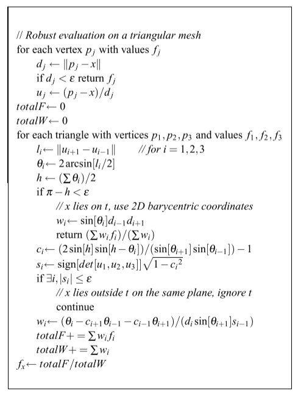

**mean value coordinate**

通过寻找函数做到面片内强度值的学习

- 先计算mesh上点的颜色，然后插值得到内部的颜色

伪代码过程

任务清单

- [x] https://youtu.be/uW5lw255dNs视频观看
- [x] https://youtu.be/QDXG4wNzkOE 视频观看
- [x] 了解mesh上对应点的变换
- [x] H36M 数据集形式

harmonic coordinate:

1. 通过降维到2维解拉普拉斯方程
2. 不断smooth直到边界停止条件
3. 固定的grid包裹mesh
4. 只对cage中的点存在定义且为正

