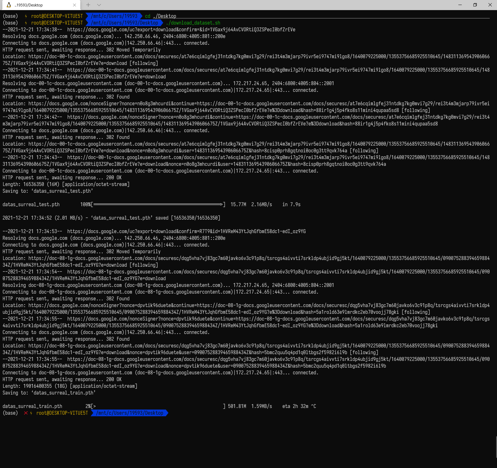

**cage**

已解决

> 安装时指定prefix采用绝对路径
>
> 现在寻找Cmake文件出错，安装出了问题

新问题

> /home/pyc/Program/Thea_build/Thea/Code/Source/Plugins/GL/glxew.h:103:12: fatal error: GL/glew.h: No such file or directory

**缺少的lib**：`apt-get install libglew-dev`

方法

下载文件过大

文件下载OK

文件含义问题

- [x] picked文件读取的csv中shape=10的含义，没有picked文件默认为SMPL模型否则需要对应的picker文件，用于对应
- [ ] mean_value_coordinates如何计算

代码阅读

- 训练好的模型中含有cage和source（猜想为template）
