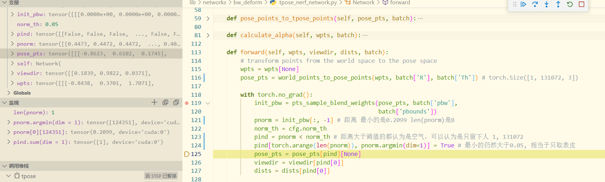

**aninerf代码**

环境配置

- pillow版本 8.2.0

数据集中导入数据：

- K:camera->pixel, D:五个畸变参数, R:旋转参数, T:平移参数
- img路径
- 世界坐标系下vertices的坐标
- 两种空间下lbs权重
- nerf sample后的结果

lbs权重生成

- Tpose找最近点，重心坐标表示生成，norm为grid点和最近点的距离
- 每一帧pxyz找最近点作为lbs值，norm需要aabbtree中找寻

运行过程

