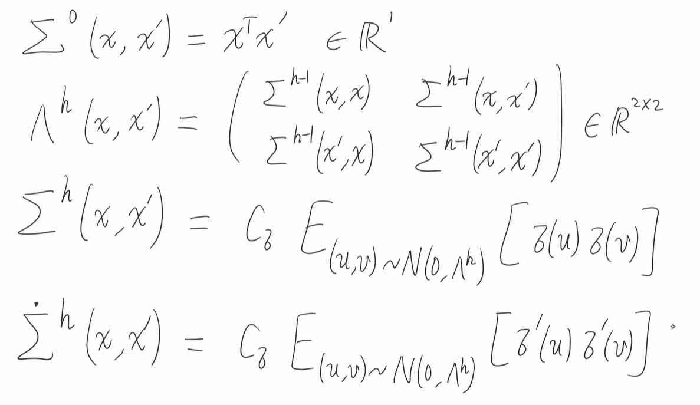
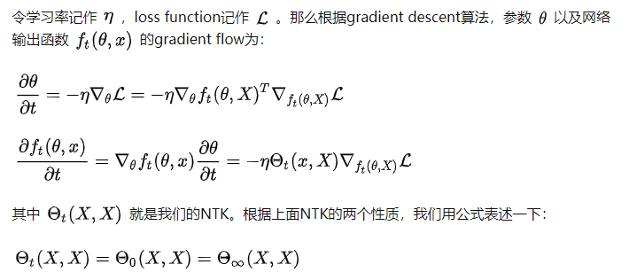
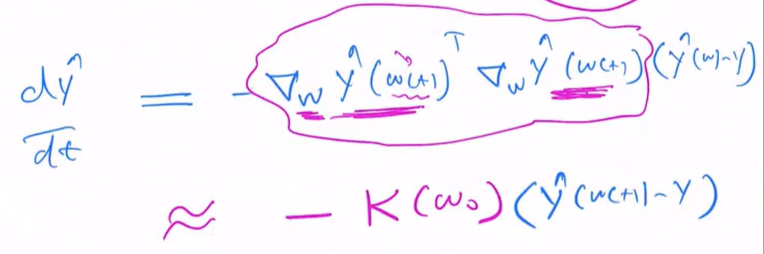

### neural tangent kernel (NTK)

#### 观点：

1. NTK在无限宽极限下趋于一个确定的核(Kernel)，在无限宽极限下不随着时间变化==（是训练中的不变量）==lazy training，but not always the case，说明在参数空间中变化很小，所以可以用一阶泰勒近似，只是linear in w，对w求导，not linear in x（有非线性激活函数）。而且在梯度下降的训练过程中保持不变，因此==无限宽网络==的输出层结果的动力学可以用一个常微分方程来表示。可以控制梯度，有上下限。

2. 无限宽的神经网络等价于高斯过程，相当于一个线性过程，可以线性叠加并且可以在不同初始条件收敛到同一过程

3. Mean field Theory中存在超参数平面中的一条临界线

4. .assets/image-20220620212719766.png)

5. ==引入NTK parameterziation==，是因为LeCun参数化会导致NTK在无限宽极限下发散。神经网络是不凸的，有很多局部最优点，通过NTK可以通过梯度下降到全局最优点

6. 定义

   

7. NTK就是前h层梯度积，经验NTK在宽度趋向无穷时可以趋近理想NTK，NTK只和网络层数有关，网络层数>=2  ，这种无穷NTK比多项式更好

8. NTK是低维的，低维的特性（数据），skip connection

#### 提出的问题困难：

1. NTK在有限宽网络会失效：**有限宽度到无穷的NTK演变问题**
2. kernel trick：kernel将低维映射到高维，容易造成数据复杂度上升，难以采样，但常常是不考虑值而是考虑两个输出的内积。用kernel matrix去描述，对称阵，且是半正定的，这样可以节省空间和计算开销

#### 数学知识：

1. 

   其中第一个等式来自第二个性质，第二个等式来自第一个性质，而 ![[公式]](https://www.zhihu.com/equation?tex=%5CTheta_%5Cinfty%28X%2CX%29) 就是那位deterministic的Kerenl。

   于是网络输出函数的动力学方程变为：

   ![[公式]](https://www.zhihu.com/equation?tex=%5Cfrac%7B%5Cpartial+f_t%28%5Ctheta%2C+x%29%7D%7B%5Cpartial+t%7D+%3D++-+%5Ceta+%5CTheta_%5Cinfty%28x%2CX%29+%5Cnabla_%7Bf_t%28%5Ctheta%2CX%29%7D+%5Cmathcal%7BL%7D)

   假设loss function是我们常见的Mean squared loss，那么方程进一步化简为一个线性常微分方程（ODE）：

   .assets/image-20220622163732369.png)
   
   当将函数一阶泰勒展开并保留一阶时，和上面ode等价，所以可以认为是一阶线性模型。
   
2. 名字由来tangent是因为取的是一阶泰勒导数

#### 模型结构：

1. 何凯明initialization添加系数$\sqrt[2]{\frac{c_\sigma}{d_h}}$，其中$d_h$为h层神经元个数，这样保证每一层范数相等

#### 研究方向：

1. 研究NTK的trainability and generalization， the NNGP (randomly initialized neural networks with certain class) kernel K and the tangent kernel Θ