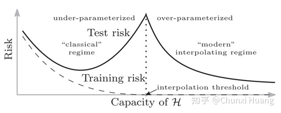

**kernel approximation**

1. 如何使用random feature去训练数据
2. 多少random feature需要去确保质量
3. evaluation of popular random features based algorithms

data dependent（根据数据distribution采样）和data-independent（高斯分布，高斯采样就可以）

sample number bigger than dim but much smaller than n.

random feature model可以看作两层神经网络（固定参数）

其中左边的部分即为传统统计学习中的bias-variance trade-off，此时模型的参数小于interpolation threshold，实际上这个threshold即为模型数与样本数相等的点（在多分类的情况下略有变化）。当模型的参数超过这个threshold的时候，模型通过进一步增加参数以增加可能的最小范数模型的范围、进而达到降低test error。考虑到double descent现象是从最近的统计学习方法中发现的，与我们经典统计学习中的“U型”特征不同，故称上图左侧为classical regime，此时模型的状态是under-parameterized；而称上图右侧为modern interpolating regime，此时模型的状态是over-parameterized。

不清楚的概念：kernel function, kernel matrix

kernel learning by random features是通过学习分布得到。先学习random feature

通过算法可以得到random feature数量级单位

