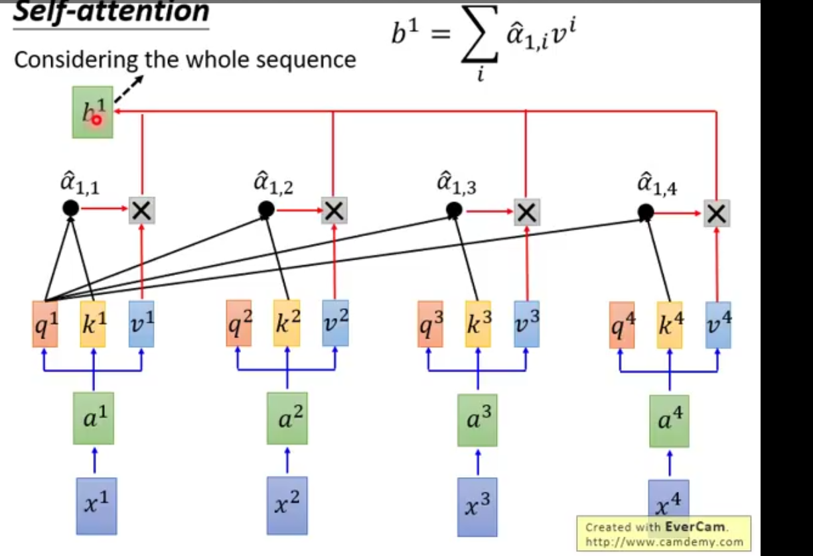
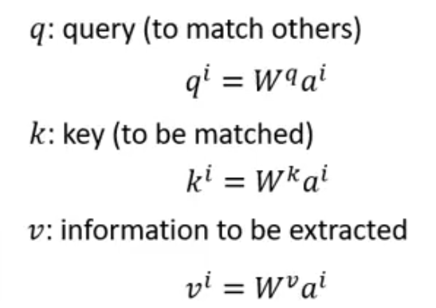

**Attention is all you need**

seq2seq中RNN全部盖臣self-attention layer，相比较于RNN，支持**parallel operation**，同样能够看到更远的信息。加入人为生成的position-encoder信息

主要结构如下所示：

其中q, k, v分别指代

其中增加的结构multi-head能够看更远，学习到更多的信息, 不同head注意不同距离的信息。

其中layer-norm是用于将input normalization，符合RNN的性质

sine and cosine function做position-encoding，能够推测更长的时序信号